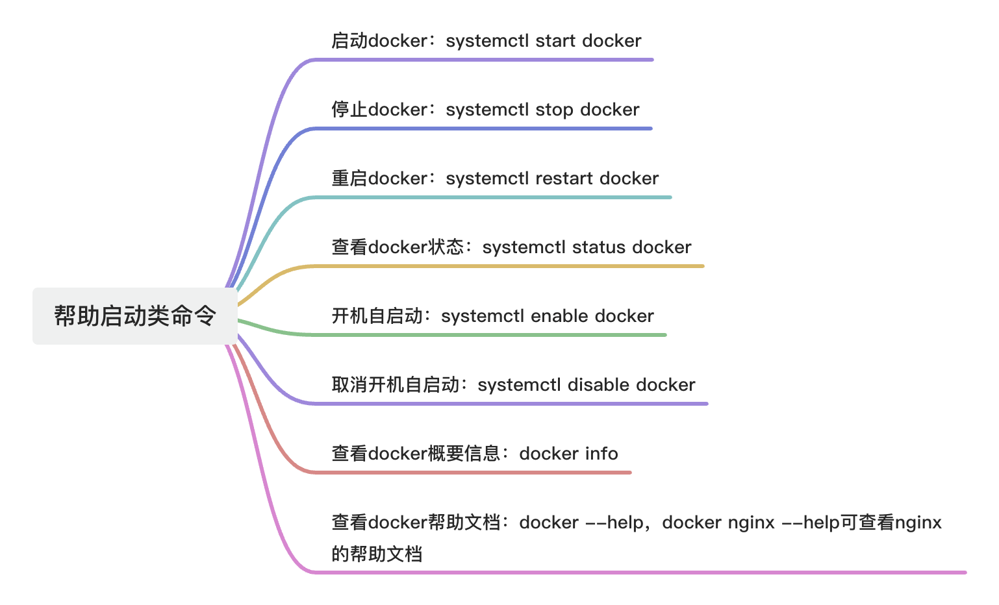

---
group:
  title: Docker
order: 3
title: Docker命令-常用帮助启动类命令

nav:
  title: DevOps
  order: 1
---

## 1、介绍
在Docker中，“帮助启动类命令” 通常指的是用于 查看帮助信息、启动容器、管理服务状态等与“启动”和“辅助操作”相关的命令。



## 2、具体命令指令介绍
systemctl仅在使用systemd作为初始化系统（init system）的Linux发行版中可用（如CentOS 7+、Ubuntu 16.04+、Debian 8+、Fedora、RHEL 7+ 等）。旧系统（如CentOS 6）使用service和chkconfig，不支持systemctl。

在mac中是不支持systemctl的，macOS使用的是launchd作为其初始化和进程管理系统，与Linux的systemd完全不同。因此，在macOS终端中运行systemctl会提示：

```bash
zsh: command not found: systemctl
```

在macOS上，不要使用systemctl，直接使用Docker Desktop的图形界面或AppleScript来管理Docker服务。

### 2.1、启动docker：systemctl start docker
```bash
systemctl start docker
```

+ systemctl：systemd系统和服务管理器的控制工具。
+ start：启动一个服务（不会开机自启，仅本次运行）。
+ docker：Docker守护进程（daemon）的服务名，对应配置文件通常为 /lib/systemd/system/docker.service或/etc/systemd/system/docker.service。

执行后，Docker后台守护进程（dockerd）会启动，你就可以使用docker run、docker ps等命令了。

**使用场景：**

该命令常用于安装Docker后首次启动：

```bash
# 安装 Docker（以 Ubuntu 为例）
sudo apt install docker.io

# 启动 Docker 服务
sudo systemctl start docker
```

### 2.2、停止Docker：systemctl stop docker
```bash
systemctl stop docker
```

+ systemctl：systemd系统和服务管理器的控制工具。
+ stop：停止一个正在运行的服务（仅本次生效，不影响开机自启设置）。
+ docker：Docker守护进程（daemon）的服务名，对应的服务配置文件通常位于 /lib/systemd/system/docker.service或/etc/systemd/system/docker.service。

执行该命令后，Docker后台守护进程（dockerd）会被终止，所有通过Docker运行的容器将默认被停止（具体行为取决于容器的重启策略和systemd配置），同时docker命令（如docker ps、docker run）将无法使用，并可能报错：

```bash
Cannot connect to the Docker daemon at unix:///var/run/docker.sock. Is the docker daemon running?
```

**使用场景：**

+ 调试或更新Docker配置前临时关闭服务；
+ 系统维护期间停用容器服务；
+ 安全审计时临时禁用Docker。

```bash
# 停止Docker服务
sudo systemctl stop docker

# 验证是否已停止
sudo systemctl status docker
# 输出中应显示 "inactive (dead)"
```

**注意事项：**

+ 不会禁用开机自启：即使执行了systemctl stop docker，如果之前设置了systemctl enable docker，系统重启后Docker仍会自动启动。
+ 正在运行的容器会被停止：默认情况下，停止dockerd会导致所有容器停止（除非配置了特殊的容器生命周期管理策略）。若需保留容器运行，应避免直接停止 Docker 服务。
+ 需要root权限：普通用户需使用sudo才能执行：

```bash
sudo systemctl stop docker
```

+ 有时候需要关闭docker.service和docker.socket，如下的举例中，看样子没有成功停止：

```bash
[root@xxx ~]# systemctl stop docker
Warning: Stopping docker.service, but it can still be activated by:
  docker.socket
[root@xxx ~]# docker images
REPOSITORY   TAG       IMAGE ID       CREATED       SIZE
nginx        latest    605c77e624dd   3 years ago   141MB
[root@xxx ~]# 
```

因为这里只停止了docker.service，但docker.socket仍然处于active状态。只要docker.socket在运行，下次执行任何docker命令时，Docker服务会立即自动重启！这可能导致误以为“Docker 没停掉”，其实它是被socket触发重新启动的。

要完全禁用Docker的自动唤醒，需要同时停用并禁用docker.socket：

```bash
# 1. 停止 docker.service 和 docker.socket
sudo systemctl stop docker.service docker.socket
# 2. 禁用开机自启（防止重启后自动启用）[实际开发中可不用关闭]
sudo systemctl disable docker.service docker.socket
```

验证是否彻底停止：

```bash
# 查看 docker 相关单元状态
systemctl status docker.service docker.socket

# 检查 docker 进程是否还在
ps aux | grep dockerd

# 尝试执行docker命令（应该报错 "Cannot connect to the Docker daemon"）
docker ps

[root@xxx ~]# docker ps
Cannot connect to the Docker daemon at unix:///var/run/docker.sock. Is the docker daemon running?
```

### 2.3、重启Docker：systemctl restart docker
```bash
systemctl restart docker
```

+ systemctl：systemd系统和服务管理器的控制工具。
+ restart：先停止服务（如果正在运行），再重新启动它。
+ docker：Docker守护进程（daemon）的服务名，对应配置文件通常为 /lib/systemd/system/docker.service或/etc/systemd/system/docker.service。

执行该命令后，Docker后台守护进程（dockerd）会被完全重启。所有由Docker管理的容器会先被停止，再根据其重启策略（如--restart=always）决定是否自动重新启动。重启完成后，docker命令（如docker ps、docker run）即可正常使用。

**使用场景：**

+ 修改了Docker配置文件（如/etc/docker/daemon.json）后，使新配置生效；
+ Docker服务出现异常或无响应，需要强制重载；
+ 升级Docker版本后重新加载服务。

```bash
# 修改 daemon.json 后重启 Docker
sudo nano /etc/docker/daemon.json
# 添加镜像加速器等配置...

# 重启 Docker 使配置生效
sudo systemctl restart docker

# 验证服务状态
sudo systemctl status docker
```

**注意事项：**

+ 容器行为取决于重启策略：若容器启动时指定了--restart=always或--restart=unless-stopped，重启Docker后这些容器会自动恢复运行。若未设置重启策略，容器将保持停止状态，不会自动启动。
+ 短暂服务中断：重启期间（通常几秒），Docker API 不可用，依赖容器的应用可能会短暂中断。
+ 需要root权限：普通用户需使用sudo：

```bash
sudo systemctl restart docker
```

+ 与reload的区别：systemctl reload docker：仅重载配置（部分配置支持热重载，不重启进程，容器不中断）。systemctl restart docker：完全重启进程，容器会短暂停止。

### 2.4、查看Docker状态：systemctl status docker
```bash
systemctl status docker
```

+ systemctl：systemd系统和服务管理器的控制工具。
+ status：显示指定服务的运行状态、进程ID、启动时间、日志片段等详细信息。
+ docker：Docker守护进程（dockerd）对应的服务名称，其服务单元文件通常位于 /lib/systemd/system/docker.service 或 /etc/systemd/system/docker.service。

执行该命令后，系统会输出Docker服务的实时状态，帮助你快速判断Docker是否正常运行。

**典型输出示例（正常运行时）：**

```bash
● docker.service - Docker Application Container Engine
   Loaded: loaded (/lib/systemd/system/docker.service; enabled; vendor preset: enabled)
   Active: active (running) since Mon 2024-06-10 10:00:00 CST; 2h 15min ago
     Docs: https://docs.docker.com
 Main PID: 1234 (dockerd)
    Tasks: 28
   Memory: 120.5M
   CGroup: /system.slice/docker.service
           └─1234 /usr/bin/dockerd -H fd:// --containerd=/run/containerd/containerd.sock
```

**关键字段说明：**

+ Active: active (running)：表示Docker正在运行。
+ enabled：表示已设置为开机自启。
+ Main PID：Docker守护进程的进程ID。
+ CGroup：显示dockerd进程及其子进程。

**异常状态示例（服务未运行）：**

```bash
● docker.service - Docker Application Container Engine
   Loaded: loaded (/lib/systemd/system/docker.service; enabled; vendor preset: enabled)
   Active: inactive (dead)
```

**或启动失败：**

```bash
Active: failed (Result: exit-code)
...
Jun 10 10:05:01 host systemd[1]: Failed to start Docker Application Container Engine.
```

此时可结合日志进一步排查。若状态显示异常（如failed或inactive），可使用以下命令查看详细日志：

```bash
# 查看 Docker 服务最近 50 行日志
sudo journalctl -u docker.service --no-pager -n 50

# 实时跟踪日志（调试用）
sudo journalctl -u docker.service -f
```

**常见问题包括：**

+ /etc/docker/daemon.json配置语法错误；
+ 端口冲突（如2375/2376被占用）；
+ 存储驱动初始化失败；
+ 权限或SELinux/AppArmor限制。

### 2.5、设置Docker开机自启动：systemctl enable docker
```bash
systemctl enable docker
```

+ systemctl：systemd系统和服务管理器的控制工具。
+ enable：创建符号链接，将服务加入系统启动项，使其在系统引导时自动启动。
+ docker：Docker守护进程（dockerd）的服务名称，对应的服务单元文件通常位于 /lib/systemd/system/docker.service。

执行该命令后，系统会在下次启动时自动运行 Docker 服务，无需手动执行 systemctl start docker。这对于服务器、生产环境或需要长期运行容器的场景至关重要。

**使用场景：**

+ 新安装Docker后，确保系统重启后容器服务能自动恢复；
+ 生产服务器部署，避免因意外重启导致服务中断；
+ 配合容器重启策略（如 --restart=always），实现“系统启动 → Docker启动 → 容器自动运行”的完整自愈链路。

**典型输出示例：**

```bash
[root@xxx ~]# sudo systemctl enable docker
Created symlink /etc/systemd/system/multi-user.target.wants/docker.service → /usr/lib/systemd/system/docker.service.
```

**验证是否已启用开机自启：**

```bash
systemctl is-enabled docker
```

+ 若返回enabled：表示已设置开机自启；
+ 若返回disabled：表示未启用。

也可以通过查看状态确认：

```bash
systemctl status docker
```

```bash
[root@xxx ~]# systemctl status docker
● docker.service - Docker Application Container Engine
   Loaded: loaded (/usr/lib/systemd/system/docker.service; enabled; vendor preset: disabled)
   Active: active (running) since Thu 2025-12-11 18:14:29 CST; 15h ago
     Docs: https://docs.docker.com
 Main PID: 244018 (dockerd)
    Tasks: 9
   Memory: 31.2M
   CGroup: /system.slice/docker.service
           └─244018 /usr/bin/dockerd -H fd:// --containerd=/run/containerd/containerd.sock
```

在输出中看到：

```bash
Loaded: loaded (...; enabled; ...)
```

其中enabled即表示已启用自启动。

### 2.6、取消Docker开机自启动：systemctl disable docker
```bash
systemctl disable docker
```

+ systemctl：systemd系统和服务管理器的控制工具。
+ disable：移除服务在系统启动时的自动加载链接，使其不再随系统引导而启动。
+ docker：Docker守护进程（dockerd）的服务名称，对应的服务单元文件通常位于 /lib/systemd/system/docker.service。

执行该命令后，系统下次启动时将不会自动运行Docker服务。但注意当前正在运行的Docker服务不会被停止，仅影响未来的开机行为。

**典型输出示例：**

```bash
[root@xxx ~]# sudo systemctl disable docker
Removed /etc/systemd/system/multi-user.target.wants/docker.service.
```

这表示systemd已成功删除了指向docker.service的开机启动符号链接，Docker将不再随系统启动。

**使用场景：**

+ 调试或临时禁用容器环境，避免系统启动时自动加载Docker；
+ 安全加固：在不需要容器服务的服务器上，防止Docker意外启动；
+ 节省资源：在轻量级或专用设备上，关闭不必要的后台服务；
+ 配合手动管理：由运维脚本在特定时机启动Docker，而非系统默认启动。

验证是否成功取消开机自启动，可以参考上面的设置Docker开机自启动。

### 2.7、查看Docker概要信息：docker info
docker info是一个跨平台（Linux / macOS / Windows）的Docker CLI命令，用于显示当前Docker环境的概要信息，包括守护进程状态、系统配置、存储驱动、网络设置、镜像与容器数量等关键数据。

+ 无需sudo（前提是当前用户已加入docker用户组，或在macOS/Windows上使用Docker Desktop）；
+ 依赖Docker守护进程（dockerd）正在运行，若服务未启动，会报错：Cannot connect to the Docker daemon at unix:///var/run/docker.sock. Is the docker daemon running?

**典型输出内容：**

```bash
[root@xxx ~]# docker info
Client: Docker Engine - Community
 Version:    26.1.3
 Context:    default
 Debug Mode: false
 Plugins:
  buildx: Docker Buildx (Docker Inc.)
    Version:  v0.14.0
    Path:     /usr/libexec/docker/cli-plugins/docker-buildx
  compose: Docker Compose (Docker Inc.)
    Version:  v2.27.0
    Path:     /usr/libexec/docker/cli-plugins/docker-compose

Server:
 Containers: 0
  Running: 0
  Paused: 0
  Stopped: 0
 Images: 1
 Server Version: 26.1.3
 Storage Driver: overlay2
  Backing Filesystem: extfs
  Supports d_type: true
  Using metacopy: false
  Native Overlay Diff: false
  userxattr: false
 Logging Driver: json-file
 Cgroup Driver: cgroupfs
 Cgroup Version: 1
 Plugins:
  Volume: local
  Network: bridge host ipvlan macvlan null overlay
  Log: awslogs fluentd gcplogs gelf journald json-file local splunk syslog
 Swarm: inactive
 Runtimes: io.containerd.runc.v2 runc
 Default Runtime: runc
 Init Binary: docker-init
 containerd version: 8b3b7ca2e5ce38e8f31a34f35b2b68ceb8470d89
 runc version: v1.1.12-0-g51d5e94
 init version: de40ad0
 Security Options:
  seccomp
   Profile: builtin
 Kernel Version: 5.10.134-19.1.al8.x86_64
 Operating System: Alibaba Cloud Linux 3.2104 U12 (OpenAnolis Edition)
 OSType: linux
 Architecture: x86_64
 CPUs: 2
 Total Memory: 1.827GiB
 Name: iZ2zeb9fdjcne1mfh06bmoZ
 ID: c9823222-3928-4f6d-ad77-7927421abba6
 Docker Root Dir: /var/lib/docker
 Debug Mode: false
 Experimental: false
 Insecure Registries:
  127.0.0.0/8
 Registry Mirrors:
  https://xxx.mirror.aliyuncs.com/
 Live Restore Enabled: false
```

**关键信息说明：**

| 字段 | 说明 |
| --- | --- |
| Containers / Images | 当前系统中的容器总数、运行中数量，以及本地镜像数量 |
| Server Version | Docker引擎版本（注意与docker --version的客户端版本区分） |
| Storage Driver | 存储驱动类型（如overlay2、aufs），影响镜像和容器的存储方式 |
| Cgroup Driver | 控制组驱动（cgroupfs或systemd），Kubernetes环境中需与kubelet一致 |
| Kernel Version / OS | 主机内核和操作系统信息 |
| CPUs / Total Memory | 主机可用的 CPU 核心数和内存总量 |
| Docker Root Dir | Docker数据根目录（默认/var/lib/docker） |
| Insecure Registries | 配置的非安全镜像仓库（如私有仓库） |
| Live Restore Enabled | 是否启用“守护进程停止时容器仍运行”的特性 |


**使用场景：**

+ 排查问题前快速诊断：确认Docker是否正常运行、资源是否充足；
+ 验证配置是否生效：如修改了/etc/docker/daemon.json后，检查Insecure Registries、Registry Mirrors等是否加载；
+ 环境审计：了解服务器上Docker的版本、驱动、安全策略等；
+ Kubernetes节点准备：检查cgroup driver是否为systemd（推荐值）。

```bash
# 查看 Docker 是否运行及基本信息
docker info

# 结合 grep 快速提取关键字段
docker info | grep "Storage Driver"
docker info | grep "Cgroup Driver"
```

| 命令 | 作用 |
| --- | --- |
| docker info | 查看Docker守护进程及系统环境的完整概要信息（跨平台） |
| docker version | 仅查看客户端/服务端版本 |
| systemctl status docker | （仅Linux）查看Docker服务运行状态 |


### 2.8、查看Docker帮助文档：docker --help
docker --help是一个跨平台（Linux / macOS / Windows）的Docker CLI命令，用于显示Docker客户端的全局帮助信息，列出所有可用的子命令、管理命令及其简要说明。

```bash
docker --help
```

+ 无需Docker守护进程（dockerd）运行即可使用；
+ 无需sudo权限；
+ 是学习和快速查阅Docker命令用法的第一入口。

**核心作用：**

+ 快速了解Docker支持哪些操作：列出常用命令（如run, ps, build）和管理类命令（如container, image, network）。
+ 区分“常用命令”与“管理命令”：
    - Common Commands：高频操作，语法简洁（如 docker ps）。
    - Management Commands：功能更完整、结构更清晰（如docker container ls等价于docker ps）。
+ 查看全局选项（Options）：如调试模式（-D）、指定Docker主机（-H）、配置目录等。

```bash
# 查看 docker run 的帮助
docker run --help

# 查看 docker container 的帮助
docker container --help

# 查看 docker image prune 的帮助
docker image prune --help
```

**使用场景：**

+ 初次接触Docker：快速了解有哪些命令可用；
+ 忘记参数写法：比如不确定-v还是--volume，直接查帮助；
+ 探索新功能：发现docker system df（查看磁盘使用）等不常用但实用的命令；
+ 脚本开发前确认选项：确保命令参数兼容当前Docker版本。


