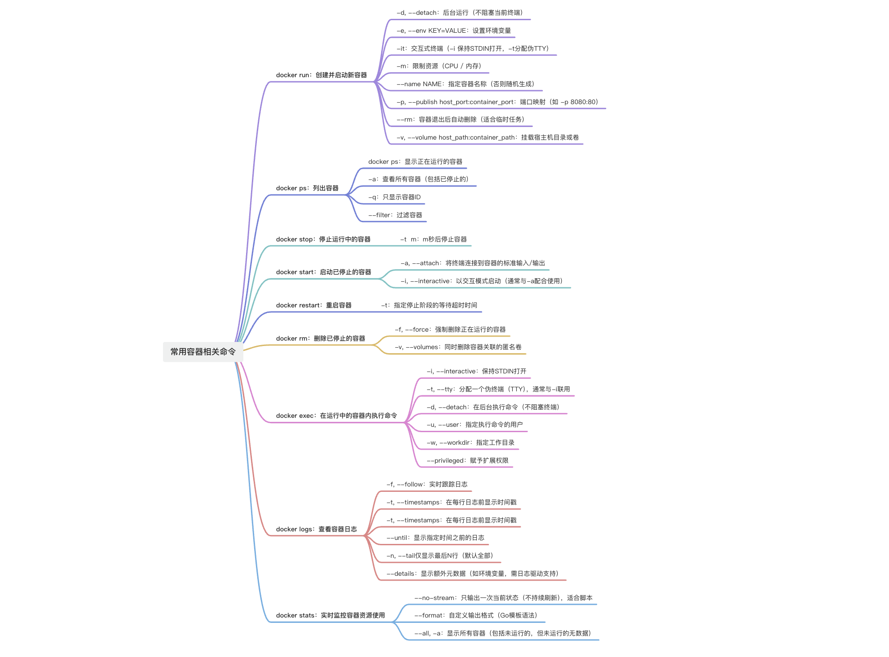

---
group:
  title: Docker
order: 5
title: Docker命令-常用容器相关命令

nav:
  title: DevOps
  order: 1
---

## 1、介绍



## 2、具体命令指令介绍

### 2.1、docker run：创建并启动新容器

docker run 是 Docker 中最核心、最常用的命令之一，用于创建并启动一个新的容器。它将镜像实例化为一个运行中的容器，并可配置网络、存储、环境变量等多种选项。

```bash
docker run [OPTIONS] IMAGE [COMMAND] [ARG...]
```

- IMAGE：要运行的镜像（如 nginx, ubuntu:22.04）。
- [COMMAND]：可选，覆盖镜像默认的启动命令。
- [ARG...]：传递给命令的参数。
- [OPTIONS]：大量可选参数，用于控制容器行为。

常用选项详解如下所示。

#### 2.1.1、后台运行：-d

```bash
docker run -d nginx
```

-d：容器在后台运行（不占用当前终端）。返回容器 ID。

适用于 Web 服务、数据库等长期运行的程序。

#### 2.1.2、设置环境变量：-e

```bash
docker run -e MYSQL_ROOT_PASSWORD=123456 mysql
```

-e：设置容器内的环境变量。多个变量可用多个-e，或使用--env-file 从文件加载。

#### 2.1.3、交互式运行：-it

```bash
docker run -it ubuntu /bin/bash
```

- -i（--interactive）：保持 STDIN 打开。
- -t（--tty）：分配一个伪终端。

启动 Ubuntu 容器并进入 Bash shell。适用于调试、临时操作容器内部。

#### 2.1.4、限制资源（CPU/内存）：-m

```bash
docker run -m 512m --cpus=1.5 nginx
```

-m 或--memory：限制内存（如 512m, 2g）。

--cpus：限制 CPU 使用（如 0.5, 2）。

#### 2.1.5、指定容器名称：--name

```bash
docker run --name my-nginx -d nginx
```

--name：为容器指定一个易记的名字（默认是随机字符串）。

后续可通过名字管理容器：docker stop my-nginx。

#### 2.1.6、端口映射：-p

```bash
docker run -d -p 8080:80 nginx
```

-p <主机端口>:<容器端口>：将容器的 80 端口映射到主机的 8080。访问[http://localhost:8080](http://localhost:8080)即可看到 Nginx 欢迎页。

支持多个 -p：

```bash
docker run -p 3306:3306 -p 8080:80 myapp
```

#### 2.1.7、自动删除容器：--rm

```bash
docker run --rm -it alpine ping -c 3 google.com
```

--rm：容器停止后自动删除。

非常适合一次性任务（如测试、脚本执行）。

#### 2.1.8、挂载数据卷：-v

```bash
# 绑定挂载（Bind Mount）
docker run -v /host/path:/container/path nginx

# 匿名卷
docker run -v /data nginx

# 命名卷（推荐）
docker run -v myvolume:/app/data postgres
```

-v 或--volume：将主机目录或 Docker 卷挂载到容器内。

实现持久化存储或共享数据。

推荐使用命名卷（myvolume）而非直接绑定主机路径，更便携。

**常见组合示例：**

| 场景                    | 命令                                                                                  |
| ----------------------- | ------------------------------------------------------------------------------------- |
| 启动 Nginx 并映射端口   | docker run -d -p 80:80 --name web nginx                                               |
| 进入 Ubuntu 调试        | docker run -it --rm ubuntu /bin/bash                                                  |
| 运行 MySQL 并持久化数据 | docker run -d --name db -e MYSQL_ROOT_PASSWORD=123 -v mysql-data:/var/lib/mysql mysql |
| 一次性运行 Python 脚本  | docker run --rm -v $(pwd):/code python:3.9 python /code/script.py                     |

### 2.2、docker ps：列出容器

docker ps 是 Docker 中用于查看容器状态的核心命令，类似于 Linux 中的 ps（process status），但它专门用于列出 Docker 容器。

```bash
docker ps [OPTIONS]
```

#### 2.2.1、显示正在运行的容器：docker ps

默认情况下，docker ps 只显示正在运行的容器。

```bash
docker ps
```

输出示例：

```bash
CONTAINER ID   IMAGE     COMMAND                  CREATED        STATUS       PORTS                    NAMES
a1b2c3d4e5f6   nginx     "/docker-entrypoint.…"   2 hours ago    Up 2 hours   0.0.0.0:80->80/tcp       web-server
```

**字段说明：**

- CONTAINER ID：容器唯一 ID（前 12 位）。
- IMAGE：使用的镜像。
- COMMAND：启动时执行的命令。
- CREATED：容器创建时间。
- STATUS：运行状态（Up/Exited）。
- PORTS：端口映射信息。
- NAMES：容器名称（可自定义）。

#### 2.2.2、查看所有容器（包括已停止的）： -a

```bash
docker ps -a
# 或
docker ps --all
```

这是排查“为什么容器没运行”的关键命令！

#### 2.2.3、只显示容器 ID： -q

```bash
docker ps -q
# 显示所有运行中容器的 ID
docker ps -a -q
# 显示所有容器（含停止）的ID
```

配合其他命令批量操作，例如：

```bash
docker stop $(docker ps -q)          # 停止所有运行中的容器
docker rm $(docker ps -a -q)         # 删除所有容器（慎用！）
```

#### 2.2.4、过滤容器：--filter

使用 --filter 按条件筛选：

| 过滤条件 | 示例                        |
| -------- | --------------------------- |
| 按状态   | docker ps -f status=exited  |
| 按名称   | docker ps -f name=web       |
| 按镜像   | docker ps -f ancestor=nginx |
| 按标签   | docker ps -f label=env=prod |

```bash
# 查看已退出的容器
docker ps -f status=exited

# 查看名称包含 "db" 的容器
docker ps -f name=db
```

### 2.3、docker stop：停止容器

docker stop 是 Docker 中用于优雅地停止一个或多个正在运行的容器的核心命令。它比强制终止更安全，能确保应用程序有时间完成清理工作（如保存数据、关闭连接等）。

```bash
docker stop [OPTIONS] CONTAINER [CONTAINER...]
```

CONTAINER：可以是容器名称或容器 ID（完整或前几位唯一即可）。

支持同时停止多个容器。

**工作原理：**

docker stop 并不是立即杀死进程，而是分两步进行：

1. 首先发送 SIGTERM 信号：
   1. 通知容器内的主进程（PID 1）准备退出。
   2. 应用程序可以捕获此信号，执行清理操作（如关闭数据库连接、保存缓存等）。
2. 等待一段时间（默认 10 秒），如果容器在超时时间内未退出，则发送 SIGKILL 强制终止。

这种“优雅停机”机制是生产环境中推荐的做法，避免数据丢失或文件损坏。

**①、停止单个容器：**

```bash
docker stop nginx-server
# 或使用容器 ID
docker stop a1b2c3d4e5f6
```

**②、停止多个容器**

```bash
docker stop web-app db-cache worker
```

**③、停止所有正在运行的容器**

```bash
docker stop $(docker ps -q)
```

docker ps -q：只输出运行中容器的 ID。

$()：将结果作为参数传给 docker stop。

**设置多久后停止容器：-t**

-t, --time=SECONDS：指定等待容器退出的超时时间（秒），默认为 10。

```bash
# 给容器30秒的时间来完成优雅关闭
docker stop -t 30 my_database
```

### 2.4、docker start：启动已停止的容器

docker start 是 Docker 中用于启动一个已停止的容器的核心命令。与创建新容器的 docker run 不同，docker start 用于重新启动已经存在的、处于停止状态的容器。

```bash
docker start [选项] <容器名或容器ID>
```

容器名或容器 ID：要启动的容器的名称或 ID（可以是完整 ID 或前几个字符）。

可以同时启动多个容器，用空格分隔。

**常用选项：**

| 选项              | 说明                                                   |
| ----------------- | ------------------------------------------------------ |
| -a, --attach      | 将终端连接到容器的标准输入/输出（类似 docker run -it） |
| -i, --interactive | 以交互模式启动（通常与-a 配合使用）                    |

**执行过程：**

- 检查容器状态：首先确认容器确实存在且处于停止状态（Exited）。
- 恢复文件系统：恢复容器的文件系统快照。
- 应用配置：应用容器创建时的所有配置（网络、卷、环境变量等）。
- 执行启动命令：执行容器镜像中定义的启动命令（CMD 或 ENTRYPOINT）。
- 启动进程：启动容器内的主进程。

**与 docker run 的区别：**

```bash
# docker run：创建并启动一个新容器（每次都会新建）
docker run nginx

# docker start：启动一个已存在的容器（复用原有容器）
docker start my_nginx_container
```

**注意事项：**

1. 容器必须存在：
   1. 如果容器已被 docker rm 删除，则无法启动。可通过 docker ps -a 确认。
2. 启动后仍是原配置
   1. 不会应用新的环境变量、端口映射等。
   2. 如需更新配置，应重新 docker run 新容器。
3. 数据持久性依赖 Volume：
   1. 如果容器内数据未挂载 Volume，重启后修改仍存在（因为容器层保留）。
   2. 但若容器被删除，数据将丢失 → 重要数据务必用-v 挂载。
4. 主进程决定容器生命周期：
   1. 如果容器主进程退出，容器会再次变为 Exited。
   2. 确保你的应用能长期运行（如用 nginx 而不是 echo hello）。

### 2.5、docker restart：重启容器

docker restart 是 Docker 中用于重启一个或多个正在运行（或已停止）的容器的便捷命令。它相当于先执行 docker stop，再执行 docker start，但由 Docker 自动完成，常用于服务更新、配置重载或故障恢复。

docker restart = docker stop + docker start（原子操作，更简洁）。

```bash
docker restart [OPTIONS] CONTAINER [CONTAINER...]
```

- CONTAINER：可以是容器名称或容器 ID（支持多个）。
- 无论容器当前是 Up 还是 Exited 状态，都可以重启。

**常用选项：**

| 选项               | 说明                                        |
| ------------------ | ------------------------------------------- |
| -t, --time=SECONDS | 指定停止阶段的等待超时时间（秒），默认为 10 |

**docker restart 的内部流程如下：**

1. 向容器主进程发送 SIGTERM 信号（优雅停止）。
2. 等待默认 10 秒（可自定义超时时间）。
3. 若未退出，则发送 SIGKILL 强制终止。
4. 立即重新启动该容器（使用原始创建参数）。

**注意事项：**

- 容器必须存在：如果容器已被 docker rm 删除，则无法重启。可通过 docker ps -a 查看所有容器。
- 不会更新镜像：即使 docker pull 了新镜像，restart 仍使用创建时的旧镜像。要升级镜像，需重建容器。
- 主进程必须能正常启动，如果容器启动命令本身有 bug（如脚本报错），重启后会立即退出。
- 与 --rm 冲突，用 docker run --rm 创建的容器，退出后自动删除，无法重启。

**实用技巧：**

```bash
# 重启所有名称包含 "prod" 的容器
docker restart $(docker ps -a -q --filter "name=prod")
```

### 2.6、docker rm：删除容器

docker rm 是 Docker 中用于删除一个或多个已停止的容器的核心命令。它是容器生命周期管理的重要一环，帮助你清理不再需要的容器，释放磁盘空间。

```bash
docker rm [OPTIONS] CONTAINER [CONTAINER...]
```

- CONTAINER：可以是容器名称或容器 ID（支持多个）。
- 默认情况下，只能删除已停止（Exited）的容器。

```bash
docker rm <容器ID或名称>
# 删除所有已停止的容器
docker container prune
# 强制删除正在运行的容器
docker rm -f <容器ID或名称>
# 先强制停止并删除所有容器
docker rm -f $(docker ps -a -q)
```

**常用选项：**

| 选项          | 说明                                              |
| ------------- | ------------------------------------------------- |
| -f, --force   | 强制删除正在运行的容器（先 stop 再 rm）           |
| -v, --volumes | 同时删除容器关联的匿名卷（named volume 不受影响） |

### 2.7、docker exec：进入容器（交互式）

docker exec 是 Docker 中一个非常实用的命令，用于在已经运行的容器中执行额外的命令。它不会启动新容器，也不会影响容器的主进程，是调试、运维和临时操作容器内部环境的首选工具。

```bash
docker exec [OPTIONS] CONTAINER COMMAND [ARG...]
```

- CONTAINER：目标容器的名称或 ID（必须处于 运行中 状态）。
- COMMAND：要在容器内执行的命令（如 ls, ps, bash, curl 等）。
- [ARG...]：命令的参数。

容器必须是 Up（运行中） 状态，否则会报错。

**常用选项详解：**

| 选项              | 说明                                    |
| ----------------- | --------------------------------------- |
| -i, --interactive | 保持 STDIN 打开（即使未 attach）        |
| -t, --tty         | 分配一个伪终端（TTY），通常与-i 联用    |
| -d, --detach      | 在后台执行命令（不阻塞终端）            |
| -u, --user        | 指定执行命令的用户（如 root, www-data） |
| -w, --workdir     | 指定工作目录（如/app）                  |
| --privileged      | 赋予扩展权限（慎用）                    |

最常用组合：-it → 实现“进入容器”的效果。

```bash
# 如果容器以 bash/sh 运行
docker exec -it <容器名> /bin/bash
# 或
docker exec -it <容器名> sh
```

举例，比如我们想调整 nginx 的配置，就需要使用到 docker exec -it web01 /bin/bash:

```bash
zhangjianhua@U-QCX2V1Y9-0238 ~ % docker exec -it web01 /bin/bash
root@f035a7810460:/#
```

这种写法是有问题的：

```bash
docker exec -it nginx
docker exec -it web01
```

docker exec 的作用是：在已经运行的容器中执行一个命令。所以你必须告诉它：执行什么命令？如果是想“进入容器内部”，通常需要启动一个 shell，比如 bash 或 sh：

```bash
# 如果容器里有 bash
docker exec -it web01 bash

# 如果容器里只有 sh（比如 Alpine 镜像）
docker exec -it web01 sh
```

nginx 官方镜像基于 Debian/Alpine，默认有/bin/bash（Debian）或/bin/sh（Alpine）。如果不确定，优先尝试 sh，兼容性更好。

其次我们即使进来了 root@xxx:/# ，但是还是发现里面缺少了很多的功能，比如 vim 编辑器等，只能用最基础的命令。那么我们该怎么修改想要变更的配置呢？

我们可以继续看后面的容器目录挂载。

### 2.8、docker logs：查看容器日志

docker logs 是 Docker 中用于查看容器日志输出的核心命令。它能实时或回溯地获取容器内主进程（PID 1）写入 stdout 和 stderr 的内容，是调试、监控和排查问题的必备工具。

```bash
docker logs [OPTIONS] CONTAINER
```

- CONTAINER：目标容器的名称或 ID（可以是运行中或已停止的容器）。
- 日志内容来自容器主进程的标准输出（stdout）和标准错误（stderr）。

即使容器已停止（Exited），只要未被删除，仍可查看其历史日志！

**核心特点：**

| 特性             | 说明                                          |
| ---------------- | --------------------------------------------- |
| 只显示主进程日志 | 不包括 docker exec 启动的子进程输出           |
| 支持实时跟踪     | 类似 tail -f                                  |
| 保留历史记录     | 默认使用 json-file 日志驱动，日志持久化到磁盘 |
| 无需进入容器     | 直接在宿主机查看，安全高效                    |

**常用选项详解：**

| 选项             | 说明                                                 |
| ---------------- | ---------------------------------------------------- |
| -f, --follow     | 实时跟踪日志（类似 tail -f）                         |
| -t, --timestamps | 在每行日志前显示时间戳                               |
| --since          | 显示指定时间之后的日志（如 1h, 2025-07-03T10:00:00） |
| --until          | 显示指定时间之前的日志                               |
| -n, --tail       | 仅显示最后 N 行（默认全部）                          |
| --details        | 显示额外元数据（如环境变量，需日志驱动支持）         |

```bash
#	查看全部日志
docker logs my-nginx
# 实时跟踪日志
docker logs -f my-app
#	带时间戳查看（排查时间线问题）
docker logs -t my-db
zhangjianhua@U-QCX2V1Y9-0238 zjh % docker logs -t mynginx
2025-12-16T09:56:21.679561833Z /docker-entrypoint.sh: /docker-entrypoint.d/ is not empty, will attempt to perform configuration
2025-12-16T09:56:21.679587667Z /docker-entrypoint.sh: Looking for shell scripts in /docker-entrypoint.d/
2025-12-16T09:56:21.682203083Z /docker-entrypoint.sh: Launching /docker-entrypoint.d/10-listen-on-ipv6-by-default.sh
```

### 2.9、docker stats：查看容器资源使用情况

docker stats 是 Docker 中用于实时监控容器资源使用情况的强大命令。它能动态显示 CPU、内存、网络、磁盘 I/O 等关键指标，类似于 Linux 的 top 或 htop，是性能调优、故障排查和容量规划的必备工具。

```bash
docker stats [OPTIONS] [CONTAINER...]
```

- 不指定容器时：监控所有正在运行的容器。
- 指定容器名/ID：只监控特定容器（支持多个）。
- 容器必须处于 运行中（Up） 状态。

运行 docker stats 后，你会看到类似这样的实时表格：

```bash
CONTAINER ID   NAME        CPU %     MEM USAGE / LIMIT     MEM %     NET I/O         BLOCK I/O       PIDS
a1b2c3d4e5f6   nginx-app   0.50%     5.2MiB / 1.95GiB      0.26%     1.2kB / 0B      0B / 0B         3
b2c3d4e5f6a7   mysql-db    2.10%     420MiB / 1.95GiB      21.0%     8.7MB / 2.1MB   120MB / 45MB    35
```

| 列名              | 说明                                                      |
| ----------------- | --------------------------------------------------------- |
| CPU %             | 容器使用的 CPU 百分比（所有核心总和）                     |
| MEM USAGE / LIMIT | 当前内存使用量 / 内存限制（若未限制，则为宿主机总内存）   |
| MEM %             | 内存使用百分比（相对于限制或宿主机内存）                  |
| NET I/O           | 网络输入 / 输出流量（接收 / 发送）                        |
| BLOCK I/O         | 磁盘块设备读取 / 写入（不包括 Volume 挂载的文件系统 I/O） |
| PIDS              | 容器内进程/线程数量                                       |

**常用选项：**

| 选项        | 说明                                           |
| ----------- | ---------------------------------------------- |
| --no-stream | 只输出一次当前状态（不持续刷新），适合脚本     |
| --format    | 自定义输出格式（Go 模板语法）                  |
| --all, -a   | 显示所有容器（包括未运行的，但未运行的无数据） |

**典型应用场景：**

**①、自动化监控脚本**

```bash
#!/bin/bash
# 每5秒记录一次 nginx 容器的 CPU 和内存
while true; do
  docker stats --no-stream --format "{{.Name}} {{.CPUPerc}} {{.MemUsage}}" nginx-app
  sleep 5
done
```
