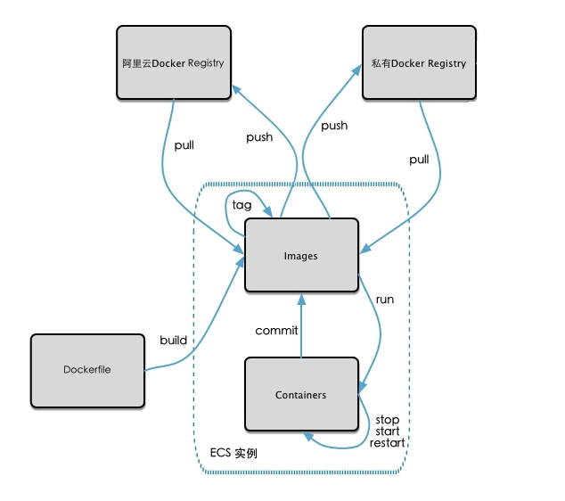
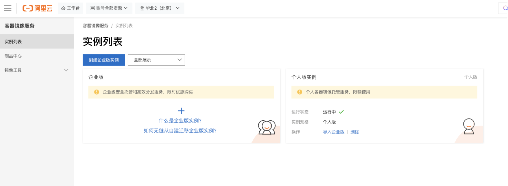
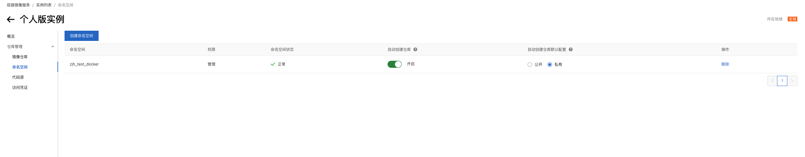
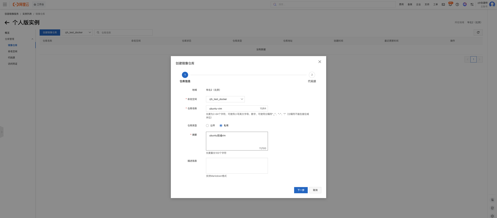
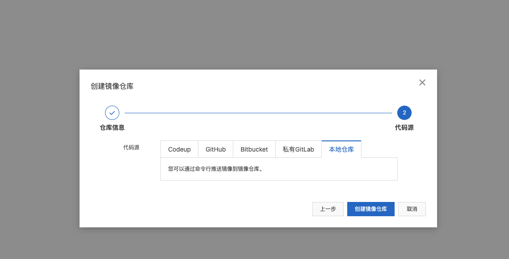
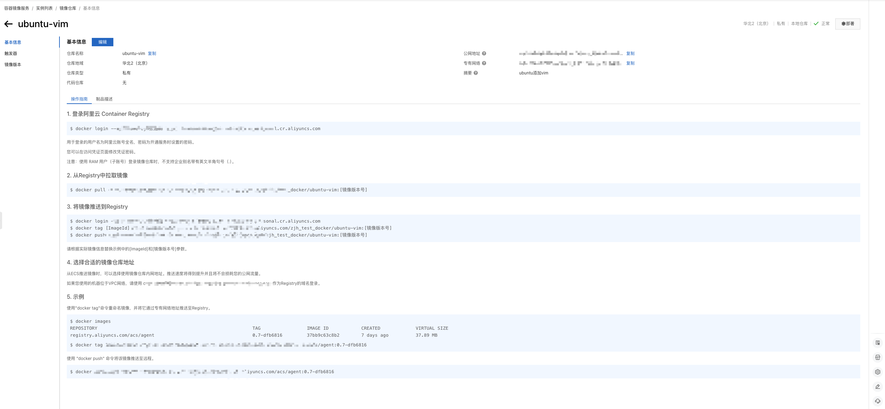

---
group:
  title: Docker
order: 7
title: docker commit创建新镜像及镜像私有化

nav:
  title: DevOps
  order: 2
---

## 1、docker commit 命令介绍

docker commit 是 Docker 中的一个命令，用于将一个正在运行（或已停止）的容器的当前状态保存为一个新的镜像（image）。这个操作类似于对容器进行“快照”，把容器文件系统的当前状态打包成一个可复用的镜像。

**基本语法：**

```bash
docker commit [OPTIONS] CONTAINER [REPOSITORY[:TAG]]
```

- CONTAINER：要提交的容器名称或 ID。
- REPOSITORY[:TAG]：新镜像的名称和可选标签（如 my-image:v1）。

**常用选项（OPTIONS）：**

| 选项          | 说明                                                   |
| ------------- | ------------------------------------------------------ |
| -a, --author  | 指定镜像作者（如"Your Name <email@example.com>"）      |
| -m, --message | 提交时的说明信息（类似 Git 的 commit message）         |
| -p, --pause   | 在提交过程中暂停容器（默认为 true）                    |
| --change      | 应用 Dockerfile 指令到新镜像（如 CMD, EXPOSE, ENV 等） |

**使用示例：**

**基本用法：**

假设有一个正在运行的容器 my-container，你想把它保存为新镜像：

```bash
docker commit my-container my-new-image:v1
```

执行后，会生成一个名为 my-new-image、标签为 v1 的新镜像。

带作者和注释：

```bash
docker commit \
  -a "Alice <alice@example.com>" \
  -m "Installed nginx and configured custom site" \
  my-container \
  my-web-server:latest
```

使用 --change 添加元数据：

```bash
docker commit \
  --change 'CMD ["nginx", "-g", "daemon off;"]' \
  --change 'EXPOSE 80' \
  my-container \
  my-nginx-image
```

这会在新镜像中设置默认启动命令并暴露 80 端口。

**注意事项：**

1. 不推荐作为常规构建方式：虽然 docker commit 很方便，但它绕过了 Dockerfile，不利于版本控制、可重复构建和团队协作。官方推荐使用 Dockerfile + docker build 来创建镜像。
2. 仅保存文件系统变更：docker commit 只保存容器的文件系统状态，不会保存：
   1. 容器的运行时状态（如内存中的数据）。
   2. 卷（volumes）中的内容。
   3. 网络配置等运行时元数据（除非通过 --change 显式指定）。
3. 镜像体积可能较大：因为它是基于整个容器文件系统的快照，可能包含不必要的临时文件，导致镜像臃肿。

**适用场景：**

- 快速调试：在容器中手动修改后想快速保存状态。
- 救急恢复：当容器配置正确但没有 Dockerfile 时，临时保存为镜像。
- 教学演示：展示容器与镜像的关系。

**举例介绍：**

```bash
zhangjianhua@U-QCX2V1Y9-0238 ~ % docker pull ubuntu
Using default tag: latest
latest: Pulling from library/ubuntu
97dd3f0ce510: Pull complete
588d79ce2edd: Download complete
Digest: sha256:c35e29c9450151419d9448b0fd75374fec4fff364a27f176fb458d472dfc9e54
Status: Downloaded newer image for ubuntu:latest
docker.io/library/ubuntu:latest
zhangjianhua@U-QCX2V1Y9-0238 ~ % docker images
IMAGE           ID             DISK USAGE   CONTENT SIZE   EXTRA
nginx:latest    553f64aecdc3        247MB         61.1MB    U
ubuntu:latest   c35e29c94501        141MB         30.8MB
zhangjianhua@U-QCX2V1Y9-0238 ~ % docker run -it ubuntu /bin/bash
root@780b53cf0b80:/# ls
bin  boot  dev  etc  home  lib  media  mnt  opt  proc  root  run  sbin  srv  sys  tmp  usr  var
root@780b53cf0b80:/# touch 1.txt
root@780b53cf0b80:/# vim 1.txt
bash: vim: command not found
```

如上，当我们访问拉下来的 ubuntu 镜像，使用 vim 的时候会发现 vim 不存在，这个时候我们可以进行安装 vim：

```bash
apt update
apt install -y vim
```

    然后这个时候就可以有vim了：

```bash
root@780b53cf0b80:/# ls
1.txt  bin  boot  dev  etc  home  lib  media  mnt  opt  proc  root  run  sbin  srv  sys  tmp  usr  var
root@780b53cf0b80:/# vim 1.txt
```

这个时候我们新启一个终端，输入 docker commit 相关内容：

```bash
docker commit -m"提交信息的描述" -a="作者" 容器ID 要创建的镜像名称:[标签名]
docker commit -m "add vim" -a "zjh" c35e29c94501 ubuntu:vim
```

```bash
zhangjianhua@U-QCX2V1Y9-0238 zjh % docker ps -a
CONTAINER ID   IMAGE     COMMAND                   CREATED          STATUS                    PORTS                                     NAMES
348531a4ac26   ubuntu    "/bin/bash"               58 minutes ago   Up 56 minutes                                                       confident_goldwasser
9ca1fb16a60f   nginx     "/docker-entrypoint.…"   7 days ago       Up 23 hours               0.0.0.0:8080->80/tcp, [::]:8080->80/tcp   mynginx
30059d3bfa80   nginx     "/docker-entrypoint.…"   12 days ago      Created                                                             nginx2001
211b7708d455   nginx     "/docker-entrypoint.…"   12 days ago      Exited (255) 8 days ago   0.0.0.0:2025->80/tcp                      web01
zhangjianhua@U-QCX2V1Y9-0238 zjh % docker commit -m "add vim" -a "zjh" 348531a4ac26 ubuntu:vim
sha256:2837239da35f89ca8a9cd11937d16bb830ae0f0337d0688bbd0ef73f101db6cb
```

这个时候我们再来查看对应的镜像：

```bash
zhangjianhua@U-QCX2V1Y9-0238 zjh % docker images
IMAGE           ID             DISK USAGE   CONTENT SIZE   EXTRA
nginx:latest    553f64aecdc3        247MB         61.1MB    U
ubuntu:latest   c35e29c94501        141MB         30.8MB    U
ubuntu:vim      2837239da35f        348MB         94.1MB
```

可以看到我们的 ubuntu:vim 的体积变成了 94.1MB。

## 2、将本地镜像发布到阿里云

阿里云 ESC Docker 生态如下：



首先 Images 可以由容器提交的方式生成，也可以通过 Dockerfile 的方式（后面会讲），然后通过 push 等操作提交到镜像仓库。（有点像 Git 里面的 git pull 和 git push ）

这个镜像仓库可以是公共的（类似 GitHub），也可以是私有的（例如公司内部搭建的，类似 GitLab）这里我们以上一节提交的带 vim 的 Ubuntu 镜像为例，push 到阿里云仓库上，首先我们访问对应的阿里云镜像管理地址，创建对应的个人容器镜像服务：[https://cr.console.aliyun.com/cn-beijing/instances](https://cr.console.aliyun.com/cn-beijing/instances)，对应页面如下：



然后创建命名空间（类似 Java 中的包名，这里取名为 zjh_test_docker）：



然后继续创建仓库：





使用本地仓库的方式，然后就创建之后就会给我们对应的上传方式，我们按照对应的命令执行就好了：



大致流程如下：

```bash
docker login --username=xxx xxx-beijing.personal.cr.aliyuncs.com
zhangjianhua@U-QCX2V1Y9-0238 zjh % docker images
IMAGE           ID             DISK USAGE   CONTENT SIZE   EXTRA
nginx:latest    553f64aecdc3        247MB         61.1MB    U
ubuntu:latest   c35e29c94501        141MB         30.8MB    U
ubuntu:vim      2837239da35f        348MB         94.1MB
zhangjianhua@U-QCX2V1Y9-0238 zjh % docker tag 2837239da35f xxx-beijing.personal.cr.aliyuncs.com/zjh_test_docker/ubuntu-vim
zhangjianhua@U-QCX2V1Y9-0238 zjh % docker push xxx-beijing.personal.cr.aliyuncs.com/zjh_test_docker/ubuntu-vim
Using default tag: latest
The push refers to repository [xxx-beijing.personal.cr.aliyuncs.com/zjh_test_docker/ubuntu-vim]
97dd3f0ce510: Pushed
fba38d820e55: Pushed
latest: digest: sha256:2837239da35f89ca8a9cd11937d16bb830ae0f0337d0688bbd0ef73f101db6cb size: 751
```

这样我们就把镜像上传到了阿里云中，接着我们可以进行下载，这里可以先把本地的镜像给删除掉，然后拉取阿里云的镜像，这里因为我们登录过了，就不用再继续登录了，直接使用：

```bash
docker pull xxx.cn-beijing.personal.cr.aliyuncs.com/zjh_test_docker/ubuntu-vim
```

```bash
zhangjianhua@U-QCX2V1Y9-0238 zjh % docker images

IMAGE                                                                                         ID             DISK USAGE   CONTENT SIZE   EXTRA
xxx-beijing.personal.cr.aliyuncs.com/zjh_test_docker/ubuntu-vim:latest                        2837239da35f        348MB         94.1MB
nginx:latest                                                                                  553f64aecdc3        247MB         61.1MB    U
ubuntu:latest                                                                                 c35e29c94501        141MB         30.8MB
zhangjianhua@U-QCX2V1Y9-0238 zjh %
```

可以看到这里的名称会是我们远程地址的这种 tag，然后为了方便我们查看，可以通过打 tag 的方式：

```bash
zhangjianhua@U-QCX2V1Y9-0238 zjh % docker tag xxx.cn-beijing.personal.cr.aliyuncs.com/zjh_test_docker/ubuntu-vim:latest my-ubuntu-vim:latest
zhangjianhua@U-QCX2V1Y9-0238 zjh % docker images
IMAGE                                                                                         ID             DISK USAGE   CONTENT SIZE   EXTRA
xxx.cn-beijing.personal.cr.aliyuncs.com/zjh_test_docker/ubuntu-vim:latest                     2837239da35f        348MB         94.1MB
my-ubuntu-vim:latest                                                                          2837239da35f        348MB         94.1MB
nginx:latest                                                                                  553f64aecdc3        247MB         61.1MB    U
ubuntu:latest
```

当然我们可以将内容推送到 docker hub 上，过程也是类似的，具体的就不继续按照步骤弄了。
