---
group:
  title: React16原理
order: 4
title: render函数链路初步梳理

nav:
  title: React原理
  order: 4
---

## 1、介绍

在React中，“render” 通常指两个层面的意思：

:::color1

- 首次渲染（Initial Render）：把组件树第一次挂载到DOM上。
- 更新渲染（Re-render）：当state或props改变时，重新生成虚拟DOM并更新界面。

:::

无论是哪种，核心目标都是把组件树转换成DOM树，并保持高效更新。

而React 16的render方法涉及Fiber架构的协调（Reconciler）和渲染（Renderer）过程，以及如何构建Fiber树、收集副作用（Effect），以及在Commit阶段执行DOM更新。这个内容比较复杂，我们将拆分多个章节进行介绍，这里我们主要熟悉render方法。

为了减少Fiber架构对redner学习过程的影响，以及了解为什么会出现Fiber，我们这里就先梳理一下React 15的链路再深入学习Fiber。

## 2、React 15的render方法链路梳理

React 15的源码与React 16及之后的版本有较大差异，React 15使用的是Stack Reconciler（栈协调器），而React 16之后使用的是Fiber Reconciler。

**栈协调器的主要特点：**

- **递归遍历**：从根组件开始，递归地调用每个组件的渲染方法，直到处理完所有叶子组件。然后回溯到父组件，继续处理兄弟组件。
- **同步阻塞**：由于是递归操作，一旦开始渲染，就会一直占用JavaScript主线程，直到整个组件树渲染完成。如果组件树很大，会导致页面卡顿，无法响应用户交互。
- **无法中断**：递归过程不能中途中断，也不能拆分任务。这导致在复杂应用中，长时间的渲染会阻塞用户交互。
- **生命周期**：在递归过程中，组件的生命周期方法（如componentWillMount、componentDidMount等）会在特定的时间点被调用。

**栈协调器的工作流程：**

- 挂载阶段：从根组件开始，递归实例化每个组件，调用mountComponent方法。对于复合组件（自定义组件），会先创建实例，然后调用render方法获取子组件，再递归处理子组件。对于宿主组件（如DOM元素），则创建真实的DOM节点。
- 更新阶段：当状态或属性发生变化时，会递归调用组件的更新方法，比较新旧虚拟DOM树，找出差异，然后更新实际DOM。

在React 15中，当我们调用ReactDOM.render(element, container, callback)时，会触发以下过程：

:::color1

1. 验证容器节点：首先检查container是否是一个有效的DOM节点。
2. 创建组件实例：根据element的类型（字符串、函数、类等）创建对应的React组件实例。
3. 挂载组件：调用组件实例的挂载方法，递归地构建整个组件树，并生成DOM节点。
4. 插入DOM：将生成的DOM节点插入到container中。
5. 执行回调：如果提供了callback，则在组件挂载或更新后执行。

:::

下面我将使用详细的流程图和简化后的代码进行分析，完整阐述React 15的render方法执行过程。

### 2.1、整体架构概览

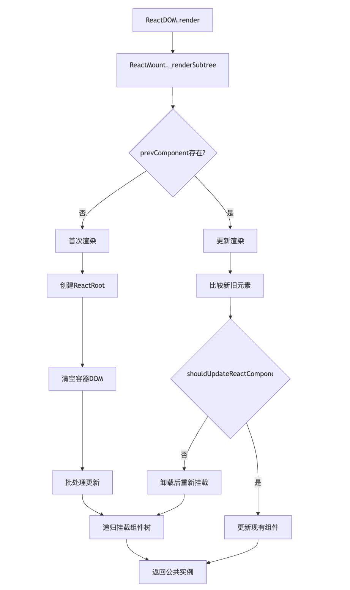


### 2.2、入口层：ReactDOM.render

源码位置：src/renderers/dom/client/ReactDOM.js

```javascript
// 用户调用的入口方法
render: function(element, container, callback) {
  // 验证容器是否为有效DOM元素
  invariant(
    isValidContainer(container),
    'Target container is not a DOM element.'
  );

  return ReactMount._renderSubtreeIntoContainer(
    null,
    element,
    container,
    false,
    callback
  );
}
```

### 2.3、核心调度层

源码位置：src/renderers/dom/client/ReactMount.js

```javascript
_renderSubtreeIntoContainer: function(
  parentComponent, nextElement, container, callback
) {
  // 关键：获取已存在的顶层组件
  var prevComponent = getTopLevelWrapperInContainer(container);

  if (prevComponent) {
    // 更新路径
    var prevElement = prevComponent._currentElement;
    if (shouldUpdateReactComponent(prevElement, nextElement)) {
      // 可复用组件 - 执行更新
      return ReactMount._updateRootComponent(
        prevComponent, nextElement, container, callback
      ).getPublicInstance();
    } else {
      // 不可复用 - 先卸载再挂载
      ReactMount.unmountComponentAtNode(container);
    }
  }

  // 首次挂载路径
  var component = ReactMount._renderNewRootComponent(
    nextElement, container, false, parentComponent
  ).getPublicInstance();

  if (callback) callback.call(component);
  return component;
}
```

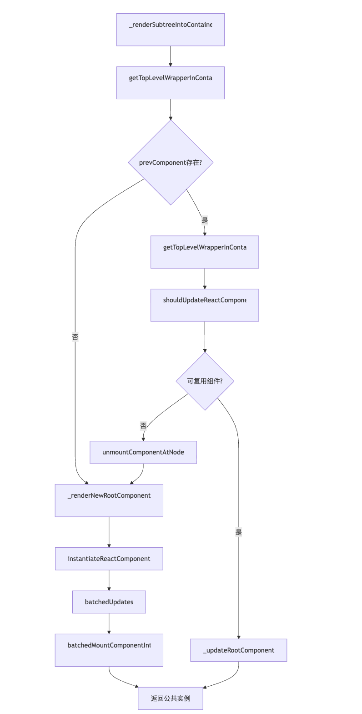

### 2.4、组件实例化层

源码位置：src/renderers/shared/stack/reconciler/instantiateReactComponent.js

```javascript
function instantiateReactComponent(node) {
  var instance;

  if (node === null || node === false) {
    // 空组件处理
    instance = ReactEmptyComponent.create(instantiateReactComponent);
  } else if (typeof node === 'object') {
    var element = node;
    if (typeof element.type === 'string') {
      // DOM原生组件 (div, span, etc)
      instance = ReactHostComponent.createInternalComponent(element);
    } else if (typeof element.type === 'function') {
      // 自定义组件 - 类组件或函数组件
      instance = new ReactCompositeComponentWrapper(element);
    }
  } else if (typeof node === 'string' || typeof node === 'number') {
    // 文本节点
    instance = ReactHostComponent.createInstanceForText(node);
  }

  return instance;
}
```


### 2.5、复合组件挂载过程

源码位置：src/renderers/shared/stack/reconciler/ReactCompositeComponent.js

```javascript
mountComponent: function(transaction, hostParent, hostContainerInfo, context) {
  this._context = context;
  this._mountOrder = nextMountID++;

  var publicProps = this._processProps(this._currentElement.props);
  var publicContext = this._processContext(context);

  var Component = this._currentElement.type;
  var inst = this._constructComponent(publicProps, publicContext);

  var renderedElement;

  // 处理无状态函数组件
  if (!shouldConstruct(Component)) {
    // 函数组件直接调用
    renderedElement = Component(publicProps, publicContext);
  } else {
    // 类组件设置实例
    inst.props = publicProps;
    inst.context = publicContext;
    inst.refs = emptyObject;
    inst.updater = ReactUpdateQueue;

    // 调用componentWillMount生命周期
    if (inst.componentWillMount) {
      inst.componentWillMount();
      // 注意：在componentWillMount中setState会在这里合并
      if (this._pendingStateQueue) {
        inst.state = this._processPendingState(inst.props, inst.context);
      }
    }

    // 调用render方法
    renderedElement = inst.render();
  }

  // 递归实例化子组件 - 这里是深度优先遍历的入口
  this._renderedComponent = this._instantiateReactComponent(
    renderedElement
  );

  // 递归调用子组件的mountComponent
  var markup = this._renderedComponent.mountComponent(
    transaction,
    hostParent,
    hostContainerInfo,
    this._processChildContext(context)
  );

  // 在事务完成后调用componentDidMount
  if (inst.componentDidMount) {
    transaction.getReactMountReady().enqueue(inst.componentDidMount, inst);
  }

  return markup;
}
```

### 2.6、DOM组件挂载过程

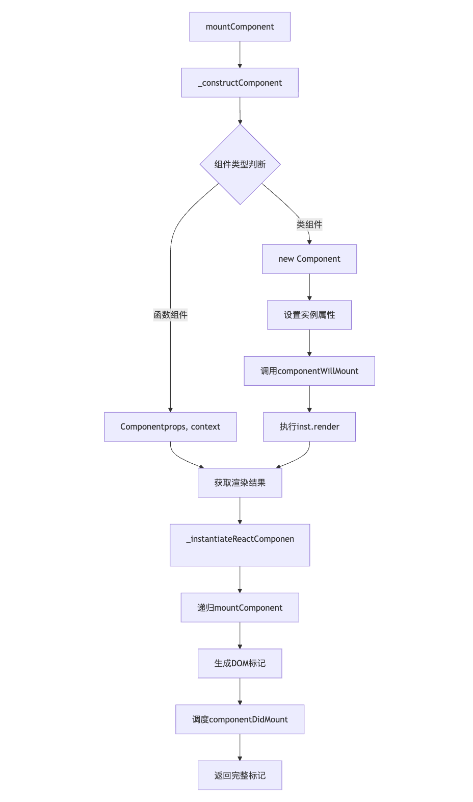

源码位置：src/renderers/dom/shared/ReactDOMComponent.js

```javascript
mountComponent: function(transaction, hostParent, hostContainerInfo, context) {
  this._rootNodeID = globalIdCounter++;
  this._hostParent = hostParent;
  this._hostContainerInfo = hostContainerInfo;

  var props = this._currentElement.props;
  var tag = this._currentElement.type;

  // 创建真实的DOM元素
  var el = document.createElement(tag);

  // 缓存DOM元素引用
  this._hostNode = el;

  // 设置DOM属性（className, style, events等）
  this._updateDOMProperties(null, props, transaction, el);

  // 创建子节点 - 关键递归点
  var children = props.children;
  if (children) {
    this._createInitialChildren(transaction, props, context, el);
  }

  // 将DOM元素挂载到容器
  if (hostContainerInfo) {
    hostContainerInfo.appendChild(el);
  }

  return el;
},

_createInitialChildren: function(transaction, props, context, el) {
  var children = props.children;

  if (typeof children === 'string' || typeof children === 'number') {
    // 文本子节点直接创建文本节点
    var textNode = document.createTextNode(children);
    el.appendChild(textNode);
  } else if (children) {
    // 单个子组件 - 递归实例化并挂载
    var childInstance = instantiateReactComponent(children);
    var childMarkup = childInstance.mountComponent(
      transaction,
      null, // hostParent
      el,   // hostContainerInfo - 直接传入当前元素作为容器
      context
    );

    // childMarkup已经是DOM元素，直接appendChild
    if (childMarkup && childMarkup.nodeType) {
      el.appendChild(childMarkup);
    }
  }
}
```

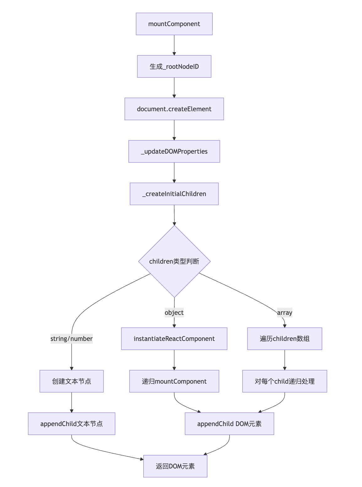

### 2.7、批处理更新机制

源码位置：src/renderers/shared/stack/reconciler/ReactUpdates.js

```javascript
var ReactUpdates = {
  batchedUpdates: function (callback, a, b, c, d, e) {
    // 确保在正确的批处理上下文中执行
    var alreadyBatchingUpdates = ReactDefaultBatchingStrategy.isBatchingUpdates;

    if (alreadyBatchingUpdates) {
      // 如果已经在批处理中，直接执行回调
      return callback(a, b, c, d, e);
    } else {
      // 否则开始新的批处理
      return ReactDefaultBatchingStrategy.batchedUpdates(callback, a, b, c, d, e);
    }
  },
};

// 默认批处理策略
var ReactDefaultBatchingStrategy = {
  isBatchingUpdates: false,

  batchedUpdates: function (callback, a, b, c, d, e) {
    var alreadyBatchingUpdates = ReactDefaultBatchingStrategy.isBatchingUpdates;
    ReactDefaultBatchingStrategy.isBatchingUpdates = true;

    try {
      // 执行实际工作
      return callback(a, b, c, d, e);
    } finally {
      // 无论成功失败都要重置标志
      ReactDefaultBatchingStrategy.isBatchingUpdates = alreadyBatchingUpdates;

      if (!ReactDefaultBatchingStrategy.isBatchingUpdates) {
        // 如果没有嵌套批处理，执行脏组件更新
        ReactUpdates.flushBatchedUpdates();
      }
    }
  },
};
```

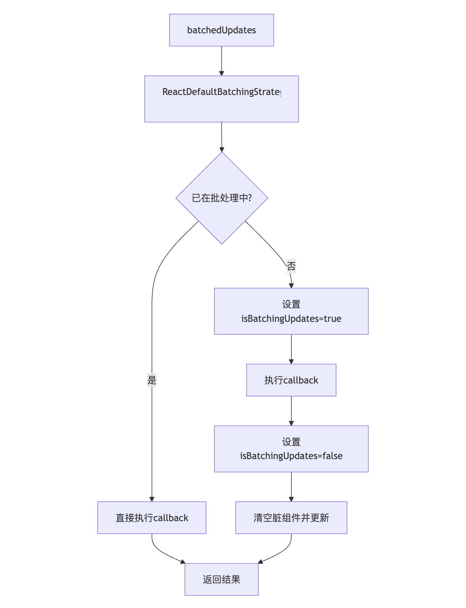

### 2.8、<font style="color:rgb(15, 17, 21);">深度优先遍历（DFS）</font>

假设我们有这样一个组件树：

```plain
App
  ├─ Header
  │    ├─ Logo
  │    └─ Nav
  │         ├─ HomeLink
  │         └─ AboutLink
  └─ Content
       ├─ Sidebar
       └─ Article
```

**①、开始遍历（递阶段）**

```plain
[帧1] 开始深度优先遍历
↓ 进入 App (开始工作)
```

```javascript
// ReactCompositeComponent.mountComponent 开始
mountComponent: function(transaction, hostParent, hostContainerInfo, context) {
  // 开始处理App组件
  this._context = context;
  var Component = this._currentElement.type;
  var inst = this._constructComponent(publicProps, publicContext);

  if (inst.componentWillMount) {
    inst.componentWillMount();  // App的componentWillMount
  }

  // 调用render获取子组件
  var renderedElement = inst.render(); // 返回[Header, Content]

  // 递归处理第一个子组件Header
  this._renderedComponent = this._instantiateReactComponent(renderedElement);
  var markup = this._renderedComponent.mountComponent(...);

  return markup;
}
```

**②、深入子组件**

```plain
[帧2] 递归进入子组件
App (进行中)
↓ 进入 Header (开始工作)
   ↓ 进入 Logo (开始工作)
```

源码逻辑：

- App组件开始工作，调用render()返回[Header, Content]。
- 实例化Header组件，递归调用Header.mountComponent()。
- Header调用render()返回[Logo, Nav]。
- 实例化Logo组件，递归调用Logo.mountComponent()。

**③、到达叶子节点**

```plain
[帧3] 到达第一个叶子节点
App (进行中)
Header (进行中)
Logo (完成!) ← 第一个完成节点
```

```javascript
// ReactDOMComponent.mountComponent - Logo是DOM组件
mountComponent: function(...) {
  var tag = this._currentElement.type; // 比如 'img'
  var el = document.createElement(tag); // 创建元素

  // 设置属性
  this._updateDOMProperties(null, props, transaction, el);

  // Logo没有子组件，直接返回DOM元素
  return el; // Logo完成！
}
```

**④、回溯到父节点并继续**

```plain
[帧4] 回溯并继续兄弟节点
App (进行中)
Header (进行中)
Logo (完成!)
↑ 回溯到Header
↓ 进入 Nav (开始工作)
```

```javascript
// 在Header.mountComponent中：
var renderedElement = inst.render(); // 返回[Logo, Nav]

// 先处理Logo
this._renderedComponents[0] = this._instantiateReactComponent(LogoElement);
var logoMarkup = this._renderedComponents[0].mountComponent(...);

// Logo完成后，继续处理Nav
this._renderedComponents[1] = this._instantiateReactComponent(NavElement);
var navMarkup = this._renderedComponents[1].mountComponent(...);

// 将两个子组件的DOM组合
var container = document.createElement('div');
container.appendChild(logoMarkup);
container.appendChild(navMarkup);
return container;
```

**⑤、继续深入孙子节点**

```plain
[帧5] 深入Nav的子节点
App (进行中)
Header (进行中)
Logo (完成!)
Nav (进行中)
↓ 进入 HomeLink (开始工作)
```

**⑥、完成深度分支**

```plain
[帧6] 完成一个完整分支
App (进行中)
Header (进行中)
Logo (完成!)
Nav (进行中)
HomeLink (完成!) ← 叶子节点
↑ 回溯到Nav
↓ 进入 AboutLink (开始工作)
```

**⑦、完成整个Header子树**

```plain
[帧7] 完成Header及其所有后代
App (进行中)
Header (进行中)
Logo (完成!)
Nav (完成!) ← Nav完成
HomeLink (完成!)
AboutLink (完成!)
↑ 回溯到Header ← Header所有子节点完成
Header (完成!) ← 调用componentDidMount
```

```javascript
// Header.mountComponent 完成阶段
mountComponent: function(...) {
  // ... 前面的递阶段工作

  // 所有子组件都已完成，Header本身完成
  var markup = ...; // 包含所有子DOM的完整标记

  // 调度componentDidMount
  if (inst.componentDidMount) {
    transaction.getReactMountReady().enqueue(inst.componentDidMount, inst);
  }

  return markup; // Header完成！
}
```

**⑧、回溯到App并继续Content分支**

```plain
[帧8] 回溯到根节点，开始另一分支
App (进行中)
Header (完成!)
↑ 回溯到App
↓ 进入 Content (开始工作)
```

**⑨、完成整个遍历**

```plain
[帧9] 完整遍历过程
App (进行中)
Header (完成!)
Content (进行中)
↓ 进入 Sidebar (开始工作)
Sidebar (完成!)
↑ 回溯到Content
↓ 进入 Article (开始工作)
Article (完成!)
↑ 回溯到Content
Content (完成!) ← 调用componentDidMount
↑ 回溯到App
App (完成!) ← 调用componentDidMount
```

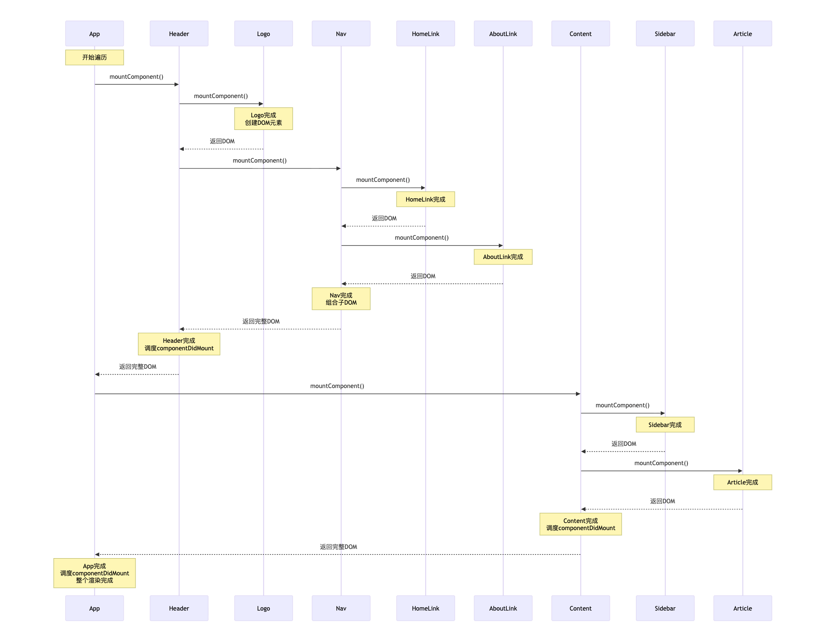

### 2.9、关键设计特点总结

- 同步递归：整个渲染过程是同步深度优先递归，无法中断。
- 即时DOM操作：在递归过程中直接创建和操作DOM元素。
- 调用栈管理：使用JavaScript调用栈管理组件树遍历，而不是显式的链表。
- 生命周期集成：生命周期方法直接在递归过程中调用。
- 批处理优化：通过事务机制批量处理setState和生命周期调用。

这种设计在组件树较小时性能优秀，但当组件树很大时，长时间的JavaScript执行会阻塞主线程，导致页面卡顿，这也是React 16引入Fiber架构的根本原因。

## 3、React 16的render方法概览

React 16的render过程主要分为两个阶段：

:::color1

- Reconciliation（协调阶段，也称为render阶段）：这个阶段会构建Fiber树，并标记需要更新的节点。这个阶段是可以中断的。
- Commit（提交阶段）：这个阶段将更新应用到DOM上，这个阶段是不可中断的。

:::

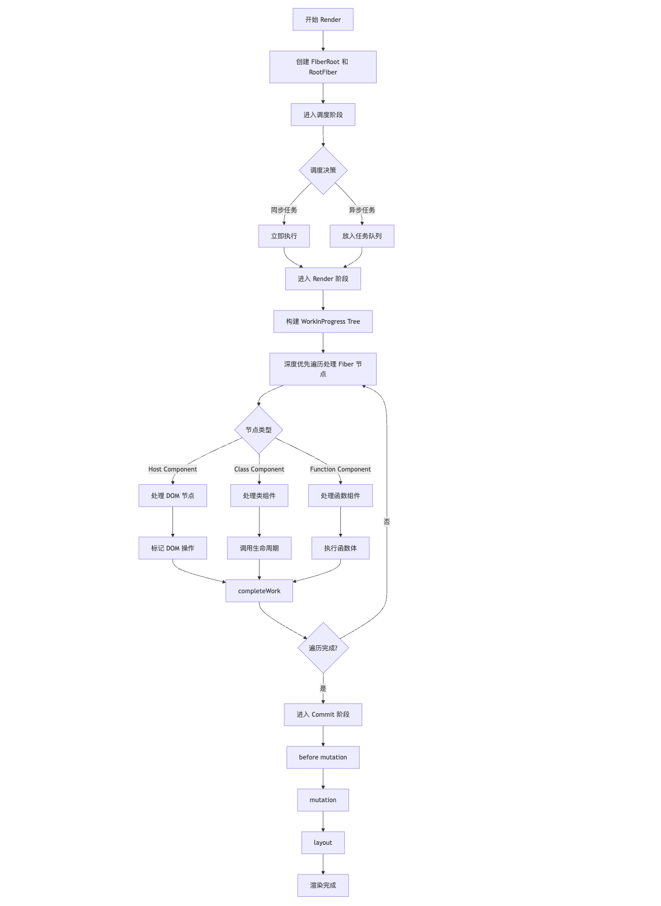

### 3.1、Reconciliation阶段（协调阶段）

在协调阶段，React会构建一棵Fiber树，这个树是在虚拟DOM树的基础上构建的，每个Fiber节点代表一个React元素。协调阶段的工作是异步的，可以被中断。React会根据优先级来调度任务。

**协调阶段的主要步骤：**

:::color1

1. 从根节点开始，遍历Fiber树。
2. 对于每个Fiber节点，调用beginWork函数，这个函数会根据组件的类型（函数组件、类组件、宿主组件等）来更新组件，并返回子组件，然后继续对子组件进行相同的处理。
3. 如果没有子节点，则调用completeWork函数来完成当前节点的工作，然后处理兄弟节点，如果兄弟节点也不存在，则返回父节点。

:::

这个过程可以看作是一个**深度优先遍历**。

```javascript
function workLoopSync() {
  while (workInProgress !== null) {
    performUnitOfWork(workInProgress);
  }
}

function performUnitOfWork(unitOfWork) {
  const next = beginWork(unitOfWork); // 处理当前节点，并返回子节点
  if (next === null) {
    completeUnitOfWork(unitOfWork); // 如果没有子节点，则完成当前节点
  } else {
    workInProgress = next; // 继续处理子节点
  }
}

function completeUnitOfWork(unitOfWork) {
  let completedWork = unitOfWork;
  do {
    const next = completeWork(completedWork); // 完成当前节点的工作
    if (next !== null) {
      workInProgress = next; // 如果有下一个节点（兄弟节点），则处理兄弟节点
      return;
    }
    const returnFiber = completedWork.return; // 如果没有兄弟节点，则返回父节点
    completedWork = returnFiber;
    workInProgress = completedWork;
  } while (completedWork !== null);
}
```

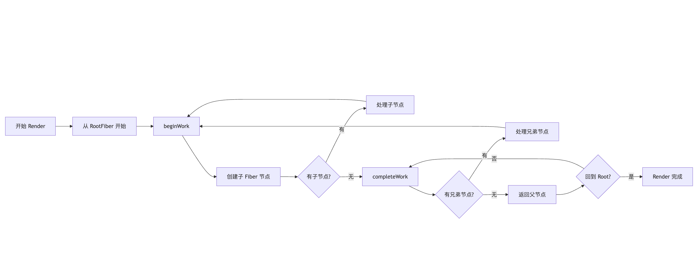

### 3.2、Commit阶段（提交阶段）

当协调阶段完成，即构建完整个Fiber树并标记了需要更新的节点后，就会进入提交阶段。提交阶段会同步执行，不可中断。

**提交阶段的主要步骤：**

:::color1

1. 在提交阶段，React会处理副作用（如DOM更新、生命周期函数等）。提交阶段分为三个子阶段：
2. before mutation阶段：在DOM更新之前，会调用getSnapshotBeforeUpdate生命周期函数。
3. mutation阶段：执行DOM更新。
4. layout阶段：更新完成后，会调用componentDidMount或componentDidUpdate等生命周期函数，以及函数组件的useLayoutEffect钩子。

:::

```javascript
function commitRoot(root) {
  const finishedWork = root.finishedWork;
  // 第一个子阶段：before mutation
  commitBeforeMutationEffects(finishedWork);

  // 第二个子阶段：mutation
  commitMutationEffects(finishedWork);

  // 第三个子阶段：layout
  commitLayoutEffects(finishedWork);
}
```

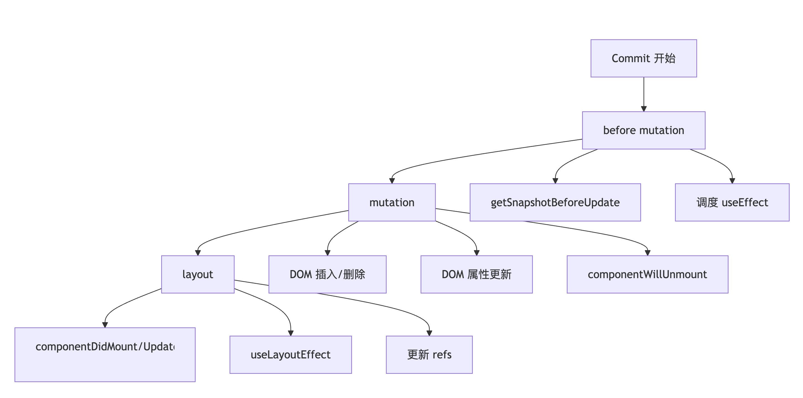

```plain
┌─────────────────────────────────────────────────┐
│                  Commit 阶段                     │
├─────────────────┬───────────────────────────────┤
│  before mutation │ • 调用 getSnapshotBeforeUpdate │
│                 │ • 调度 useEffect              │
├─────────────────┼───────────────────────────────┤
│    mutation     │ • DOM 插入: placement         │
│                 │ • DOM 更新: update            │
│                 │ • DOM 删除: deletion          │
│                 │ • 调用 componentWillUnmount   │
├─────────────────┼───────────────────────────────┤
│     layout      │ • 调用 componentDidMount      │
│                 │ • 调用 componentDidUpdate     │
│                 │ • 执行 useLayoutEffect        │
│                 │ • 更新 refs                   │
└─────────────────┴───────────────────────────────┘
```

## 4、react16对比react15优势

React 15和16都是深度优先遍历，React 16的优势到底体现在哪里呢？首先，我们需要理解React 15的Stack Reconciler和React 16的Fiber Reconciler在遍历过程中的区别。

### 4.1、React 15的Stack Reconciler（递归深度优先遍历）

- 递归遍历整个组件树，直到叶子节点，然后返回。
- 在这个过程中，JavaScript会一直占用主线程，直到整个树被遍历完成。如果组件树很大，则会导致主线程被长时间占用，从而阻塞用户交互和其他高优先级任务（如动画），导致掉帧。

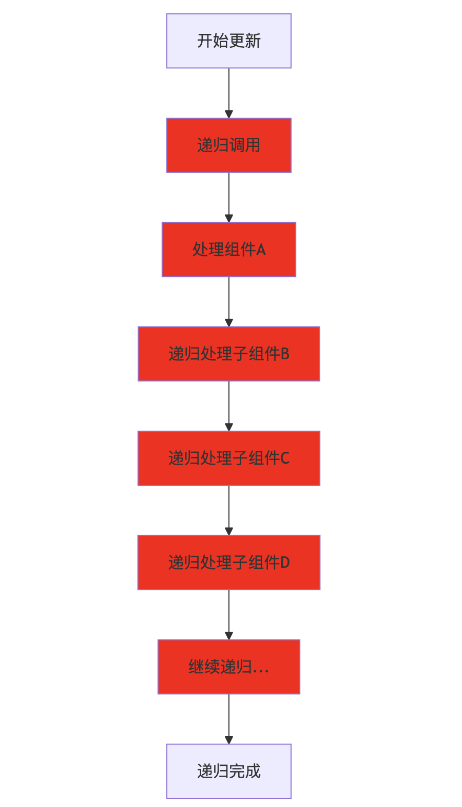

### 4.2、React 16的Fiber Reconciler（基于链表的深度优先遍历）

- 将整个渲染过程分解为多个小单元（每个Fiber节点就是一个工作单元），并且可以在每个单元执行后中断，让出主线程给高优先级任务，然后再继续执行。
- 通过requestIdleCallback（或setTimeout）来在浏览器的空闲时间执行任务，并且可以设置任务的优先级。

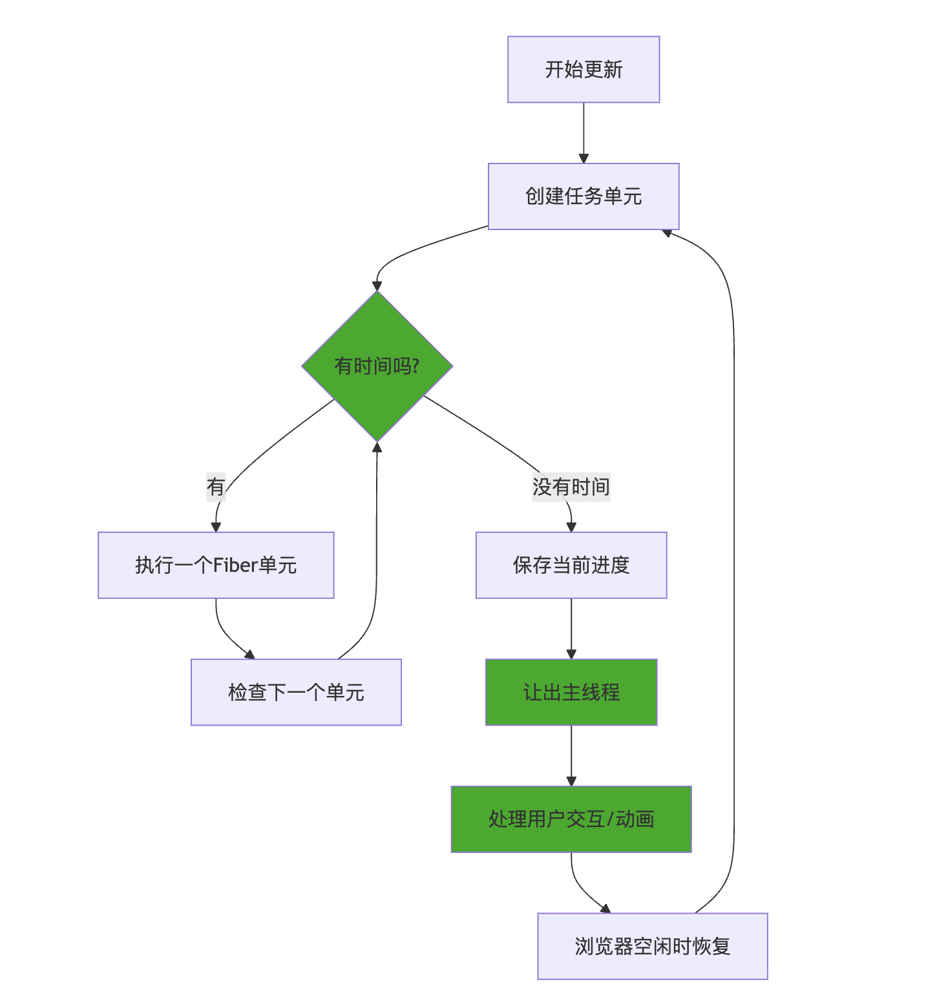

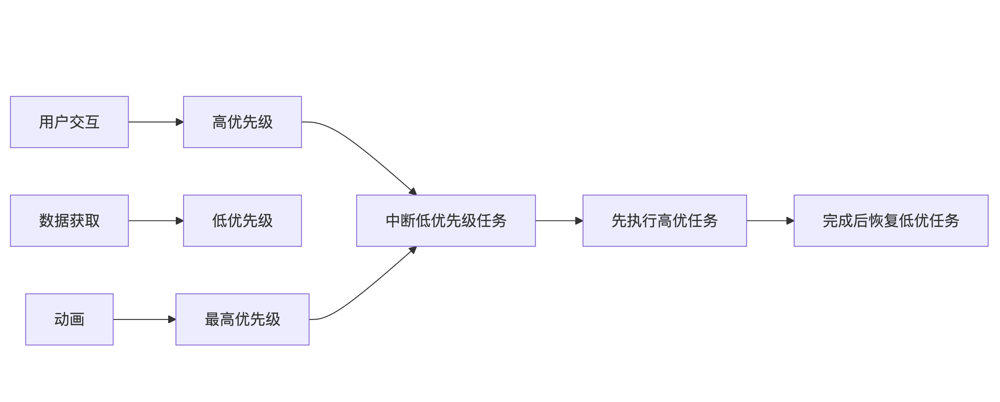

**具体来说，React 16的优势在于：**

:::color1

1. **可中断性**：React 15的递归遍历是不可中断的，一旦开始就必须执行完。而React 16将递归的不可中断的遍历改成了可中断的遍历，通过循环模拟递归，并且将每个Fiber节点作为一个工作单元，每次执行一个单元，然后检查是否还有时间，如果没有时间就暂停，下次再继续。
2. **优先级调度**：React 16可以为不同的更新设置不同的优先级。高优先级的更新（如用户输入）可以中断低优先级的更新（如渲染一个很大的列表），从而使得用户交互更加流畅。
3. **更好的错误处理**：React 16引入了错误边界（Error Boundaries），可以捕获子组件树的JavaScript错误，并显示降级UI。
4. **更高效的更新**：Fiber架构下，React可以更好地利用浏览器的空闲时间，将渲染工作拆分成多个帧，避免长时间阻塞主线程。
5. **新的生命周期**：为了适应异步渲染，React 16引入了新的生命周期（如getDerivedStateFromProps、getSnapshotBeforeUpdate）并废弃了一些不安全的生命周期（如componentWillMount、componentWillUpdate等）。
6. **支持更多的组件类型**：例如Fragment、Portal、StrictMode等。

:::

## 5、React 16的render方法依次梳理

```javascript
  ReactDOM.render(...)
     ↓
  legacyRenderSubtreeIntoContainer(...)
     ↓
   （首次渲染）→ 创建 fiberRoot
     ↓
  updateContainer(<App />, fiberRoot, null, callback)
     ↓ ←───────────────────────┐
  提交 update                   │
  并scheduleWork                │
     ↓                         │
  scheduleUpdateOnFiber()      │
     ↓                         │
  performSyncWorkOnRoot(root)     ← 进入Render阶段
     ↓
  workLoopSync()      ← 推动Fiber树的遍历
     ↓
  performUnitOfWork     ← 处理单个 Fiber 节点
     ↓
  beginWork     ← 创建App、div、button等Fiber节点，构建子节点，生成child fiber
     ↓
  completeUnitOfWork    ← 完成当前unit后，跳转到sibling或return parent
     ↓
  completeWork     ← 创建真实DOM（但未插入）
     ↓
  commitRoot(root)  ← 进入Commit阶段（唯一操作DOM的地方）
     ↓
   commitBeforeMutationEffects   ← 聚焦旧节点、处理Suspense
     ↓
   commitMutationEffects       ← 删除、插入、更新DOM
     ↓
   commitLayoutEffects         ← 调用componentDidMount / useLayoutEffect
     ↓
   执行 callback               ← 用户传入的回调函数在此被调用
```

### 5.1、初始化阶段

#### 5.1.1、render

**参数介绍：**

- element：要渲染的React元素（例如通过React.createElement 创建）。
- container：目标DOM容器（如document.getElementById('root')）。
- callback：可选的回调函数，在渲染/更新完成后执行。

**返回值：**

返回legacyRenderSubtreeIntoContainer函数调用。

```javascript
/**
 * 渲染入口：将 React 组件渲染到 DOM 容器中
 *
 * @param {React$Element} element - 要渲染的 React 元素（例如通过 React.createElement 创建）
 * @param {Container} container - 目标 DOM 容器（如 document.getElementById('root')）
 * @param {?Function} callback - 可选的回调函数，在渲染/更新完成后执行
 */
export function render(
  element: React$Element<any>,   // 要渲染的根元素，比如 <App />
  container: Container,          // DOM 容器，如 <div id="root"></div>
  callback: ?Function            // 渲染完成后调用的函数
) {
  // console.log(container, 'container'); // 输出容器 DOM 节点
  // console.log(container.nodeType, 'container nodeType'); // 应为 1（元素节点）
  // console.log(isValidContainer(container), 'isValidContainer(container)'); // 是否合法

  // nodeType 是 DOM 节点的标准属性，表示节点类型：
  //   1 -> 元素节点（如 div、span）
  //   3 -> 文本节点
  //   8 -> 注释节点
  //   9 -> document 节点
  //   11 -> DocumentFragment
  // 我们只允许渲染到元素节点上（nodeType === 1）

  // -----------------------------
  // 🔍 检查容器是否有效
  // -----------------------------
  // invariant(condition, message) 是 React 内部断言工具
  // 如果条件不成立，则抛出错误
  invariant(
    isValidContainer(container),
    'Target container is not a DOM element.' // 错误提示
  );

  // -----------------------------
  // ⚠️ 开发警告：防止与 React 18 新 API 混用
  // -----------------------------
  if (__DEV__) {
    // 检查该容器是否曾被用于 React 18 的 createRoot()
    const isModernRoot =
      isContainerMarkedAsRoot(container) && container._reactRootContainer === undefined;

    if (isModernRoot) {
      console.error(
        'You are calling ReactDOM.render() on a container that was previously ' +
        'passed to ReactDOM.createRoot(). This is not supported. ' +
        'Did you mean to call root.render(element)?'
      );
    }
    // 💡 这个警告是为了避免开发者在一个用 React 18 方式初始化的容器上，
    //    错误地使用旧版 ReactDOM.render()。
  }

  // -----------------------------
  // 🚀 核心逻辑：进入旧版渲染流程
  // -----------------------------
  return legacyRenderSubtreeIntoContainer(
    null,        // parentComponent: 初始渲染没有父组件
    element,     // 要渲染的 React 元素树（虚拟 DOM）
    container,   // 真实 DOM 容器
    false,       // forceHydrate: 是否为服务端渲染后“注水”
                 // false = 客户端首次渲染；true = SSR hydration
    callback     // 渲染或更新完成后执行的回调
  );
}
```

**关键知识点解析：**

**①、isValidContainer(container)**

- 用来判断传入的container是否是一个合法的DOM容器。
- 必须满足：
  - 是真实DOM节点（instanceof Node）。
  - nodeType === 1（元素节点）、9（document）、11（fragment）。
  - 不是<html>标签（出于安全考虑不允许挂载到根标签）。

**②、invariant(condition, message)**

- React内部使用的断言函数。
- 类似于 if (!condition) throw new Error(message)。
- 在生产环境中会被压缩成极简形式，不影响性能。

**③、**DEV** 和开发警告**

- **DEV** 是编译时注入的常量，仅在开发环境为 true。
- 这里的警告是为了兼容 React 18：
  - 如果你先用了 createRoot(rootNode)（React 18 新 API）。
  - 然后又调用 ReactDOM.render(...)，会触发此警告。

**④、legacyRenderSubtreeIntoContainer(...)**

- 检查是否首次渲染（是否有\_reactRootContainer）。
- 创建 Fiber Root 或复用已有实例
- 调度更新任务
- 执行首次挂载或后续更新

所以render()函数本身只是一个封装入口，真正的逻辑在legacyRenderSubtreeIntoContainer中。

#### 5.1.2、legacyRenderSubtreeIntoContainer

用于初始化或更新组件树渲染到DOM容器的核心函数之一。它在React的legacy模式（即非并发模式）下使用。核心功能包括：

:::color1

- 初始化Fiber树结构（创建fiberRoot和rootFiber）。
- 支持服务端渲染（hydrate）。
- 处理首次渲染与更新逻辑。
- 支持渲染完成后的回调，并正确绑定this。
- 返回根组件实例（供外部访问）。

:::

**参数介绍：**

- parentComponent：可选的父组件实例，初始渲染时为null，一般用于嵌套渲染场景。
- children：ReactNodeList，要渲染的 React 元素（如 `<App />`）。
- container：DOM容器，实际挂载的DOM节点（如 document.getElementById('root')）。
- forceHydrate：布尔值，是否强制水合（SSR 场景），true表示服务端渲染后客户端接管。
- callback：回调函数，组件挂载/更新完成后执行的回调。

```javascript
/**
 * 该方法是将子树渲染到容器中(初始化Fiber数据结构，创建fiberRoot及rootFiber对象)
 * @param {React$Component} parentComponent:父组件，初始渲染时传null
 * @param {ReactNodeList} children:方法中的第一个参数，要渲染的ReactElement
 * @param {Container} container:渲染容器
 * @param {boolean} forceHydrate:true为服务端渲染，false为客户端渲染
 * @param {Function} callback:组件渲染完成后需要执行的回调函数
 */
// 2、legacyRenderSubtreeIntoContainer函数
function legacyRenderSubtreeIntoContainer(
  parentComponent: ?React$Component<any, any>,
  children: ReactNodeList,
  container: Container,
  forceHydrate: boolean,
  callback: ?Function
) {
  if (__DEV__) {
    topLevelUpdateWarnings(container);
    warnOnInvalidCallback(callback === undefined ? null : callback, 'render');
  }
  /**
   * 检测container是否已经是初始化的渲染容器
   * react会在初始渲染时为最外层容器中添加_reactRootContainer属性
   * react会根据此属性进行不同渲染的方式
   * root不存在表示初始渲染
   * root存在表示更新
   */
  //  获取container对象中是否有_reactRootContainer属性
  let root: RootType = (container._reactRootContainer: any);
  // 即将存储根Fiber对象
  let fiberRoot;
  if (!root) {
    // 初始化渲染
    // 初始化根Fiber数据结构
    // 为container容器添加_reactRootContainer属性
    // 在_reactRootContainer对象中有一个属性叫做_internalRoot
    // _internalRoot属性值即为FiberRoot,表示根节点Fiber数据结构
    root = container._reactRootContainer = legacyCreateRootFromDOMContainer(
      container,
      forceHydrate
    );
    // 获取FiberRoot对象
    fiberRoot = root._internalRoot;
    /**
     * 改变Callback函数中this的指向
     * 使其指向render方法第一个参数的真实DOM对象
     */
    // 如果Callback参数是函数类型
    if (typeof callback === 'function') {
      // 使用originalCallback存储callback函数
      const originalCallback = callback;
      // callback参数重新赋值
      callback = function () {
        // 获取render方法第一个参数的真实DOM对象
        // 实际上就是id为root的div子元素
        const instance = getPublicRootInstance(fiberRoot);
        originalCallback.call(instance);
      };
    }
    unbatchedUpdates(() => {
      updateContainer(children, fiberRoot, parentComponent, callback);
    });
  } else {
    fiberRoot = root._internalRoot;
    if (typeof callback === 'function') {
      const originalCallback = callback;
      callback = function () {
        const instance = getPublicRootInstance(fiberRoot);
        originalCallback.call(instance);
      };
    }
    updateContainer(children, fiberRoot, parentComponent, callback);
  }
  const logTest = getPublicRootInstance(fiberRoot);
  console.log(logTest, 'legacyRenderSubtreeIntoContainer return');
  return logTest;
}
```

**分步详细分析：**

**①、开发环境警告检查（仅 DEV）**

```javascript
if (__DEV__) {
  topLevelUpdateWarnings(container);
  warnOnInvalidCallback(callback === undefined ? null : callback, 'render');
}
```

在开发环境下进行一些运行时警告：

- topLevelUpdateWarnings: 检查是否重复调用render、是否有不推荐的用法等。
- warnOnInvalidCallback: 验证callback是否是一个合法函数（避免传入字符串、数字等错误类型）。

这些都属于开发者友好提示，不影响主流程。

**②、判断是否为首次渲染**

```javascript
let root: RootType = (container._reactRootContainer: any);
```

- React会在第一次渲染时，在DOM容器上添加一个私有属性\_reactRootContainer，用来保存整个应用的“根上下文”。
- 如果该属性存在，说明已经初始化过；否则是首次渲染。

```javascript
if (!root) {
  // 首次渲染
} else {
  // 更新阶段
}
```

这是React区分「初始化」和「更新」的关键机制。

##### 5.1.2.1、首次渲染阶段

当调用ReactDOM.render(...) 第一次挂载应用到某个DOM容器时，该容器还没有被React初始化过。此时会进入首次渲染流程。触发条件：

```javascript
if (!root) { // 即 container._reactRootContainer 不存在
```

**首次渲染具体步骤：**

**①、创建并初始化根结构：legacyCreateRootFromDOMContainer**

```javascript
root = container._reactRootContainer = legacyCreateRootFromDOMContainer(container, forceHydrate);
```

作用：为这个DOM容器创建整个React应用所需的“运行时上下文”。

**内部主要工作包括：**

- 清空容器内容（除非是服务端渲染 forceHydrate === true）。
- 调用createFiberRoot(container)创建FiberRoot和对应的HostRootFiber。
- 设置初始fiber树结构。
- 如果是hydrate模式，保留现有DOM节点等待复用。

FiberRoot是整个应用的“总控对象”，保存着当前树、待处理更新队列、副作用列表等。

**②、获取fiberRoot引用**

```javascript
fiberRoot = root._internalRoot;
```

后续所有调度操作都基于这个fiberRoot进行。

**③、处理回调函数（修正this指向）**

```javascript
if (typeof callback === 'function') {
  const originalCallback = callback;
  callback = function () {
    const instance = getPublicRootInstance(fiberRoot);
    originalCallback.call(instance);
  };
}
```

目的是让callback()中的this指向根组件的实例（比如`<App />`的类实例）。getPublicRootInstance(fiberRoot) 返回最外层组件的公共实例：

:::color1

- 类组件 → 实例对象
- 函数组件 → null

:::

**④、执行非批量更新（确保立即生效）**

```javascript
unbatchedUpdates(() => {
  updateContainer(children, fiberRoot, parentComponent, callback);
});
```

unbatchedUpdates: 在legacy模式下，强制本次更新不被批量合并，立即执行。

updateContainer(...): 将 children（如 `<App />`）作为一次更新任务提交给 fiberRoot：

:::color1

- 创建一个Update对象加入更新队列。
- 触发reconciliation（协调）过程。
- 开始构建work-in-progress Fiber树。
- 最终在commit阶段将DOM插入页面。

:::

至此，React 完成了首次渲染的全部准备工作和实际渲染。

**⑤、返回根组件实例**

```javascript
return getPublicRootInstance(fiberRoot);
```

可用于外部访问组件实例（仅对class组件有效）。

结果：页面上出现了React渲染的内容，且容器已被打上标记，下次再render就走更新路径。

##### 5.1.2.2、更新阶段

当再次调用ReactDOM.render(`<NewApp />`, container)，而该容器已经渲染过一次，就会进入更新逻辑。触发条件：

```javascript
if (!root) {
  /* 初始 */
} else {
  /* 更新 */
}
```

即：container.\_reactRootContainer已存在。

**更新阶段具体步骤：**

**①、 复用已有root和fiberRoot**

```javascript
fiberRoot = root._internalRoot;
```

不需要重新创建任何Fiber结构，直接复用之前创建好的FiberRoot和fiber树上下文。这意味着：同一个容器多次render，只是更新内容，不会重建应用！

**②、处理回调函数（同首次渲染）**

```javascript
if (typeof callback === 'function') {
  const originalCallback = callback;
  callback = function () {
    const instance = getPublicRootInstance(fiberRoot);
    originalCallback.call(instance);
  };
}
```

同样包装callback，保证this指向正确，行为与首次一致。

**③、提交更新任务**

```javascript
updateContainer(children, fiberRoot, parentComponent, callback);
```

:::color1

- 把新的children作为一个更新任务提交。
- 不使用unbatchedUpdates（因为在更新模式下不需要强制同步）。
- 触发标准的更新流程：
  - schedule update。
  - beginWork / reconcile。
  - commit变更DOM。

:::

注意：这里没有unbatchedUpdates包裹，说明更新可能参与批量更新优化（比如多个setState合并）。

**④、返回根组件实例**

```javascript
return getPublicRootInstance(fiberRoot);
```

可用于外部访问组件实例（仅对class组件有效）。

**补充说明：**

**多次render的含义：**

```javascript
ReactDOM.render(<App />, root); // 首次：初始化 + 渲染
ReactDOM.render(<App2 />, root); // 更新：diff 替换内容
```

这并不会创建两个React应用，而是同一个应用的两次更新。如果想卸载必须显示调用：

```javascript
ReactDOM.unmountComponentAtNode(root);
// 然后才能重新开始一个新的“首次渲染”
```

#### 5.1.3、legacyCreateRootFromDOMContainer

它是legacyRenderSubtreeIntoContainer中用于初始化阶段的核心函数之一。为指定的DOM容器创建一个React的“根上下文”（即FiberRoot），并根据是否是服务端渲染（SSR），决定是否清空容器内容。

**参数介绍：**

- container：Container（DOM元素），要挂载React应用的DOM容器，如<div id="root"></div>。
- forceHydrate：boolean，是否强制启用hydration（水合），通常在SSR场景下传true。

```javascript
/**
 * 判断是否为服务器渲染，如果不是服务器端渲染
 * 清空container容器中的节点
 */
// legacyCreateRootFromDOMContainer函数
function legacyCreateRootFromDOMContainer(container: Container, forceHydrate: boolean): RootType {
  // container为<div id='root'></div>
  // 检测是否为服务端渲染
  const shouldHydrate = forceHydrate || shouldHydrateDueToLegacyHeuristic(container);
  // 如果不是服务端渲染
  if (!shouldHydrate) {
    let warned = false;
    // 存储container内部的子元素
    let rootSibling;
    // 开启循环，删除container容器中的节点，注意这里是先赋值container.lastChild给rootSibling
    // 然后删掉rootSibling，直到container没有lastChild，其返回为undefined
    while ((rootSibling = container.lastChild)) {
      if (__DEV__) {
        if (
          !warned &&
          rootSibling.nodeType === ELEMENT_NODE &&
          (rootSibling: any).hasAttribute(ROOT_ATTRIBUTE_NAME)
        ) {
          warned = true;
          console.error(
            'render(): Target node has markup rendered by React, but there ' +
              'are unrelated nodes as well. This is most commonly caused by ' +
              'white-space inserted around server-rendered markup.'
          );
        }
      }
      container.removeChild(rootSibling);
      /**
       * 为什么要清除container中的元素
       * 有时需要在container中放置一些占位图或者loading图以提高首屏加载用户体验。
       * 就无可避免需要向container中加入html标记。
       * 在将ReactElement渲染到container之前，必须要先清空container
       * 因为占位图和ReactElement不能同时显示
       * 在加入占位代码时，最好只有一个父元素，可以减少内部代码循环次数以提高性能
       * <div>
       *  <p>1</p>
       *  <p>2</p>
       * </div>
       */
    }
  }
  if (__DEV__) {
    if (shouldHydrate && !forceHydrate && !warnedAboutHydrateAPI) {
      warnedAboutHydrateAPI = true;
      console.warn(
        'render(): Calling ReactDOM.render() to hydrate server-rendered markup ' +
          'will stop working in React v17. Replace the ReactDOM.render() call ' +
          'with ReactDOM.hydrate() if you want React to attach to the server HTML.'
      );
    }
  }
  const logTest = createLegacyRoot(
    container,
    shouldHydrate
      ? {
          hydrate: true,
        }
      : undefined
  );
  return logTest;
}
```

**整体执行流程概览：**

```javascript
legacyCreateRootFromDOMContainer(container, forceHydrate)
         ↓
   判断 shouldHydrate（是否服务端渲染）
         ↓
    否？ → 清空 container 所有子节点
         ↓
    是？ → 保留原有 HTML 结构（准备复用）
         ↓
   调用 createLegacyRoot(...) 创建 FiberRoot
         ↓
      返回 Root 对象（含 _internalRoot）
```

**分步详解：**

**①、判断是否需要Hydration（服务端渲染接续）**

```javascript
const shouldHydrate = forceHydrate || shouldHydrateDueToLegacyHeuristic(container);
```

确定当前是否处于“hydration”模式 —— 即客户端接管服务端已渲染的HTML。

两种判断依据：

| 来源                                                                                  | 说明                                                                                                          |
| ------------------------------------------------------------------------------------- | ------------------------------------------------------------------------------------------------------------- |
| <font style="color:rgb(0, 0, 0);">forceHydrate</font>                                 | <font style="color:rgb(0, 0, 0);">外部直接指定（比如调用render(..., true)）</font>                            |
| <font style="color:rgb(0, 0, 0);">shouldHydrateDueToLegacyHeuristic(container)</font> | <font style="color:rgb(0, 0, 0);">启发式检测：检查容器内是否有服务端渲染留下的标记（如data-reactroot）</font> |

这个启发式方法会查看容器内部是否存在带data-reactroot=""属性的元素，如果有，则认为是SSR输出的内容，建议使用hydrate()。

⚠️ 注意：React官方后来推荐使用ReactDOM.hydrate()显式进行hydration，而不是通过render(..., true)。

**②、如果不是hydration模式 → 清空容器**

```javascript
if (!shouldHydrate) {
  let warned = false;
  let rootSibling;

  while ((rootSibling = container.lastChild)) {
    if (__DEV__) {
      if (
        !warned &&
        rootSibling.nodeType === ELEMENT_NODE &&
        (rootSibling: any).hasAttribute(ROOT_ATTRIBUTE_NAME)
      ) {
        warned = true;
        console.error(
          'render(): Target node has markup rendered by React, but there ' +
            'are unrelated nodes as well. This is most commonly caused by ' +
            'white-space inserted around server-rendered markup.'
        );
      }
    }
    container.removeChild(rootSibling);
  }
}
```

为什么要清空？

- 因为接下来要由React完全控制这个容器。
- React需要从零开始构建DOM，不能让旧内容干扰。
- 特别是在非SSR场景下，任何已有HTML都可能是占位图、loading动画或遗留代码。

**删除方式：倒序删除最后一个子节点：**

注意这里是先将container.lastChild赋值给rootSibling，然后使用while判断rootSibling是否为undefined。

```javascript
while ((rootSibling = container.lastChild)) {
  container.removeChild(rootSibling);
}
```

如果发现某个子节点是由React之前渲染出来的（带有data-reactroot等属性），但又不是完整的hydration结构，就会报错：

```javascript
❗ 'render(): Target node has markup rendered by React...'
```

**常见原因：**

- 在服务端渲染后，手动修改了HTML插入了额外空格或注释。
- 或者重复调用了render而没有卸载。

**③、开发环境提示：建议使用hydrate()**

```javascript
if (__DEV__) {
  if (shouldHydrate && !forceHydrate && !warnedAboutHydrateAPI) {
    warnedAboutHydrateAPI = true;
    console.warn(
      'render(): Calling ReactDOM.render() to hydrate server-rendered markup ' +
        'will stop working in React v17. Replace the ReactDOM.render() call ' +
        'with ReactDOM.hydrate() if you want React to attach to the server HTML.',
    );
  }
}
```

如果你没传forceHydrate=true，但系统检测出这是服务端渲染内容，那应该用ReactDOM.hydrate(`<App />`, container) 而不是render(..., true)，否则在未来版本（v17+）中将不再支持！实际上从React 18开始hydrate和render都被新的createRoot API替代。

**④、 创建Legacy Root（核心步骤）**

```javascript
return createLegacyRoot(
  container,
  shouldHydrate
    ? {
        hydrate: true,
      }
    : undefined,
);
```

createLegacyRoot实际上封装了：

```javascript
new ReactDOMBlockingRoot(container, LegacyRoot, options);
```

#### 5.1.4、createLegacyRoot

createLegacyRoot实际上封装了：

```javascript
new ReactDOMBlockingRoot(container, LegacyRoot, options);
```

```javascript
/**
 * 通过实例化 ReactDOMBlockingRoot类创建LegacyRoot
 * @param {Container} container:要渲染React组件的DOM容器，例如一个带有id='root'的<div>元素。
 * @param {RootOptions} options:可选的配置对象，可以包含一些额外的选项，如渲染策略等。
*/
export function createLegacyRoot(
  container: Container,
  options?: RootOptions,
): RootType {
  // container为<div id='root'></div>
  // LegacyRoot为常量，值为0
  // 通过render方法创建的container就是LegacyRoot
  return new ReactDOMBlockingRoot(container, LegacyRoot, options);
}
```

#### 5.1.5、ReactDOMBlockingRoot

作用：创建一个“阻塞式”的React根实例（即Legacy模式下的根），并初始化其内部的Fiber结构FiberRoot，为后续渲染和更新做准备。

```javascript
/**
 * 创建ReactDOMBlockingRoot的类
 * 通过它可以创建LegacyRoot的Fiber数据结构
 * @param {Container} container: 这是React组件要挂载的DOM容器，例如一个<div>元素。
 * @param {RootTag} tag :RootTag 0 | 1 | 2
 * @param {RootOptions} options  可选参数，包含一些配置，如是否启用 hydrate（ hydrate 选项）和 hydrate 时的回调函数（ hydrationOptions 选项）。
 * 函数的主要工作是创建一个_internalRoot属性，并将其赋值为createRootImpl函数的返回值。createRootImpl是一个内部函数，它根据传入的参数（容器、根类型和选项）创建一个React根实例的实现。这个根实例包含了React如何管理组件的渲染和更新的内部逻辑。
 * 在ReactDOMBlockingRoot构造函数执行后，container对象会被赋予一个_reactRootContainer属性，这个属性包含一个internalRoot对象，它是React内部用于存储与这个根实例相关的数据结构。这样，当调用render方法时，React可以找到并操作这个内部根来更新组件树。
*/
function ReactDOMBlockingRoot(
  container: Container,
  tag: RootTag,
  options: void | RootOptions,
) {
  // tag =》 0 =》 legacyRoot
  // container =》 <div id='root'></div>
  // container._reactRootContainer = {internalRoot:{}}
 this._internalRoot = createRootImpl(container, tag, options);
}
```

**RootTag的三种取值：**

| 值  | 常量名         | 含义                                    |
| --- | -------------- | --------------------------------------- |
| 0   | LegacyRoot     | 传统同步渲染模式（ReactDOM.render使用） |
| 1   | BlockingRoot   | 过渡模式（Concurrent 模式早期版本）     |
| 2   | ConcurrentRoot | 完全并发模式（React 18+ 的createRoot）  |

当前函数中传入的是LegacyRoot(0)，所以它代表的是旧版同步阻塞渲染模式。

**createRootImpl的核心：**

```javascript
this._internalRoot = createRootImpl(container, tag, options);
```

这是一个内部封装函数，主要职责是：

:::color1

- 调用createFiberRoot(container, ...) 创建完整的Fiber树根结构；
- 返回一个FiberRoot实例；
- 设置初始状态、更新队列、副作用链等；

:::

**简化理解：**

```javascript
function createRootImpl(container, tag, options) {
  const isHydrate = options?.hydrate;
  return createFiberRoot(container, tag, null, isHydrate, null, null);
}
```

最终返回的是FiberRoot对象，赋值给this.\_internalRoot。

#### 5.1.6、createRootImpl

功能：根据传入的DOM容器、根类型（Legacy/Concurrent）和配置选项，创建一个完整的FiberRoot实例，并进行必要的初始化设置（如hydration支持、事件监听等），最终返回这个FiberRoot。

```javascript
/**
 * @param {Container} container: 这是React组件要挂载的DOM容器，例如一个<div>元素。
 * @param {RootTag} tag :RootTag 0 | 1 | 2
 * @param {RootOptions} options  可选参数，包含一些配置，如是否启用 hydrate（ hydrate 选项）和 hydrate 时的回调函数（ hydrationOptions 选项）。
 * @returns {FiberRoot}
 * createRootImpl是React DOM中创建根实例的核心函数，它处理了不同场景下的渲染和 hydrate 操作，为React组件的生命周期管理提供了基础。
 */
// createRootImpl函数
function createRootImpl(
  container: Container,
  tag: RootTag,
  options: void | RootOptions,
) {
  const hydrate = options != null && options.hydrate === true;
  const hydrationCallbacks =
    (options != null && options.hydrationOptions) || null;
    // 创建容器：调用createContainer函数，根据container、tag、hydrate和hydrationCallbacks创建一个容器对象。
    //createContainer会创建一个内部数据结构，用于管理组件的渲染和更新。
  const root = createContainer(container, tag, hydrate, hydrationCallbacks);
  // 标记容器为根：使用markContainerAsRoot函数将创建的容器标记为根节点，这样React就知道这个容器是根实例的一部分。
  markContainerAsRoot(root.current, container);
  // 根据options中的hydrate属性，确定是否需要进行 hydrate 操作。如果hydrate为true，表示需要从服务器端渲染的数据中 hydrate 客户端的DOM。
  if (hydrate && tag !== LegacyRoot) {
    const doc =
      container.nodeType === DOCUMENT_NODE
        ? container
        : container.ownerDocument;
    // 处理 hydrate 操作：如果hydrate为true且tag不是LegacyRoot，则执行 hydrate 相关的逻辑。这包括获取容器的文档对象（doc），并使用
    // eagerlyTrapReplayableEvents函数来处理服务端渲染时可能存在的事件监听器，确保客户端和服务器端的事件处理一致。
    eagerlyTrapReplayableEvents(container, doc);
  }
  // 最后，createRootImpl返回创建的root对象，这个对象可以用于后续的render调用，以在容器中渲染React组件树。
  return root;
}
```

**执行流程分步解析：**

**①、提取hydration配置**

```javascript
const hydrate = options != null && options.hydrate === true;
const hydrationCallbacks = (options != null && options.hydrationOptions) || null;
```

- 判断是否开启hydration模式（即客户端接管服务端已渲染的HTML）。
- 若 options.hydrate === true → 表示这不是首次渲染，而是“水合”已有DOM。
- hydrationCallbacks是开发者可提供的回调函数，在hydration过程中某些阶段触发（比如Suspense内容加载完成）。

注意：即使没有显式传hydrate: true，在SSR场景下也可能通过其他方式判断出需要hydration。

**②、创建 FiberRoot**

```javascript
const root = createContainer(container, tag, hydrate, hydrationCallbacks);
```

createContainer是一个内部工厂函数，位于ReactFiberReconciler模块中，主要职责是：

**调用createFiberRoot(container, tag, ...) 来生成：**

| 对象          | 说明                                                   |
| ------------- | ------------------------------------------------------ |
| FiberRoot     | 整个应用的全局状态容器                                 |
| HostRootFiber | 根fiber节点，类型为HostComponent，代表整个组件树的起点 |

关键结构关系：

```javascript
FiberRoot.current        → HostRootFiber
HostRootFiber.stateNode  → FiberRoot
```

同时初始化：

:::color1

- 更新队列（updateQueue）。
- 子节点指针。
- 渲染优先级。
- hydration状态（如果启用）。

:::

最终返回的就是这个FiberRoot实例，赋值给root变量。

**③、标记容器为根节点：markContainerAsRoot**

```javascript
markContainerAsRoot(root.current, container);
```

作用为让React能够快速识别某个DOM容器是否已经被React接管为“根”。

**具体操作：**

- 将HostRootFiber（即root.current）挂到container.\_reactRootContainer或类似的私有属性上。
- 或者使用 WeakMap 缓存映射（现代实现）。

这样当后续调用unmountComponentAtNode(container)时，React可以通过检查是否有\_reactRootContainer来判断能否卸载。 本质为建立DOM容器《=》FiberRoot的双向引用关系。

**④、特殊处理：非Legacy模式的Hydration事件劫持**

```javascript
if (hydrate && tag !== LegacyRoot) {
  const doc = container.nodeType === DOCUMENT_NODE ? container : container.ownerDocument;

  eagerlyTrapReplayableEvents(container, doc);
}
```

这段代码只对非Legacy模式下的hydration生效，目的为提前绑定replayable events（可重放事件），在并发模式下，React需要在hydration阶段就监听一些关键事件（如click、input），以便：

- 当用户在hydration完成前点击按钮，React能捕获并“重放”该事件。
- 避免因事件丢失导致行为不一致。

**eagerlyTrapReplayableEvents做了什么？**

- 给container和document添加事件代理监听器。
- 拦截特定事件（replayable event types），暂存它们。
- 待hydration完成后按顺序“重放”。

举例：用户在页面刚加载时点了登录按钮，但此时JS还没完全执行。React会记住这个click，在组件准备好后自动触发。

**⑤、返回FiberRoot**

```javascript
return root;
```

最终将构建好的FiberRoot返回出去，供上层使用。例如被赋值给：

```javascript
this._internalRoot = createRootImpl(...); // 在 ReactDOMBlockingRoot 中
```

或者用于后续调用updateContainer(...)提交首次渲染任务。

#### 5.1.7、createContainer

createContainer是创建React应用“根实例”的入口函数，它调用底层的createFiberRoot来初始化整个Fiber 树的根节点结构（即FiberRoot和HostRootFiber）。

```javascript
/**
 * createContainer是React内部用于创建容器（Container）的辅助函数，它返回一个名为OpaqueRoot的抽象对象，这个对象代表了React组件树的根。
 * @param {Container} containerInfo:这是React组件要挂载的DOM容器，例如一个<div>元素。
 * @param {RootTag} tag:一个枚举值，表示根的类型，如LegacyRoot或ConcurrentRoot。
 * @param {boolean} hydrate:表示是否需要进行 hydrate 操作，即从服务器端渲染的数据中 hydrate 客户端的DOM。
 * @param {boolean} hydrationCallbacks:可选的回调对象，用于处理 hydrating 时的特定事件，如处理 Suspense 组件的 hydrate 逻辑。
 */
export function createContainer(
  containerInfo: Container,
  tag: RootTag,
  hydrate: boolean,
  hydrationCallbacks: null | SuspenseHydrationCallbacks
): OpaqueRoot {
  return createFiberRoot(containerInfo, tag, hydrate, hydrationCallbacks);
}
```

参数详解：

| 参数 | 类型 | 含义 |
| --- | --- | --- |
| containerInfo | Container（DOM 元素） | React应用要挂载的目标容器，例如<div id="root"></div> |
| tag | RootTag(0|1|2) | 渲染模式标识：   • 0 = LegacyRoot   • 1 = BlockingRoot   • 2 = ConcurrentRoot |
| hydrate | boolean | 是否启用hydration（服务端渲染接续） |
| hydrationCallbacks | null | SuspenseHydrationCallbacks | hydration过程中用于处理Suspense相关事件的回调函数对象（可选） |

#### 5.1.8、createFiberRoot

主要功能：创建并初始化一个完整的FiberRoot对象（即应用的全局控制中心），并构建其对应的根Fiber节点（HostRootFiber），建立双向引用关系，初始化更新队列，为后续渲染和调度做好准备。

```javascript
/**
 * containerInfo:表示React组件将挂载到的DOM容器信息。
 * tag:表示React组件的类型 0 | 1 | 2。
 * hydrate:指示是否在服务器端渲染后进行客户端的 hydrate 操作。
 * hydrationCallbacks:如果启用，用于处理Suspense组件在 hydrate 时的回调。
 * 作用：createFiberRoot是React的内部函数，用于创建一个FiberRoot实例
 */
export function createFiberRoot(
  containerInfo: any,
  tag: RootTag,
  hydrate: boolean,
  hydrationCallbacks: null | SuspenseHydrationCallbacks
): FiberRoot {
  // 使用new FiberRootNode创建一个新的FiberRoot实例。
  // FiberRootNode是一个内部类，它包含了containerInfo、tag和hydrate属性。
  const root: FiberRoot = (new FiberRootNode(containerInfo, tag, hydrate): any);
  // 如果enableSuspenseCallback标志为真（这表明React的实验性Suspense回调功能已启用），
  // 将hydrationCallbacks赋值给root的hydrationCallbacks属性。
  if (enableSuspenseCallback) {
    root.hydrationCallbacks = hydrationCallbacks;
  }
  // 用于创建根节点对应的rootFiber
  // 使用createHostRootFiber函数创建一个未初始化的Fiber节点，
  // Fiber是React用来表示组件树的轻量级对象。这个uninitializedFiber代表了根组件。
  const uninitializedFiber = createHostRootFiber(tag);
  // 为fiberRoot添加current属性，值为rootFiber
  // 这样root就知道当前的组件树是从哪个Fiber开始的。
  root.current = uninitializedFiber;
  // 为rootFiber添加stateNode对象，值为fiberRoot
  uninitializedFiber.stateNode = root;
  // 调用initializeUpdateQueue初始化uninitializedFiber的更新队列，这是React用来管理组件更新和调度的地方。
  // 为fiber对象添加updateQueue属性，初始化updateQueue对象
  // updateQueue用于存放Update对象
  // Update对象用于记录组件状态的改变
  initializeUpdateQueue(uninitializedFiber);
  // 最后，函数返回创建的FiberRoot对象，这个对象在React的渲染和更新过程中起着核心作用。
  return root;
}
```

**执行流程分步解析：**

**①、创建FiberRoot对象**

```javascript
const root: FiberRoot = new FiberRootNode(containerInfo, isConcurrent, shouldEagerlyHydrateAttempts);
```

FiberRoot是全局状态管理中心，保存着整个应用的运行时元信息。

**②、创建HostRootFiber（根fiber节点）**

```javascript
const uninitializedFiber = createHostRootFiber(tag);
```

返回一个新的FiberNode，表示整棵组件树的起点（也叫HostRoot）。关键属性设置如下：

| 属性          | 值                     | 说明                                          |
| ------------- | ---------------------- | --------------------------------------------- |
| tag           | HostRoot (3)           | 特殊类型，表示这是宿主环境的根                |
| stateNode     | FiberRoot（稍后赋值）  | 指向外部控制对象                              |
| type          | null                   | HostRoot没有组件类型                          |
| memoizedState | { element: null, ... } | 初始状态对象（用于保存context、base state等） |
| updateQueue   | 待初始化               | 存放所有setState和render更新                  |

这个fiber将作为render(`<App />`) 时的父节点。

**③、建立双向引用关系**

```javascript
root.current = uninitializedFiber;
uninitializedFiber.stateNode = root;
```

形成闭环结构：

```javascript
         FiberRoot
           ↓ current
     HostRootFiber
           ↓ stateNode
         FiberRoot ←───────┐
                           │
                   （循环引用）
```

这个设计极为重要：

| 引用方向                            | 用途                          |
| ----------------------------------- | ----------------------------- |
| FiberRoot.current → HostRootFiber   | 获取当前正在显示的fiber树     |
| HostRootFiber.stateNode → FiberRoot | 从任意fiber节点跳转到全局状态 |

这使得React可以在reconciliation、commit、error boundary等阶段自由穿梭于数据结构之间。

**④、初始化更新队列：initializeUpdateQueue**

```javascript
initializeUpdateQueue(uninitializedFiber);
```

目的：为HostRootFiber创建一个空的updateQueue，用于接收后续的更新任务（比如setState或render调用）。初始化后的结构大致如下：

```javascript
uninitializedFiber.updateQueue = {
  baseState: {}, // 当前状态基础值
  firstBaseUpdate: null, // 待处理的更新链表头
  lastBaseUpdate: null, // 尾指针
  shared: {
    pending: null, // 存放通过 setState 提交的更新
  },
  effects: null, // 副作用列表（如 useEffect）
};
```

所有updateContainer(children, fiberRoot, ...)提交的任务都会进入这个队列。

**⑤、返回FiberRoot**

```javascript
return root;
```

最终将构建好的FiberRoot返回出去，供上层使用。例如：

- ReactDOMBlockingRoot.\_internalRoot。
- updateContainer(root.current, ...)。
- 调度系统获取优先级。
- DevTools探测组件树。

**最终生成的数据结构图示：**

```javascript
┌───────────────────────────────┐
│        FiberRoot              │
├───────────────────────────────┤
│ containerInfo ──────────────→ │ #root DOM 节点
│ tag ───────────────────────→  │ 0 (LegacyRoot)
│ hydrate ───────────────────→  │ false
│ current ────────────────────┐ │
│                           ▼ ▼
│                    ┌───────────────────────┐
│                    │   HostRootFiber       │
│                    ├───────────────────────┤
│                    │ tag: HostRoot (3)     │
│                    │ type: null            │
│                    │ stateNode ──────────┐ │
│                    │ updateQueue ────┐   │ │
│                    └─────────────────┴───┘ │
└────────────────────────────────────────────┘
                              ↑
                      FiberRoot.current
```

同时HostRootFiber.updateQueue已初始化，等待接收第一个更新任务。

#### 5.1.9、createHostRootFiber

作用：createHostRootFiber是React Fiber架构的“根节点生成器”，它根据渲染模式（tag）配置行为标志（mode），并创建一个类型为HostRoot的Fiber节点，作为整个组件树的起点，是React支持并发模式、StrictMode、性能分析等高级特性的基础机制之一。


| 参数 | 类型 | 含义 |
| --- | --- | --- |
| tag | RootTag(0\|1\|2) | 渲染模式标识：<br>• 0 = LegacyRoot<br>• 1 = BlockingRoot<br>• 2 = ConcurrentRoot |

**这里注意只有RootTag中的tag为0 | 1 | 2，普通Fiber节点的tag为0 ~ 23+的数字，代表了不同的节点类型。**

```javascript
/**
 * @param {RootTag} tag:一个枚举值，表示根的类型，如LegacyRoot或ConcurrentRoot。
 * 作用：用于创建一个Fiber节点，它是React Fiber架构中的基本构建块，代表了React组件树的根节点。
*/
export function createHostRootFiber(tag: RootTag): Fiber {
  // 根据tag的值，设置mode标志。这些模式常量定义了React如何处理更新和渲染：
  let mode;
  if (tag === ConcurrentRoot) {
    // ConcurrentMode：启用并发模式。
    // BlockingMode：启用阻塞模式。
    // StrictMode：启用严格模式，用于检测潜在的问题和性能优化。
    // NoMode：表示没有特定的模式。
    mode = ConcurrentMode | BlockingMode | StrictMode;
  } else if (tag === BlockingRoot) {
    mode = BlockingMode | StrictMode;
  } else {
    mode = NoMode;
  }
  // enableProfilerTimer和isDevToolsPresent检查：如果这两个条件都满足
  //（即性能计时器启用且React DevTools已安装），
  // ProfileMode将被添加到mode中。这允许在开发工具中收集性能数据。
  if (enableProfilerTimer && isDevToolsPresent) {
    mode |= ProfileMode;
  }
  return createFiber(HostRoot, null, null, mode);
}
```

**执行流程分步解析：**

**①、根据tag设置mode标志位**

```javascript
let mode;
if (tag === ConcurrentRoot) {
  mode = ConcurrentMode | BlockingMode | StrictMode;
} else if (tag === BlockingRoot) {
  mode = BlockingMode | StrictMode;
} else {
  mode = NoMode;
}
```

mode是一个位掩码（bitmask）字段，存储在每个Fiber节点的.mode属性中，用于控制该子树的行为方式。

| 常量           | 值（十进制值） | 作用                                                         |
| -------------- | -------------- | ------------------------------------------------------------ |
| NoMode         | 0b0000(0)      | 传统同步模式，无特殊行为                                     |
| ConcurrentMode | 0b0001(1)      | 启用可中断渲染、时间切片等并发特性                           |
| BlockingMode   | 0b0010(2)      | 过渡模式（React 17使用），支持部分并发能力但行为更接近legacy |
| StrictMode     | 0b0100(4)      | 启用严格模式：重复挂载检查、废弃API警告等                    |
| ProfileMode    | 0b1000(8)      | 启用性能分析，供DevTools使用                                 |

不同tag对应的mode：

| 标签 | 模式组成 | 说明 |
| --- | --- | --- |
| ConcurrentRoot (2) | ConcurrentMode<br>BlockingMode<br>StrictMode | 完全并发模式（React 18+ createRoot） |
| BlockingRoot (1) | BlockingMode<br>StrictMode | 过渡模式（React 17） |
| LegacyRoot (0) | NoMode | 传统模式（ReactDOM.render） |

注意：LegacyRoot默认不开启StrictMode，除非在<React.StrictMode>中包裹。

**②、条件添加ProfileMode**

```javascript
if (enableProfilerTimer && isDevToolsPresent) {
  mode |= ProfileMode;
}
```

如果启用了性能计时器（enableProfilerTimer === true），并且检测到React DevTools已安装（isDevToolsPresent === true），就给根节点加上ProfileMode，允许：

- 记录组件渲染耗时。
- 在DevTools中查看flame chart。
- 分析组件性能瓶颈。

这是React性能分析功能的基础。

**③、创建Fiber节点：createFiber(...)**

```javascript
return createFiber(HostRoot, null, null, mode);
```

调用底层工厂函数创建真正的FiberNode。

生成的Fiber节点结构：

```javascript
{
  // 基本标识
  tag: 3,                    // HostRoot
  type: null,                // 无组件类型
  key: null,
  // 指向外部控制器
  stateNode: fiberRoot,      // 指向 FiberRoot（后续由 createFiberRoot 设置）
  // 控制行为模式
  mode: ConcurrentMode | BlockingMode | StrictMode | ProfileMode,
  // 初始状态（将在 completeWork 阶段初始化）
  memoizedState: {
    element: null,
    context: null,
    pendingContext: null,
    // ...
  },
  // 更新机制
  updateQueue: null,         // 后续由 initializeUpdateQueue 初始化
  // 子树链接
  return: null,              // 父节点为空（它是根）
  child: null,               // 子节点待设置（比如 App 组件）
  sibling: null,

  // 替代树（用于并发更新）
  alternate: null
}
```

#### 5.1.10、createFiber

createFiber是React的“Fiber节点构造器”，它根据传入的类型（tag）、props、key和模式（mode），创建一个初始的FiberNode对象，作为组件树的基本构建单元。

```javascript
/**
 * tag:表示Fiber节点的类型，可以是HostComponent、HostText、HostRoot等，这些常量定义了节点在React组件树中的角色。
 * pendingProps:表示组件的当前属性，这些属性可能在更新过程中发生变化。mixed类型表示它可以是任何类型的数据。
 * key:用于区分具有相同类型的兄弟节点，通常在列表渲染中使用。它可以是null或一个字符串。
 * mode:表示当前的渲染模式，如ConcurrentMode、BlockingMode、StrictMode等，这影响了React如何处理组件的更新和渲染。
 * 作用：用于创建一个Fiber对象，它是React Fiber架构中的核心数据结构。Fiber节点代表了React组件树中的一个节点，用于跟踪组件的状态和执行更新。
*/
const createFiber = function(
  tag: WorkTag,
  pendingProps: mixed,
  key: null | string,
  mode: TypeOfMode,
): Fiber {
  return new FiberNode(tag, pendingProps, key, mode);
};
```

| 参数 | 类型 | 含义 |
| --- | --- | --- |
| tag | `WorkTag` | 表示这个 Fiber 的类型，如 `FunctionComponent=0`，`HostComponent=5` 等 |
| pendingProps | `mixed` | 即将应用的新 props（在 reconcile 阶段使用） |
| key | `null \| string` | React 用于 diff 算法的唯一标识符 |
| mode | `TypeOfMode` | 位掩码，控制该子树的行为模式（如并发、严格模式等） |

FiberNode是一个轻量级类，定义在ReactFiber.js中。

创建流程图解：

当你写JSX：

```javascript
<div>
  <button>click</button>
</div>
```

React在reconciliation过程中会：

```javascript
React.createElement('div')
     ↓
reconciler 处理
     ↓
createFiber(HostComponent, {children: ...}, null, mode)
     ↓
fiber.type = 'div'
     ↓
后续再为 button 创建：
     ↓
createFiber(HostComponent, {}, null, mode)
     ↓
fiber.type = 'button'
```

最终形成：

```javascript
HostRoot (tag=3)
  └─ FunctionComponent App (tag=0)
     └─ HostComponent div (tag=5)
        └─ HostComponent button (tag=5)
```

为什么需要createFiber？直接new不行吗？

实际上createFiber就是封装了new FiberNode(...)，但它的好处是：

| 优势                  | 说明                                                |
| --------------------- | --------------------------------------------------- |
| 🧩 统一入口           | 所有Fiber创建都走同一路径，便于调试和优化           |
| ⚙️ 可拦截扩展         | 可以插入dev-only 逻辑、性能监控、feature flag控制等 |
| 🧪 支持池化（旧版本） | React早期曾尝试Fiber对象池复用（后来废弃）          |
| 🔒 解耦构造细节       | 外部无需知道FiberNode的具体实现                     |

#### 5.1.11、FiberNode

FiberNode是React Fiber架构的“细胞级”数据结构，每个节点都是一个FiberNode对象，它既是UI的描述，又是可中断渲染、优先级调度、增量更新的执行单元。

```javascript
/**
 * tag:表示Fiber节点的类型，如HostComponent、HostText等。
 * pendingProps：pendingProps是一个混合类型（可以是任何JavaScript值）的属性，
 * 它存储了当前Fiber节点即将应用的属性。在更新过程中，如果组件的属性发生变化，pendingProps将包含新的属性值。
 * key:是一个可选的字符串或null，用于在遍历和渲染组件时区分具有相同类型的兄弟节点。
 *      它通常在列表渲染中使用，以帮助React更高效地识别和重用已存在的DOM元素。。
 * mode:定义了当前的渲染模式。React支持多种模式，如ConcurrentMode（用于实现并发更新）、
 *  NoContext（默认模式，不支持并发）和ProfilerMode（用于性能分析）。这个参数影响React如何调度和执行组件的更新。。

 * 作用：FiberNode是一个构造函数，用于创建React Fiber架构中的核心数据结构——Fiber对象。
 *      Fiber对象代表了React组件树中的一个节点，它用于跟踪组件的状态和执行更新。
*/
function FiberNode(
  tag: WorkTag,
  pendingProps: mixed,
  key: null | string,
  mode: TypeOfMode,
) {
  // Instance
  this.tag = tag;
  this.key = key;
  this.elementType = null;
  this.type = null;
  this.stateNode = null;

  // Fiber
  this.return = null;
  this.child = null;
  this.sibling = null;
  this.index = 0;

  this.ref = null;

  this.pendingProps = pendingProps;
  this.memoizedProps = null;
  this.updateQueue = null;
  this.memoizedState = null;
  this.dependencies = null;

  this.mode = mode;

  // Effects
  this.effectTag = NoEffect;
  this.nextEffect = null;

  this.firstEffect = null;
  this.lastEffect = null;

  this.expirationTime = NoWork;
  this.childExpirationTime = NoWork;

  this.alternate = null;

  if (enableProfilerTimer) {
    // Note: The following is done to avoid a v8 performance cliff.
    //
    // Initializing the fields below to smis and later updating them with
    // double values will cause Fibers to end up having separate shapes.
    // This behavior/bug has something to do with Object.preventExtension().
    // Fortunately this only impacts DEV builds.
    // Unfortunately it makes React unusably slow for some applications.
    // To work around this, initialize the fields below with doubles.
    //
    // Learn more about this here:
    // https://github.com/facebook/react/issues/14365
    // https://bugs.chromium.org/p/v8/issues/detail?id=8538
    this.actualDuration = Number.NaN;
    this.actualStartTime = Number.NaN;
    this.selfBaseDuration = Number.NaN;
    this.treeBaseDuration = Number.NaN;

    // It's okay to replace the initial doubles with smis after initialization.
    // This won't trigger the performance cliff mentioned above,
    // and it simplifies other profiler code (including DevTools).
    this.actualDuration = 0;
    this.actualStartTime = -1;
    this.selfBaseDuration = 0;
    this.treeBaseDuration = 0;
  }

  // This is normally DEV-only except www when it adds listeners.
  // TODO: remove the User Timing integration in favor of Root Events.
  if (enableUserTimingAPI) {
    this._debugID = debugCounter++;
    this._debugIsCurrentlyTiming = false;
  }

  if (__DEV__) {
    this._debugSource = null;
    this._debugOwner = null;
    this._debugNeedsRemount = false;
    this._debugHookTypes = null;
    if (!hasBadMapPolyfill && typeof Object.preventExtensions === 'function') {
      Object.preventExtensions(this);
    }
  }
}
```

FiberNode的完整结构：

**①、基本标识信息**

| 属性 | 类型 | 描述 |
| :--- | :--- | :--- |
| **tag** | `WorkTag` | Fiber 节点的类型枚举值<br>(0=FunctionComponent, 5=HostComponent, 3=HostRoot) |
| **key** | `string \| null` | 用于优化 diff 算法的唯一键 |
| **elementType** | `any` | 创建元素时传入的原始类型 |
| **type** | `string \| Function` | 实际渲染的类型<br>• 字符串：DOM 标签名<br>• 函数：组件实现 |
| **stateNode** | `Object \| null` | 指向关联的真实实例<br>• DOM 节点<br>• 组件实例<br>• FiberRoot |

**②、树形结构链接（构成Fiber Tree）**

| 字段    | 含义                                  |
| ------- | ------------------------------------- |
| return  | 指向父Fiber节点（相当于“调用者栈帧”） |
| child   | 第一个子Fiber节点                     |
| sibling | 下一个兄弟Fiber节点                   |
| index   | 在兄弟中的索引                        |

这四个字段构成了链表式树结构，支持深度优先遍历：

```javascript
       A
     /   \
    B     C
   / \     \
  D   E     F

A.child → B
B.sibling → C
B.child → D
D.sibling → E
C.child → F
```

**③、属性与状态管理**

| 字段          | 含义                                              |
| ------------- | ------------------------------------------------- |
| pendingProps  | 新的props（将要在本次更新中使用）                 |
| memoizedProps | 上一次成功渲染所用的props（用于对比变化）         |
| memoizedState | 当前的状态快照（useState / this.state / context） |
| updateQueue   | 存放setState和render提交的更新任务队列            |

updateQueue是实现setState异步批处理的核心。

**④、模式控制（Behavior Mode）**

| 字段 | 含义                                                           |
| ---- | -------------------------------------------------------------- |
| mode | 位掩码，控制行为： • ConcurrentMode • StrictMode • ProfileMode |

从根节点继承下来，影响整个子树的行为。

**⑤、双缓冲机制（Double Buffering）**

| 字段      | 含义                                                |
| --------- | --------------------------------------------------- |
| alternate | 指向另一个版本的Fiber（work-in-progress ↔ current） |

React使用两个Fiber树：

- current tree：当前屏幕上显示的树。
- work-in-progress tree：正在构建的新树。

两者通过alternate相互指向，避免重复创建对象。

```javascript
Current Tree:        WIP Tree:
   A      ←→           A'
   ↓                   ↓
   B      ←→           B'
```

当WIP树完成渲染后，会通过commit切换FiberRoot.current = WIP，实现无缝更新。

**⑤、 副作用（Side Effects）相关字段**

这些字段在commit阶段被用来高效遍历需要处理的节点。

| 字段        | 含义                                                                                                  |
| ----------- | ----------------------------------------------------------------------------------------------------- |
| flags       | 位掩码，标记此节点有哪些副作用： • Placement（插入） • Update（更新） • Deletion（删除） • Callback等 |
| nextEffect  | 指向下一个有副作用的节点（构成effect list链表）                                                       |
| firstEffect | effect list头部（仅HostRoot有）                                                                       |
| lastEffect  | effect list尾部                                                                                       |

所有带副作用的节点会被串联成一条链表，在commit阶段快速遍历执行。

**⑥、调试与开发专用字段**

| 字段             | 含义                                  |
| ---------------- | ------------------------------------- |
| debugOwner       | 开发者工具用：谁创建了这个节点        |
| debugSource      | 源码位置（文件、行号）                |
| \_debugHookTypes | 记录hooks类型顺序（StrictMode检查用） |

这些只在development模式下存在。

### 5.2、提交更新任务(render前准备)

上面我们介绍到legacyRenderSubtreeIntoContainer在创建\_reactRootContainer之后都会调用updateContainer，这个函数是render阶段的起点，它负责提交一个更新任务，触发调度（scheduling），为后续的render阶段和commit阶段做准备。它本身既不是render阶段，也不是commit阶段，而是这两个阶段的“发起者”。

React的一次更新分为三个主要阶段：

```javascript
1. ❌ updateContainer        → 提交更新（入口）
  ↓
2. ✅ Render Phase           → 构建 Fiber 树（可中断）
  ↓
3. ✅ Commit Phase           → 提交到 DOM（不可中断）
```

为什么说updateContainer不是commit阶段：

因为它只做了这几件事：

:::color1

- ✅ 计算本次更新的优先级（expirationTime）。
- ✅ 创建一个 Update 对象：{ payload: { element }, callback }。
- ✅ 把这个 update 加入 HostRootFiber.updateQueue。
- ✅ 调用 scheduleWork 告诉调度器：“有新任务来了！”。

:::

它根本没有接触DOM，也没有执行任何组件逻辑或副作用。所以它只是“发了个信号”，真正的渲染还没开始！

#### 5.2.1、updateContainer函数介绍

##### 5.2.1.1、updateContainer步骤分析

updateContainer函数负责将一个新的React元素（如`<App />`）提交为一次更新任务，从而触发整个React应用的首次渲染或后续更新流程。

```javascript
updateContainer(element, container, parentComponent, callback);
```

作用：把要渲染的React元素挂载到根容器上，并安排一次更新任务，最终触发React的调度和渲染流程。

它是连接“JSX”与“React 内部Fiber架构”的桥梁，常用于以下场景：

- 首次调用ReactDOM.render(`<App />`, rootElement)。
- 后续重新渲染组件。
- 服务端渲染后进行 hydration（注水）。

**参数解析：**

| 参数            | 类型             | 说明                                                                           |
| --------------- | ---------------- | ------------------------------------------------------------------------------ |
| element         | ReactNodeList    | 要渲染的React元素，比如`<App />`                                               |
| container       | OpaqueRoot       | 根节点对应的FiberRoot对象，代表整个应用的根容器（如#root DOM节点包装后的结构） |
| parentComponent | ?React$Component | 父级组件实例（通常为null，在render子组件时才可能非空）                         |
| callback        | ?Function        | 更新完成后执行的回调函数（对应render的第二个参数）                             |

返回值：ExpirationTime —— 表示本次更新的优先级时间戳（越小越紧急），用于调度系统判断执行顺序。

**执行流程详解：**

**①、开发环境调试支持**

```javascript
if (__DEV__) {
  onScheduleRoot(container, element);
}
```

在开发模式下记录调度事件，供React DevTools使用，用于追踪更新来源。

**②、获取当前Host Root Fiber**

```javascript
const current = container.current;
```

- container是FiberRoot，它的.current指向的是当前内存中的HostRootFiber（即根 fiber 节点）。
- 这个fiber是所有组件树的起点。

**③、获取当前时间以计算优先级**

```javascript
const currentTime = requestCurrentTimeForUpdate();
```

获取当前“调度时间”，用于后续计算本次更新的过期时间（expiration time），决定其优先级。

**④、Jest测试警告**

```javascript
if (__DEV__ && typeof jest !== 'undefined') {
  warnIfUnmockedScheduler(current);
  warnIfNotScopedWithMatchingAct(current);
}
```

提醒开发者在使用act()测试时要正确mock调度器行为，保证测试准确性。

**⑤、获取Suspense配置**

```javascript
const suspenseConfig = requestCurrentSuspenseConfig();
```

获取当前上下文下的Suspense相关配置（例如加载延迟、超时等），影响更新的优先级。

**⑥、计算本次更新的优先级**

```javascript
const expirationTime = computeExpirationForFiber(currentTime, current, suspenseConfig);
```

根据当前时间、fiber和suspense设置，计算出这次更新的过期时间（Expiration Time）。

过期时间本质上就是“优先级”的体现：

- 时间越早（数值越大） → 低优先级（可打断）
- 时间越晚（数值越小） → 高优先级（立即处理）

例如用户交互产生的更新会比数据加载更紧急。

**⑦、获取context上下文**

```javascript
const context = getContextForSubtree(parentComponent);
if (container.context === null) {
  container.context = context;
} else {
  container.pendingContext = context;
}
```

- 如果有父组件，则继承其context。
- 初始渲染时设置context；否则标记为pendingContext，等待下次渲染生效。

**⑧、防止render中嵌套更新**

```javascript
if (__DEV__ && ReactCurrentFiberIsRendering && ...) {
  console.error('Render methods should be a pure function...');
}
```

- 检查是否在render()方法里直接调用了setState或再次触发了更新。
- 这会导致无限循环或不可预测的行为，React会报错提醒你在componentDidUpdate中做这类操作。

**⑨、创建Update对象**

```javascript
const update = createUpdate(expirationTime, suspenseConfig);
update.payload = { element };
```

- 创建一个Update对象，表示这是一次更新任务。
- 把新的React元素（JSX）放入payload.element字段。
- 注意字段名必须叫element，因为DevTools依赖这个名字来显示内容。

**⑩、处理并存储回调函数**

```javascript
callback = callback === undefined ? null : callback;
if (callback !== null) {
  if (__DEV__) check type
  update.callback = callback;
}
```

- 将传入的回调函数保存到update对象中。
- 这个回调会在commit阶段完成之后被调用（相当于 ReactDOM.render(..., () => {...}) 中的回调）。

**⑪、将更新加入队列**

```javascript
enqueueUpdate(current, update);
```

- 把刚刚创建的update添加到HostRootFiber的updateQueue中。
- React支持批量更新，多个update可能共存于队列中。

**⑫、触发调度工作**

```javascript
scheduleWork(current, expirationTime);
```

- 告诉React调度器：“有一个高/低优先级的任务需要处理。”
- 这会启动Reconciler协调过程（也就是diff + 创建effect list）。
- 最终进入render阶段和commit阶段，完成DOM更新。

实际上这个函数已经废弃，现在用的是scheduleUpdateOnFiber(fiber, lane)，但逻辑类似。

**⑬、返回过期时间**

```javascript
return expirationTime;
```

返回本次更新的时间戳，可用于测试或跟踪特定更新。

updateContainer 是React从外部世界（JSX）进入内部协调引擎（Fiber Reconciler）的关键入口之一。理解它有助于深入掌握：

- React 是如何启动渲染的？
- 更新是如何排队和调度的？
- 为什么setState是异步的？
- 如何实现不同优先级的更新？

虽然现代React已经转向更精细的Lane模型和createRoot()新API，但这段代码的思想仍然具有极高的学习价值。关于这些内容，我们将在后面进行更精细的学习。

##### 5.2.1.2、createUpdate函数详解

```javascript
/**
 * 创建一个表示“更新”的对象（Update Object），用于描述一次状态变更。
 *
 * 在 React 中，无论是 setState、forceUpdate 还是 ReactDOM.render，
 * 所有导致组件重新渲染的操作都会被抽象成一个 `Update` 对象，
 * 并被加入到对应 Fiber 节点的更新队列（updateQueue）中，等待处理。
 *
 * @param {ExpirationTime} expirationTime - 本次更新的过期时间（代表优先级）
 * @param {?SuspenseConfig} suspenseConfig - 与 Suspense 相关的配置（如超时时间、优先级提升等）
 *
 * @returns {Update<*>} 返回一个全新的 Update 对象
 */
export function createUpdate(
  expirationTime: ExpirationTime,
  suspenseConfig: null | SuspenseConfig
): Update<*> {
  // 创建 Update 对象的基本结构
  // 注意：这里使用环状链表设计，初始时 next 指向自己
  let update: Update<*> = {
    // 🔹 过期时间：决定此更新的优先级和何时必须完成
    // 数值越小表示优先级越高（越早过期），调度器据此安排执行顺序
    expirationTime,
    // 🔹 Suspense 配置：影响加载状态和优先级提升（例如 transition 的 timeout）
    // 可用于提高某些更新的优先级（如用户输入后的渲染）
    suspenseConfig,
    // 🔹 更新类型标记：默认为 UpdateState（最常见的状态更新）
    // 其他可能值：ReplaceState, ForceUpdate, CaptureUpdate 等
    tag: UpdateState,
    // 🔹 载荷数据：存储实际要更新的内容
    // 例如：setState 的 partialState，或 render 的 { element }
    payload: null,
    // 🔹 回调函数：更新提交后执行（如 setState(callback) 或 render(callback)）
    // 在 commit 阶段完成后被调用
    callback: null,
    // 🔹 链表指针：指向下一个 Update，用于构成 updateQueue 的环状单向链表
    // 初始设为 null（类型占位）
    next: (null: any),
  };
  // 🔗 将 next 指针指向自身，形成“环状单向链表”的初始状态
  // 这样设计是为了方便后续通过 `last.next` 快速访问队列头部
  // 队列结构：last -> update -> ... -> first -> update（闭环）
  update.next = update;
  // 🛠️ 开发环境专用：记录创建时的调度优先级，便于 DevTools 调试分析
  // getCurrentPriorityLevel() 返回当前 Scheduler 的运行优先级
  //（如 ImmediatePriority、UserBlockingPriority 等）
  if (__DEV__) {
    update.priority = getCurrentPriorityLevel();
  }
  // ✅ 返回构建好的 Update 对象
  // 后续将由 enqueueUpdate() 加入 fiber.updateQueue
  return update;
}
```

createUpdate是React更新机制的“工厂函数”，它创建了一个标准化的更新描述对象，为后续的入队、调度、执行提供了统一的数据基础。

每个组件对应的Fiber节点上都有自己的updateQueue，而不是集中放在根FiberRoot上。也就是说：

- 根组件（HostRoot）有它的updateQueue。
- 每个类组件实例（ClassComponent）也有自己的updateQueue。
- 函数组件目前不直接使用updateQueue（但通过hooks实现类似功能）。

```javascript
FiberRoot
   │
   └── current → HostRootFiber (type: HostRoot)
                   │
                   ├── child → App Fiber
                   │           │
                   │           ├── child → ChildComponent Fiber ← 它有自己的 updateQueue
                   │           │
                   │           └── updateQueue? ✅ 有！
                   │
                   └── updateQueue? ✅ 有！（用于 ReactDOM.render 的更新）
```

FiberRoot不直接存updateQueue，它的 .current（即 HostRootFiber）才有updateQueue。

##### 5.2.1.3、enqueueUpdate方法

```javascript
/**
 * 将一个更新（update）对象加入指定 fiber 节点的更新队列中。
 *
 * 在 React 中，每次调用 setState、forceUpdate 或 ReactDOM.render，
 * 都会创建一个 update 对象，并通过此函数将其“入队”到对应组件的 fiber 上。
 * 多个更新会形成一个环状链表，等待在 reconciliation（协调）阶段依次处理。
 *
 * 这是实现批量更新、状态合并和优先级调度的基础机制之一。
 *
 * @param {Fiber} fiber - 目标 Fiber 节点（通常是类组件或 HostRoot）
 * @param {Update<State>} update - 要添加的更新对象（由 createUpdate 创建）
 */
export function enqueueUpdate<State>(fiber: Fiber, update: Update<State>) {
  // 获取当前 fiber 的 updateQueue
  // 注意：fiber.updateQueue 可能为 null —— 比如组件已被卸载（unmounted）
  const updateQueue = fiber.updateQueue;
  // 如果队列不存在，说明该 fiber 已经被销毁或不再响应更新
  // 此时直接返回，避免对已卸载组件进行无效更新（防止内存泄漏）
  if (updateQueue === null) {
    // Only occurs if the fiber has been unmounted.
    return;
  }
  // React 使用 shared.pending 来管理 pending updates（并发模式下的设计）
  // 所有新产生的 update 都会被加到 shared.pending 构成的环状链表中
  const sharedQueue = updateQueue.shared;
  const pending = sharedQueue.pending; // 当前链表的最后一个 update
  if (pending === null) {
    // 🟢 情况1：这是第一个 update
    // 构建环状链表：让 update.next 指向自己，形成闭环
    // 即：update -> update（自环）
    update.next = update;
  } else {
    // 🟡 情况2：已有其他 pending updates
    // 将新 update 插入到链表末尾，保持环状结构：
    //
    // 原链表（假设两个 update）：
    //   pending(A) → B → A （闭环）
    //
    // 插入 C 后：
    //   pending(C) → B → C → A → B? 不对！
    // 正确操作：
    //   C.next = A       (因为 A 是原链表头 = pending.next)
    //   B.next = C       (因为 pending 是 B，B.next 指向 C)
    //   最终：B → C → A → B（闭环），新的 pending 是 C
    //
    update.next = pending.next; // 新节点指向原链表头部
    pending.next = update; // 老的末尾指向新节点
    // 注意：此时环仍未闭合，等下一行赋值后才完成
  }
  // 🔗 更新 sharedQueue.pending 为最新的 update
  // 这样做有两个好处：
  // 1. 始终可以通过 `pending` 访问到最后一次添加的 update
  // 2. 通过 `pending.next` 可以访问到链表的第一个 update（即队列头）
  sharedQueue.pending = update;

  // 🛠️ 开发环境警告：检测是否在更新过程中再次触发 setState
  if (__DEV__) {
    // currentlyProcessingQueue 表示当前正在处理哪个共享队列
    // 如果正在处理某个队列时又往它里面加 update，说明在 render 阶段调用了 setState
    if (currentlyProcessingQueue === sharedQueue && !didWarnUpdateInsideUpdate) {
      console.error(
        'An update (setState, replaceState, or forceUpdate) was scheduled ' +
          'from inside an update function. Update functions should be pure, ' +
          'with zero side-effects. Consider using componentDidUpdate or a ' +
          'callback.'
      );
      didWarnUpdateInsideUpdate = true;
    }
  }
  // ✅ 至此，update 已成功加入队列
  // 等待后续 scheduleWork 触发渲染流程，在 beginWork 阶段由 processUpdateQueue 消费
}
```

**为什么使用“环状单向链表”？**

React 使用环状链表（circular linked list）而不是普通队列，原因如下：

| 优势        | 说明                                                         |
| ----------- | ------------------------------------------------------------ |
| ⚡ 高效插入 | 无论多少次setState，插入都是 O(1)                            |
| 🔗 自然合并 | 多个组件的 update 队列可以通过a.next = b.next快速拼接        |
| 🔄 易于遍历 | queue.pending.next就是第一个 update，queue.pending是最后一个 |

类比：像一群人手拉手围成一圈，你知道最后一个人是谁，就能找到第一个人。  
数据结构图解：

①、初始状态

```javascript
sharedQueue.pending = null;
```

②、添加第一个update（A）

```javascript
updateA.next = updateA;
sharedQueue.pending = updateA;

// 结构：A ⇄ A（自环）
```

**③、添加第二个update（B）**

```javascript
updateB.next = updateA; // B 指向 A（原头）
updateA.next = updateB; // A 原本是尾，现在变成中间，指向 B
sharedQueue.pending = updateB;

// 结构：A → B → A（闭环），B 是新的 pending
```

④、遍历时从pending.next开始：

```javascript
let first = pending.next; // → A
let current = first;
do {
  // 处理 current.update
  current = current.next;
} while (current !== first);
```

典型使用场景：

```javascript
// 场景1：类组件 setState
this.setState({ count: 1 });
// → createUpdate → enqueueUpdate(this._reactInternalFiber, update)

// 场景2：ReactDOM.render
ReactDOM.render(<App />, root);
// → updateContainer → createUpdate → enqueueUpdate(HostRootFiber, update)
```

#### 5.2.2、scheduleWork/scheduleUpdateOnFiber方法介绍

调度一次更新任务：从指定的fiber节点向上找到根节点，并安排一次渲染工作。这是React更新流程中最核心的函数之一，被称为“调度入口”。

它负责：

:::color1

- 验证更新合法性。
- 标记优先级和过期时间。
- 触发根节点的调度（确保React开始处理更新）。
- 处理同步/异步更新的分流。

:::

所有setState、forceUpdate、ReactDOM.render最终都会走到这里。

```javascript
/**
 * @param {Fiber} fiber - 发起更新的 fiber 节点（如类组件、HostRoot 等）
 * @param {ExpirationTime} expirationTime - 本次更新的优先级/过期时间
 */
export function scheduleUpdateOnFiber(fiber: Fiber, expirationTime: ExpirationTime) {
  // 🔁 检查是否发生了“嵌套更新”（在 render 阶段调用了 setState）
  // 如果发现多层 update 嵌套，会抛出警告或错误（防止无限循环）
  checkForNestedUpdates();
  // 🛠️ DEV-only：如果在 render 阶段尝试更新 state，给出明确警告
  // 提醒开发者：render 应该是纯函数，副作用应放在 componentDidUpdate
  warnAboutRenderPhaseUpdatesInDEV(fiber);
  // 🔎 从当前 fiber 向上遍历父链，找到对应的 FiberRoot
  // 并沿途标记每个 fiber 的 childExpirationTime（用于判断子树是否有待处理更新）
  // 如果 fiber 已被卸载，则返回 null
  const root = markUpdateTimeFromFiberToRoot(fiber, expirationTime);
  if (root === null) {
    // ⚠️ 只有当组件已被卸载时才会进入此分支
    // 在开发模式下发出警告，避免内存泄漏或无效更新
    warnAboutUpdateOnUnmountedFiberInDEV(fiber);
    return;
  }
  // 🧩 并发模式专用：检查当前 fiber 是否正在被处理（work-in-progress）
  // 若是，则说明存在竞争或中断问题，需记录警告（仅限调试）
  checkForInterruption(fiber, expirationTime);
  // 📊 记录本次调度事件（用于 Profiler 和 DevTools 性能分析）
  recordScheduleUpdate();
  // TODO: computeExpirationForFiber 也读取了优先级。应该将 priorityLevel
  // 作为参数传递给这些函数，避免重复获取。
  // 获取当前调度上下文中的优先级（Immediate / UserBlocking / Normal ...）
  const priorityLevel = getCurrentPriorityLevel();
  // 🚨 分支一：同步更新（Sync）—— 最高优先级，立即执行
  if (expirationTime === Sync) {
    // 特殊情况判断：是否处于 legacy 模式下的非批量更新环境？
    // 即：ReactDOM.render(...) 直接触发的首次渲染
    if (
      // 当前处于 unbatchedUpdates 上下文中（即未启用批处理）
      (executionContext & LegacyUnbatchedContext) !== NoContext &&
      // 并且不在 render 或 commit 阶段（避免递归冲突）
      (executionContext & (RenderContext | CommitContext)) === NoContext
    ) {
      // 记录本次交互行为（用于 DevTools 的 "Interactions" 跟踪）
      schedulePendingInteractions(root, expirationTime);
      // 🔥 立即执行同步渲染！这是 ReactDOM.render 的起点
      // performSyncWorkOnRoot 会直接进入 render → commit 流程
      performSyncWorkOnRoot(root);
    } else {
      // 一般情况：先注册调度任务，但不立即执行
      // 确保根节点已被安排进调度系统（可能合并多个更新）
      ensureRootIsScheduled(root);
      // 记录 pending interactions（用于调试工具追踪用户行为）
      schedulePendingInteractions(root, expirationTime);
      // 如果当前没有其他执行上下文（即不在 render/commit 中）
      // 说明这是一个用户发起的顶层更新（如点击事件），应尽快 flush
      if (executionContext === NoContext) {
        // 🔁 立即清空同步回调队列（比如 flushSyncCallbackQueue）
        // 注意：这仅对用户触发的同步更新生效，保留历史行为兼容性
        //
        // 💡 为什么在这里 flush？为了保证像 onClick 中 setState
        //    能立刻反映到 DOM 上（即使在 concurrent 模式下）
        flushSyncCallbackQueue();
      }
    }
  }
  // 🕰️ 分支二：异步/可中断更新（Concurrent Mode 下常见）
  else {
    // 将该根节点加入调度计划（可能是防抖、节流、按优先级排队）
    ensureRootIsScheduled(root);
    // 记录 interaction（用于性能分析和时间线追踪）
    schedulePendingInteractions(root, expirationTime);
  }
  // 🎯 特殊优化：如果是离散事件（如 click、keydown）触发的高优先级更新
  // 我们希望这类 UI 反馈尽可能快地响应，因此单独跟踪它们
  if (
    // 当前正处于离散事件上下文中（由事件系统设置）
    (executionContext & DiscreteEventContext) !== NoContext &&
    // 并且优先级足够高（用户阻塞级或更高）
    (priorityLevel === UserBlockingPriority || priorityLevel === ImmediatePriority)
  ) {
    // 使用全局 Map 记录每个 root 上最低优先级（最紧急）的离散更新
    // 以便后续可以提前 flush 这些关键更新
    if (rootsWithPendingDiscreteUpdates === null) {
      // 第一次记录
      rootsWithPendingDiscreteUpdates = new Map([[root, expirationTime]]);
    } else {
      const lastDiscreteTime = rootsWithPendingDiscreteUpdates.get(root);
      // 只保存更紧急（expirationTime 更小）的那次更新
      if (lastDiscreteTime === undefined || lastDiscreteTime > expirationTime) {
        rootsWithPendingDiscreteUpdates.set(root, expirationTime);
      }
    }
  }
}

// ✅ 兼容旧 API：`scheduleWork` 是 `scheduleUpdateOnFiber` 的别名
// 在早期 React 版本中广泛使用，现在逐渐被取代
export const scheduleWork = scheduleUpdateOnFiber;
```

**关键概念点详解：**

**①、markUpdateTimeFromFiberToRoot**

- 功能：从当前fiber向上冒泡到FiberRoot。
- 作用：
  - 检查fiber是否已卸载。
  - 更新沿途所有父fiber的childExpirationTime（用于跳过无更新的子树）。

类似“污染标记”，告诉React哪些子树需要重新渲染。

markUpdateTimeFromFiberToRoot是React更新传播的“烽火台系统”——它从更新源头点燃火焰，一路向上传递信号，唤醒沉睡的调度器，并确保整个组件树都知道“有事发生”，为接下来的渲染流程做好准备。

**后续我们将对markRootUpdatedAtTime如何管理根节点的过期时间数组进行深入探究。**

**②、ensureRootIsScheduled(root)**

- 核心调度逻辑入口。
- 内部会：
  - 比较新旧优先级。
  - 取消低优任务，启动高优任务。
  - 调用requestIdleCallback或setTimeout安排work loop。

它不会立即开始渲染，而是“预约”一个时间片来处理。

工作流程图：

```javascript
[收到更新] → scheduleUpdateOnFiber
               ↓
     markUpdateTimeFromFiberToRoot
               ↓
     ensureRootIsScheduled(root)
               ↓
   有没有过期更新？→ 是 → scheduleSyncCallback(performSyncWorkOnRoot)
               ↓
       获取最高优 expirationTime
               ↓
   有没有现成任务？→ 有 → 比较优先级和时间 → 不够格？→ cancel + 重建
               ↓
              否
               ↓
   根据 expirationTime 创建新任务：
     - Sync? → scheduleSyncCallback
     - Async? → scheduleCallback(timeout)
               ↓
   保存 callbackNode → 等待 Scheduler 触发

```

关键设计思想：

- **防重调度（Deduplication）**
  - 避免多次setState导致多个render任务排队。
  - 复用已有任务，只在必要时替换。
- **优先级抢占（Priority Preemption）**
  - 高优更新（如点击）可中断低优更新（如后台加载）。
  - 通过比较priorityLevel和expirationTime实现。
- **过期自动升优先级**
  - 如果一个更新迟迟未执行（超过预期时间），会被标记为lastExpiredTime。
  - 下次调度时强制转为同步执行，防止饿死。
- **与Scheduler深度集成**
  - 使用timeout控制任务排序。
  - 利用requestIdleCallback或MessageChannel实现时间切片。

如：

```javascript
// 用户快速点击按钮三次
this.setState({ step: 1 });
this.setState({ step: 2 });
this.setState({ step: 3 });

// React 会：
// 1. 把三个 update 加入队列
// 2. 第一次调 ensureRootIsScheduled → 创建 normal-pri 异步任务
// 3. 后两次发现已有任务且优先级足够 → 直接复用
// 4. 最终在一个 render 阶段批量处理这三个 update
```

**③、performSyncWorkOnRoot**

真正开始执行同步渲染

流程：

```javascript
render阶段（构造新fiber树）
  ↓
commit阶段（提交变更到DOM）
```

适用于：

- 首次渲染。
- flushSync强制同步。
- 服务端hydration后的首次更新。

**④、批处理与flushSyncCallbackQueue**

- flushSyncCallbackQueue()会立即执行所有待处理的同步回调。
- 保证在事件结束前DOM已更新（符合浏览器交互预期）。

注意：频繁调用会导致性能下降，慎用！

**⑤、DiscreteEventContext离散事件优化**

- 对click、keydown等短促事件做特殊优化。
- 记录最高优先级的离散更新，便于快速响应。

例如：按钮点击后应立刻变色，不能卡顿。

**调用流程简化图：**

```javascript
this.setState()
    ↓
enqueueUpdate(fiber, update)
    ↓
scheduleUpdateOnFiber(fiber, expirationTime)
    ↓
markUpdateTimeFromFiberToRoot → 找到 root
    ↓
ensureRootIsScheduled(root)
    ↓
[调度器] requestIdleCallback / setTimeout
    ↓
workLoop → beginWork → reconcile children
    ↓
commitRoot → 更新 DOM
```

### 5.3、进入render阶段

主要方法有：

```javascript
performSyncWorkOnRoot(root)  ← 进入Render阶段
     ↓
workLoopSync() ←推动Fiber树的遍历
     ↓
performUnitOfWork
     ↓
beginWork → 创建App、div、button等Fiber节点
     ↓
completeUnitOfWork
     ↓
completeWork → 创建真实 DOM（但未插入）
```

#### 5.3.1、performSyncWorkOnRoot

```javascript
/**
 * 对指定的FiberRoot执行一次完整的同步渲染（render + commit）
 *
 * 此函数用于处理高优先级更新或已过期的任务（expired work），确保立即完成渲染。
 * 它是React在Legacy模式下或紧急更新时的主要入口。
 *
 * @param {FiberRoot} root - 整个应用的根节点（由ReactDOM.createRoot或legacy render 创建）
 * @returns {null} - 始终返回null
 */
function performSyncWorkOnRoot(root) {
  // 获取该 root 上是否有“已过期”的任务（即低优先级任务超时未执行）
  // 如果有，则本次必须以最高优先级重新处理这些任务
  const lastExpiredTime = root.lastExpiredTime;
  // 确定本次渲染的优先级时间：
  // - 如果存在过期任务，则使用 lastExpiredTime（强制升级为同步优先级）
  // - 否则使用 Sync（标准同步优先级，-1），表示立即执行
  const expirationTime = lastExpiredTime !== NoWork ? lastExpiredTime : Sync;
  // 【安全检查】确保当前没有其他 render 或 commit 正在进行
  // executionContext 是一个位标志，若包含 RenderContext 或 CommitContext，说明正在工作中
  // 防止递归调用或并发冲突
  invariant(
    (executionContext & (RenderContext | CommitContext)) === NoContext,
    'Should not already be working.' // 错误提示：不应重复进入工作状态
  );
  // 清空所有待处理的被动副作用（passive effects）
  // 主要是 useEffect 回调，在 render 完成后异步执行
  // 先清空是为了避免副作用干扰当前同步渲染的一致性
  flushPassiveEffects();
  // 判断是否需要放弃当前正在进行的工作（work-in-progress），重建新栈
  // 条件：root 不同 或 渲染优先级不同 → 说明环境已变，旧的中间结果无效
  if (root !== workInProgressRoot || expirationTime !== renderExpirationTime) {
    // 重置全局工作变量，准备从头开始构建新的 Fiber 树
    prepareFreshStack(root, expirationTime);
    // （开发调试用）追踪当前渲染与哪些用户交互相关（用于 DevTools 性能分析）
    startWorkOnPendingInteractions(root, expirationTime);
  }
  // 如果 workInProgress 不为 null，说明还有未完成的 fiber 节点需要处理
  // 即：我们还有工作要做
  if (workInProgress !== null) {
    // 保存当前执行上下文，便于后续恢复
    const prevExecutionContext = executionContext;
    // 进入 render 阶段，设置执行上下文标志
    executionContext |= RenderContext;
    // 保存当前的 dispatcher（Hooks 调度器），然后切换到适合当前 root 的 dispatcher
    // 不同模式（如 concurrent vs legacy）有不同的 Hooks 行为
    const prevDispatcher = pushDispatcher(root);
    // （仅启用 enableSchedulerTracing 时有效）保存当前 interactions 集合
    // 用于跟踪本次渲染是由哪些用户交互触发的（DevTools 使用）
    const prevInteractions = pushInteractions(root);
    // 开始计时（开发环境性能监控），记录 workLoop 的起始时间
    startWorkLoopTimer(workInProgress);
    // 开始主循环：同步遍历并处理整个 Fiber 树
    do {
      try {
        // 执行同步工作循环
        // workLoopSync 会不断调用 performUnitOfWork 处理每个 fiber 节点
        // 直到整棵树构建完成（workInProgress 变为 null）
        workLoopSync();
        break; // 成功完成后跳出循环
      } catch (thrownValue) {
        // 如果某个组件抛出异常（例如 JS 错误 或 Suspense 异步加载）
        // 交给错误处理机制统一处理（可能降级到 error boundary）
        handleError(root, thrownValue);
      }
    } while (true); // 循环直到无错误完成或 fatal error
    // 重置 context 依赖收集器
    // 避免上一轮 render 中收集的 context 订阅影响下一次更新
    resetContextDependencies();
    // 恢复之前的执行上下文（退出 RenderContext）
    executionContext = prevExecutionContext;
    // 恢复之前的 dispatcher（ReactCurrentDispatcher.current）
    popDispatcher(prevDispatcher);
    // （仅开发环境）弹出 interaction 栈，恢复之前的状态
    if (enableSchedulerTracing) {
      popInteractions(((prevInteractions: any): Set<Interaction>));
    }
    // 检查渲染过程中是否发生了致命错误（无法通过 error boundary 捕获）
    if (workInProgressRootExitStatus === RootFatalErrored) {
      const fatalError = workInProgressRootFatalError;
      // 停止计时器（因中断）
      stopInterruptedWorkLoopTimer();
      // 放弃当前所有中间结果，准备新栈
      prepareFreshStack(root, expirationTime);
      // 标记此root当前被暂停（suspended），防止无限重试
      markRootSuspendedAtTime(root, expirationTime);
      // 确保后续仍有机会调度更新（比如低优先级任务）
      ensureRootIsScheduled(root);
      // 抛出原始错误，交由外层捕获（可能导致页面崩溃）
      throw fatalError;
    }
    // 【关键断言】同步渲染应该完全走完所有节点
    // 如果此时 workInProgress 仍然不为空，说明中断但未报错 → 属于 React 内部 bug
    if (workInProgress !== null) {
      invariant(
        false,
        'Cannot commit an incomplete root. This error is likely caused by a ' +
          'bug in React. Please file an issue.'
      );
    } else {
      // ✅ 渲染成功完成！现在我们有一棵完整且一致的新 Fiber 树
      // 停止工作循环计时器（完成）
      stopFinishedWorkLoopTimer();
      // 将构建好的新树（alternate）赋值给 finishedWork
      // 注意：root.current 是当前视图上的 Fiber 树
      // root.current.alternate 就是这次 render 构建的新树
      root.finishedWork = (root.current.alternate: any);
      // 记录本次提交的时间戳
      root.finishedExpirationTime = expirationTime;
      // 进入 commit 阶段：真正将变更应用到 DOM
      // 即使某些组件 suspend（挂起），sync render 也会强制提交（显示 fallback）
      finishSyncRender(root);
    }
    // 在退出前，确保未来任何待处理的更新都会被正确调度
    // 比如低优先级 update 是否已被安排
    // 防止漏掉其他 expiration times 的任务
    ensureRootIsScheduled(root);
  }

  // 返回 null（无实际意义，仅为语法要求）
  return null;
}
```

**关键概念点详解：**

**①、任务降级后超时提升**

```javascript
// Check if there's expired work on this root. Otherwise, render at Sync.
const lastExpiredTime = root.lastExpiredTime;
const expirationTime = lastExpiredTime !== NoWork ? lastExpiredTime : Sync;
```

- lastExpiredTime: 记录是否有低优先级任务已经“超时”，需要以最高优先级重新调度。
- 如果存在过期任务（lastExpiredTime !== NoWork），则本次渲染使用lastExpiredTime作为优先级；
- 否则使用Sync（同步优先级，最高优先级）。

这是React实现“任务降级后超时提升优先级”的关键机制。

**②、清空所有待处理effect**

```javascript
flushPassiveEffects();
```

- 立即清空所有待处理的被动effect（useEffect相关）。
- 被动effect通常是非阻塞的副作用（比如埋点、订阅），但如果有pending的，先执行完再开始新的render，避免副作用混乱。

**③、持续调用workLoopSync**

主循环：持续调用workLoopSync() 处理Fiber节点，直到整棵树构建完成，workLoopSync()是真正的递归下降遍历Fiber树的过程（深度优先），如果组件抛出异常（比如Suspense异步加载失败，或普通JS错误）：被 handleError(root, thrownValue) 捕获并处理，可能触发error boundary或标记fatal error。成功完成后跳出循环。

```javascript
do {
  try {
    workLoopSync();
    break;
  } catch (thrownValue) {
    handleError(root, thrownValue);
  }
} while (true);
```

```javascript
function workLoopSync() {
  // Already timed out, so perform work without checking if we need to yield.
  while (workInProgress !== null) {
    workInProgress = performUnitOfWork(workInProgress);
  }
}
```

break在try块中。

- 只要workLoopSync()成功返回（不抛异常），就会执行到break，然后跳出do-while。
- 如果workLoopSync()抛出异常，则跳转到catch，处理完错误后，再次进入do循环 —— 这就是React的“可恢复错误处理机制”。

**大致流程为：**

```javascript
performSyncWorkOnRoot(root)
│
├─ 1. 确定优先级：expired? → highest priority : Sync
├─ 2. 断言：不能重复进入 render
├─ 3. 清理 pending passive effects
├─ 4. 判断是否需新建栈（prepareFreshStack）
├─ 5. 设置上下文（RenderContext, dispatcher）
├─ 6. 进入 workLoopSync() 主循环（构建 Fiber 树）
│     └─ 遇到错误 → handleError()
│
├─ 7. 清理上下文（popXXX, resetXXX）
├─ 8. 检查错误状态：
│     └─ fatal error → 重置 + 抛出
│
├─ 9. 检查 workInProgress 是否为空（应为 null）
│
├─10. 提交阶段准备：
│     └─ 设置 finishedWork
│     └─ finishSyncRender() → 进入 commit
│
└─11. ensureRootIsScheduled → 保障后续更新可调度

```

#### 5.3.2、workLoopSync

```javascript
function workLoopSync() {
  // 进入同步工作循环。
  // 因为这是同步渲染（sync render），且可能已超时，
  // 所以不再检查是否需要让出控制权（yield），而是“一口气”完成所有工作。
  //
  // React 在 concurrent 模式下会定期检查是否应该中断（防止主线程卡顿），
  // 但在 sync 模式下（如 legacy 模式或紧急更新），必须立即完成，不能中断。
  while (workInProgress !== null) {
    // 执行一个工作单元（Unit of Work）：
    // - 处理当前 workInProgress 节点（例如执行 render、打更新标记等）
    // - 返回下一个需要处理的 fiber 节点（通过 return、child、sibling 链表遍历整棵树）
    //
    // performUnitOfWork 是 React 协调（reconciliation）的核心函数之一，
    // 它会根据组件类型（HostComponent、FunctionComponent 等）调用不同的 beginWork。
    //
    // 当整棵 Fiber 树构建完成后，workInProgress 会被设为 null，循环结束。
    workInProgress = performUnitOfWork(workInProgress);
  }
}
```

```javascript
             +------------------+
             | workInProgress ≠ null? |
             +--------┬---------+
                      │ 是
                      ▼
         performUnitOfWork(workInProgress)
                      │
                      ▼
     返回下一个 fiber 节点 → 赋值给 workInProgress
                      │
                      └───────┘
                              ↓
                        （继续循环）

当 workInProgress === null 时退出循环
→ 表示整棵 Fiber 树已完成构建
→ 回到 performSyncWorkOnRoot，进入 commit 阶段
```

#### 5.3.3、performUnitOfWork

performUnitOfWork是React协调（Reconciliation）过程中的核心函数之一，它的作用可以一句话概括：“处理一个Fiber节点的工作，并返回下一个需要处理的节点”，从而推动整个React应用树的构建或更新。

```javascript
/**
 * 执行一个“工作单元”（Unit of Work）
 *
 * 这是React协调器（Reconciler）的核心函数之一。
 * 它负责处理一个 Fiber 节点：计算其新状态、调用 render 方法、创建子 fiber，
 * 并返回下一个需要处理的fiber节点（实现深度优先遍历）。
 *
 * @param {Fiber} unitOfWork -当前正在处理的work-in-progress fiber 节点
 * @returns {Fiber | null} - 下一个要处理的 fiber 节点，或 null 表示完成
 */
function performUnitOfWork(unitOfWork: Fiber): Fiber | null {
  // 获取当前节点对应的“当前树”上的 fiber（即页面上正在显示的版本）
  // 在双缓存机制中：
  // - unitOfWork: 是 workInProgress 树中的节点（即将构建的新版本）
  // - unitOfWork.alternate: 指向 current 树中的对应节点（当前视图上的旧版本）
  //
  // 这里将 alternate 作为 current 使用，是为了在 beginWork 中对比 props/state 变化
  const current = unitOfWork.alternate;

  // 开始计时该 fiber 的处理时间（仅用于开发调试和性能分析）
  startWorkTimer(unitOfWork);

  // （仅 DEV 模式）设置当前正在处理的 fiber，用于错误堆栈、警告信息中打印组件路径
  setCurrentDebugFiberInDEV(unitOfWork);

  let next;
  // 如果启用了 Profiler 支持，并且当前 fiber 处于 ProfileMode 模式
  // 则开启 profiler 计时器，用于记录组件的实际渲染耗时（如 <Profiler> 组件使用）
  if (enableProfilerTimer && (unitOfWork.mode & ProfileMode) !== NoMode) {
    startProfilerTimer(unitOfWork); // 开始测量该 fiber 的渲染时间

    // 调用 beginWork：根据组件类型执行具体的 reconcile 逻辑
    // - 类组件：检查更新、调用 getDerivedStateFromProps、render
    // - 函数组件：执行函数体、处理 Hooks
    // - HostComponent：准备 DOM 更新
    next = beginWork(current, unitOfWork, renderExpirationTime);

    // 停止 profiler 计时器，并记录本次耗时 delta
    // 第二个参数 true 表示即使未运行也强制记录（防止遗漏）
    stopProfilerTimerIfRunningAndRecordDelta(unitOfWork, true);
  } else {
    // 普通情况：直接调用 beginWork
    next = beginWork(current, unitOfWork, renderExpirationTime);
  }

  // （仅 DEV 模式）清除当前 debug fiber，避免影响其他操作
  resetCurrentDebugFiberInDEV();

  // 将 pendingProps 合并到 memoizedProps
  // memoizedProps 是下次更新时用来比较是否变化的基准值
  // 这一步相当于“确认本次接收的 props 已经被消费”
  unitOfWork.memoizedProps = unitOfWork.pendingProps;

  // 如果 beginWork 没有产生子节点（next === null），说明这个 fiber 已经完成
  // 此时进入 complete 阶段：收尾工作，比如收集副作用、向上回溯
  if (next === null) {
    // 调用 completeUnitOfWork 回溯处理已完成的 fiber
    // 它会：
    // 1. 执行 completeWork（如创建真实 DOM 节点）
    // 2. 收集副作用（effect tags）
    // 3. 返回下一个待处理的兄弟节点或父节点的兄弟节点
    next = completeUnitOfWork(unitOfWork);
  }

  // 清除当前 owner（ReactCurrentOwner 用于跟踪谁调用了 createElement）
  // 避免跨 fiber 污染（例如 Suspense 中切换时）
  ReactCurrentOwner.current = null;

  // 返回下一个要处理的 fiber 节点
  // - 如果有子节点：返回 child
  // - 如果没有子节点但有兄弟节点：在 complete 阶段返回 sibling
  // - 如果整条路径都完成了：最终返回 null，表示整个 work loop 结束
  return next;
}
```

核心作用详解：

**①、推动Fiber树的遍历（深度优先）**

React不是一次性渲染整棵组件树，而是采用 增量式、分片处理的方式。

performUnitOfWork就是这个“分片处理”的基本单位 —— 每次只处理一个Fiber节点。通过返回下一个要处理的节点，实现对整棵树的深度优先遍历：

```javascript
        App
       /   \
   Header   Main
             \
           Content

执行顺序：App → Header → (Header 完成) → Main → Content → (Content 完成) → (Main 完成) → ...
```

这种机制使得React可以：

- 在浏览器空闲时逐步处理（Concurrent Mode）。
- 中断并恢复工作。
- 避免主线程阻塞。

**②、执行当前节点的“begin阶段” 工作（beginWork）**

在performUnitOfWork中会调用beginWork(current, workInProgress, ...)，这是协调的核心逻辑入口。

根据组件类型不同，beginWork会做以下事情：

| 组件类型                  | beginWork做了什么                                       |
| ------------------------- | ------------------------------------------------------- |
| 函数组件                  | 执行函数体、调用 Hooks、生成子元素                      |
| 类组件                    | 检查shouldComponentUpdate、调用render方法               |
| HostComponent（如 div）   | 准备DOM更新（但不创建真实 DOM）                         |
| Fragment                  | 直接展开其子节点                                        |
| Context Provider/Consumer | 处理context传递与订阅                                   |
| Suspense                  | 检查是否挂起（suspended），决定显示fallback还是children |

如果有子节点，就创建对应的workInProgress子fiber，并返回它作为下一个工作单元。

**③、当没有子节点时，进入“complete阶段”**

如果beginWork返回null（表示该节点没有子节点需要处理），说明这个fiber的“向下遍历”已完成。此时performUnitOfWork会调用：

```javascript
next = completeUnitOfWork(unitOfWork);
```

**这一步负责：**

- 调用completeWork：创建真实DOM节点（对于HostComponent）。
- 收集副作用（effect tags）：比如需要插入、更新、删除等操作。
- 向上回溯（return），直到找到有兄弟节点（sibling）的父级，继续处理兄弟。

**这就是所谓的“render阶段分为begin和complete两个子阶段”。**

**④、维护Fiber双缓存结构**

React使用双缓存Fiber树（current tree和workInProgress tree）来实现高效更新。

performUnitOfWork在workInProgress树上操作，确保：

- 不破坏当前正在显示的UI（current tree）。
- 构建完一致的新树后，一次性切换指针完成提交。

**执行流程图：**

```javascript
                  performUnitOfWork(fiber)
                             ↓
                   调用 beginWork(fiber)
                             ↓
            ┌───────────── 是 ─────────────┐
            ↓                              ↓
     有子节点？                    没有子节点（next === null）
            ↓                              ↓
   返回第一个 child                调用 completeUnitOfWork(fiber)
            ↓                              ↓
 下一个 workInProgress              创建 DOM、收集副作用、回溯
                                        返回 sibling 或 return
                                              ↓
                                   继续处理下一个节点
```

#### 5.3.4、beginWork

beginWork是React render阶段的核心调度器，它根据组件类型调用对应的更新函数，决定是复用旧树（bailout）还是重新渲染，并返回下一个要处理的Fiber节点，驱动深度优先遍历。

```javascript
/**
 * beginWork 是 React 协调过程中的核心函数之一，运行在 render 阶段。
 * 它负责根据当前 Fiber 节点的类型（如 FunctionComponent、ClassComponent 等），
 * 执行组件的“开始工作”流程：计算新状态、调用渲染函数、生成子 Fiber 节点。
 *
 * 该函数的主要职责包括：
 * - 判断是否需要跳过更新（bailout）
 * - 处理各种组件类型的更新逻辑（mount / update）
 * - 返回下一个要处理的子 Fiber 节点（用于 work loop 遍历）
 *
 * @param {Fiber | null} current - 对应上一次渲染的旧 Fiber 节点（双缓存树中的 old tree）
 * @param {Fiber} workInProgress - 当前正在处理的新 Fiber 节点（work-in-progress tree）
 * @param {ExpirationTime} renderExpirationTime - 当前渲染任务的优先级/过期时间
 * @returns {Fiber | null} 下一个需要处理的 Fiber 节点（深度优先遍历中的下一个节点）
 */
function beginWork(
  current: Fiber | null,
  workInProgress: Fiber,
  renderExpirationTime: ExpirationTime,
): Fiber | null {
  // 获取当前 Fiber 上挂载的更新优先级
  const updateExpirationTime = workInProgress.expirationTime;

  // DEV ONLY: 如果开启了热重载（HMR），并且标记了需要重新挂载，则强制 remount
  if (__DEV__) {
    if (workInProgress._debugNeedsRemount && current !== null) {
      // 创建一个新的 Fiber 替代当前节点，实现强制重新挂载
      return remountFiber(
        current,
        workInProgress,
        createFiberFromTypeAndProps(
          workInProgress.type,
          workInProgress.key,
          workInProgress.pendingProps,
          workInProgress._debugOwner || null,
          workInProgress.mode,
          workInProgress.expirationTime,
        ),
      );
    }
  }

  // =====================
  // STEP 1: 判断是否需要更新（didReceiveUpdate）
  // =====================

  if (current !== null) {
    // 存在旧 Fiber，说明是更新阶段（update）
    const oldProps = current.memoizedProps;
    const newProps = workInProgress.pendingProps;

    // 检查 props、context 是否变化，或类型改变（HMR 场景）
    if (
      oldProps !== newProps ||
      hasLegacyContextChanged() ||
      (__DEV__ ? workInProgress.type !== current.type : false)
    ) {
      // 标记为收到了更新，将进入完整的 render 流程
      didReceiveUpdate = true;
    } else if (updateExpirationTime < renderExpirationTime) {
      // 无更新且无待处理的高优先级任务 → 可以 bailout（跳过 render）
      didReceiveUpdate = false;

      // 进入优化路径：不执行组件逻辑，仅做上下文栈推入等 bookkeeping 工作
      switch (workInProgress.tag) {
        case HostRoot:
          pushHostRootContext(workInProgress);
          resetHydrationState();
          break;
        case HostComponent:
          pushHostContext(workInProgress);
          // 并发模式下，若子树被 deprioritized（例如离屏内容）
          if (
            workInProgress.mode & ConcurrentMode &&
            renderExpirationTime !== Never &&
            shouldDeprioritizeSubtree(workInProgress.type, newProps)
          ) {
            if (enableSchedulerTracing) {
              markSpawnedWork(Never);
            }
            // 将此子树降级为 Never 优先级，不再渲染
            workInProgress.expirationTime = workInProgress.childExpirationTime = Never;
            return null;
          }
          break;
        case ClassComponent: {
          const Component = workInProgress.type;
          if (isLegacyContextProvider(Component)) {
            pushLegacyContextProvider(workInProgress);
          }
          break;
        }
        case HostPortal:
          pushHostContainer(workInProgress, workInProgress.stateNode.containerInfo);
          break;
        case ContextProvider: {
          const newValue = workInProgress.memoizedProps.value;
          pushProvider(workInProgress, newValue);
          break;
        }
        case Profiler:
          if (enableProfilerTimer) {
            // Profiler 只有在其子孙中有实际更新时才标记为 Update
            const hasChildWork = workInProgress.childExpirationTime >= renderExpirationTime;
            if (hasChildWork) {
              workInProgress.effectTag |= Update;
            }
          }
          break;
        case SuspenseComponent: {
          const state: SuspenseState | null = workInProgress.memoizedState;
          if (state !== null) {
            if (enableSuspenseServerRenderer) {
              if (state.dehydrated !== null) {
                pushSuspenseContext(workInProgress, setDefaultShallowSuspenseContext(suspenseStackCursor.current));
                workInProgress.effectTag |= DidCapture; // 标记需捕获
                break;
              }
            }

            // 判断 fallback 是否应显示
            const primaryChildFragment: Fiber = (workInProgress.child: any);
            const primaryChildExpirationTime = primaryChildFragment.childExpirationTime;
            if (
              primaryChildExpirationTime !== NoWork &&
              primaryChildExpirationTime >= renderExpirationTime
            ) {
              // 主内容有待处理的工作 → 正常更新 Suspense
              return updateSuspenseComponent(current, workInProgress, renderExpirationTime);
            } else {
              // 主内容无工作 → 直接跳过主内容，返回 fallback 分支
              pushSuspenseContext(workInProgress, setDefaultShallowSuspenseContext(suspenseStackCursor.current));
              const child = bailoutOnAlreadyFinishedWork(
                current,
                workInProgress,
                renderExpirationTime,
              );
              return child !== null ? child.sibling : null;
            }
          } else {
            pushSuspenseContext(workInProgress, setDefaultShallowSuspenseContext(suspenseStackCursor.current));
          }
          break;
        }
        case SuspenseListComponent: {
          const didSuspendBefore = (current.effectTag & DidCapture) !== NoEffect;
          const hasChildWork = workInProgress.childExpirationTime >= renderExpirationTime;

          if (didSuspendBefore) {
            if (hasChildWork) {
              // 前次已 suspend，且仍有工作 → 正常更新列表
              return updateSuspenseListComponent(current, workInProgress, renderExpirationTime);
            }
            workInProgress.effectTag |= DidCapture; // 快速 bailout，保持 suspended 状态
          }

          let renderState = workInProgress.memoizedState;
          if (renderState !== null) {
            renderState.rendering = null;
            renderState.tail = null;
          }
          pushSuspenseContext(workInProgress, suspenseStackCursor.current);

          if (hasChildWork) {
            break; // 继续处理子节点
          } else {
            return null; // 无工作，跳过
          }
        }
      }

      // 执行 bailout：复用现有子树，跳过组件执行
      return bailoutOnAlreadyFinishedWork(
        current,
        workInProgress,
        renderExpirationTime,
      );
    } else {
      // 有更新任务，但 props/context 未变 → 先假设无更新，后续可能被 effect queue 改变
      didReceiveUpdate = false;
    }
  } else {
    // current 为 null → 首次挂载（mount）
    didReceiveUpdate = false;
  }

  // 清除当前节点的 expirationTime（表示这个更新已被消费）
  workInProgress.expirationTime = NoWork;

  // =====================
  // STEP 2: 根据 Fiber 类型分发处理逻辑
  // =====================

  switch (workInProgress.tag) {
    case IndeterminateComponent:
      // 函数式组件尚未确定具体类型（比如 lazy load 中的异步加载阶段）
      return mountIndeterminateComponent(
        current,
        workInProgress,
        workInProgress.type,
        renderExpirationTime,
      );

    case LazyComponent:
      // 处理 React.lazy 异步组件加载
      const elementType = workInProgress.elementType;
      return mountLazyComponent(
        current,
        workInProgress,
        elementType,
        updateExpirationTime,
        renderExpirationTime,
      );

    case FunctionComponent:
      // 函数组件更新
      const Component = workInProgress.type;
      const unresolvedProps = workInProgress.pendingProps;
      const resolvedProps =
        workInProgress.elementType === Component
          ? unresolvedProps
          : resolveDefaultProps(Component, unresolvedProps);
      return updateFunctionComponent(
        current,
        workInProgress,
        Component,
        resolvedProps,
        renderExpirationTime,
      );

    case ClassComponent:
      // 类组件更新
      const Component = workInProgress.type;
      const unresolvedProps = workInProgress.pendingProps;
      const resolvedProps =
        workInProgress.elementType === Component
          ? unresolvedProps
          : resolveDefaultProps(Component, unresolvedProps);
      return updateClassComponent(
        current,
        workInProgress,
        Component,
        resolvedProps,
        renderExpirationTime,
      );

    case HostRoot:
      // 根节点更新（如 ReactDOM.render 的容器）
      return updateHostRoot(current, workInProgress, renderExpirationTime);

    case HostComponent:
      // 原生 DOM 组件（div, span 等）
      return updateHostComponent(current, workInProgress, renderExpirationTime);

    case HostText:
      // 文本节点更新
      return updateHostText(current, workInProgress);

    case SuspenseComponent:
      // Suspense 组件逻辑（fallback 控制）
      return updateSuspenseComponent(current, workInProgress, renderExpirationTime);

    case HostPortal:
      // Portal 类型（ReactDOM.createPortal）
      return updatePortalComponent(current, workInProgress, renderExpirationTime);

    case ForwardRef:
      // forwardRef 包装的组件
      const type = workInProgress.type;
      const unresolvedProps = workInProgress.pendingProps;
      const resolvedProps =
        workInProgress.elementType === type
          ? unresolvedProps
          : resolveDefaultProps(type, unresolvedProps);
      return updateForwardRef(
        current,
        workInProgress,
        type,
        resolvedProps,
        renderExpirationTime,
      );

    case Fragment:
      // Fragment 节点（<>...</>）
      return updateFragment(current, workInProgress, renderExpirationTime);

    case Mode:
      // <React.StrictMode> 或并发模式配置节点
      return updateMode(current, workInProgress, renderExpirationTime);

    case Profiler:
      // 性能分析器组件
      return updateProfiler(current, workInProgress, renderExpirationTime);

    case ContextProvider:
      // Context 提供者（value 变化会触发 consumer 更新）
      return updateContextProvider(current, workInProgress, renderExpirationTime);

    case ContextConsumer:
      // Context 消费者（使用 Consumer 模式）
      return updateContextConsumer(current, workInProgress, renderExpirationTime);

    case MemoComponent:
      // React.memo 包裹的组件
      const type = workInProgress.type;
      let resolvedProps = resolveDefaultProps(type, workInProgress.pendingProps);
      if (__DEV__) {
        if (workInProgress.type !== workInProgress.elementType) {
          const outerPropTypes = type.propTypes;
          if (outerPropTypes) {
            checkPropTypes(
              outerPropTypes,
              resolvedProps,
              'prop',
              getComponentName(type),
              getCurrentFiberStackInDev,
            );
          }
        }
      }
      resolvedProps = resolveDefaultProps(type.type, resolvedProps);
      return updateMemoComponent(
        current,
        workInProgress,
        type,
        resolvedProps,
        updateExpirationTime,
        renderExpirationTime,
      );

    case SimpleMemoComponent:
      // 无比较函数的 memo 组件（浅比较）
      return updateSimpleMemoComponent(
        current,
        workInProgress,
        workInProgress.type,
        workInProgress.pendingProps,
        updateExpirationTime,
        renderExpirationTime,
      );

    case IncompleteClassComponent:
      // 实验性特性：类组件未完成构造（如缺少 render 方法）
      return mountIncompleteClassComponent(
        current,
        workInProgress,
        workInProgress.type,
        workInProgress.pendingProps,
        renderExpirationTime,
      );

    case SuspenseListComponent:
      // 多个 suspense 项的列表控制（较少见）
      return updateSuspenseListComponent(
        current,
        workInProgress,
        renderExpirationTime,
      );

    case FundamentalComponent:
      if (enableFundamentalAPI) {
        return updateFundamentalComponent(current, workInProgress, renderExpirationTime);
      }
      break;

    case ScopeComponent:
      if (enableScopeAPI) {
        return updateScopeComponent(current, workInProgress, renderExpirationTime);
      }
      break;

    case Block:
      if (enableBlocksAPI) {
        const block = workInProgress.type;
        const props = workInProgress.pendingProps;
        return updateBlock(current, workInProgress, block, props, renderExpirationTime);
      }
      break;
  }

  // 不可达分支：遇到未知 tag，说明 React 内部出错
  invariant(
    false,
    'Unknown unit of work tag (%s). This error is likely caused by a bug in ' +
      'React. Please file an issue.',
    workInProgress.tag,
  );
}

```

**beginWork主要做三件事：**

| 目标               | 说明                                                                       |
| ------------------ | -------------------------------------------------------------------------- |
| 决定是否需要更新   | 判断组件是否有新props、context变化或优先级更新，决定是“跳过”还是“重新渲染” |
| 执行组件的更新逻辑 | 根据Fiber.tag分发到具体的更新函数（如updateFunctionComponent）             |
| 构建子Fiber树      | 调用组件的render方法（或函数体），产出React Element，并转换为子Fiber节点   |

**详细功能拆解：**

**①、判断是否真的需要更新（Bailout决策）**

这是性能优化的关键！

```javascript
if (current !== null) {
  const oldProps = current.memoizedProps;
  const newProps = workInProgress.pendingProps;

  if (oldProps !== newProps || context changed) {
    didReceiveUpdate = true;  // 需要更新
  } else if (updateExpirationTime < renderExpirationTime) {
    // 没有高优先级更新 → 可以 bailout
    return bailoutOnAlreadyFinishedWork(...);
  } else {
    didReceiveUpdate = false;
  }
}
```

bailout的含义：

- 不执行组件的render()或函数体。
- 直接复用current.child的Fiber子树。
- 极大提升性能，避免不必要的计算。

类似于“短路求值”：如果没变化，就不干活。

**②、清理当前节点的过期时间**

```javascript
workInProgress.expirationTime = NoWork;
```

- 表示这个更新已经被“消费”了。
- 防止重复处理同一个更新任务。

**③、根据Fiber.tag分发处理逻辑**

beginWork本身不实现具体逻辑，而是像一个“路由器”，把不同类型的Fiber转发给对应的更新函数。

| Fiber.tag              | 处理函数                    | 作用                           |
| ---------------------- | --------------------------- | ------------------------------ |
| FunctionComponent      | updateFunctionComponent     | 调用函数组件，生成子元素       |
| ClassComponent         | updateClassComponent        | 调用生命周期、setState、render |
| HostComponent          | updateHostComponent         | 处理div/span等原生标签         |
| HostText               | updateHostText              | 处理文本节点                   |
| Fragment               | updateFragment              | 处理<></>片段                  |
| MemoComponent          | updateMemoComponent         | 执行memo的比较逻辑             |
| SuspenseComponent      | updateSuspenseComponent     | 控制fallback显示/隐藏          |
| ContextProvider        | updateContextProvider       | 提供context value              |
| ForwardRef             | updateForwardRef            | 处理ref转发                    |
| IndeterminateComponent | mountIndeterminateComponent | 首次加载函数组件时的临时状态   |

这种“分而治之”的设计让beginWork保持简洁，同时支持高度扩展。

**④、支持特殊场景：HMR、Lazy、Portal、Profiler等**

- HMR（热重载）：通过\_debugNeedsRemount强制remount。
- React.lazy：处理异步加载组件，展示fallback。
- createPortal：将子节点渲染到其他DOM容器。
- Profiler：记录渲染耗时。
- Suspense：根据pending状态决定显示主内容还是fallback。

**执行模式：深度优先遍历的核心驱动力**

beginWork的返回值决定了React下一步处理哪个Fiber节点：

```javascript
return nextUnitOfWork;
```

这推动了深度优先遍历（DFS）：

```javascript
         App
       /      \
     div      span
    /   \
 button  p

遍历顺序：App → div → button → div → p → div → App → span → App
```

1. 如果beginWork返回child，就继续往下走。
2. 如果没有child，就返回sibling。
3. 如果也没有sibling，就“归”到return（父节点）。
4. 最终回到根节点，render阶段结束。

#### 5.3.5、completeUnitOfWork

```javascript
/**
 * completeUnitOfWork - 完成当前 Fiber 节点的工作，并推动 effect list 的收集。
 *
 * 这是 render 阶段“归”过程（completion phase）的核心函数，与 beginWork 形成“递”与“归”的配对。
 * 当 beginWork 向下遍历到叶子节点后，control flow 回到这里，开始从底向上完成每个 Fiber 节点：
 *   - 调用 completeWork 创建 DOM（mount）或打更新标记（update）
 *   - 收集副作用（effect），构建 effect list 链表
 *   - 返回下一个要处理的节点（sibling 或 parent）
 *
 * 最终当回到根节点时，表示 render 阶段结束，准备进入 commit 阶段。
 *
 * @param {Fiber} unitOfWork - 当前正在完成的 Fiber 节点（workInProgress 树中的节点）
 * @returns {Fiber | null} 下一个需要处理的 Fiber 节点（可能是 sibling、return，或 null 表示完成）
 */
function completeUnitOfWork(unitOfWork: Fiber): Fiber | null {
  // 将传入的 Fiber 设为当前工作单元
  workInProgress = unitOfWork;
  // 使用 do-while 循环实现深度优先遍历的“归”过程
  // 每次完成一个节点后，尝试处理它的 sibling；如果没有 sibling，则返回父节点（return）
  do {
    // current: 对应上一次渲染的旧 Fiber（双缓存中的 old tree）
    // returnFiber: 父 Fiber，用于向上归并 effect list
    const current = workInProgress.alternate;
    const returnFiber = workInProgress.return;
    // =====================
    // STEP 1: 判断当前 Fiber 是否成功完成
    // =====================
    if ((workInProgress.effectTag & Incomplete) === NoEffect) {
      // 正常完成路径：该 Fiber 没有抛出异常或中断
      setCurrentDebugFiberInDEV(workInProgress); // DEV only: 设置当前调试上下文
      let next = null;
      if (!enableProfilerTimer || (workInProgress.mode & ProfileMode) === NoMode) {
        // 大多数情况：执行 completeWork
        next = completeWork(current, workInProgress, renderExpirationTime);
      } else {
        // 开启 Profiler 时，记录组件渲染耗时
        startProfilerTimer(workInProgress);
        next = completeWork(current, workInProgress, renderExpirationTime);
        stopProfilerTimerIfRunningAndRecordDelta(workInProgress, false);
      }
      stopWorkTimer(workInProgress);           // 停止调度计时（用于 DevTools）
      resetCurrentDebugFiberInDEV();           // 清除调试上下文
      resetChildExpirationTime(workInProgress); // 重置子树过期时间（防止残留）
      // =====================
      // STEP 2: 如果 completeWork 产生了新的 work（如 Suspense 触发 fallback）
      // =====================
      if (next !== null) {
        // 例如：Suspense 发现 pending → 切换到 fallback 分支
        // 此时需要立即处理新生成的 work，暂停当前归过程
        return next; // 跳转到新节点，继续 beginWork
      }
      // =====================
      // STEP 3: 将当前 Fiber 的 effects 合并到父 Fiber 的 effect list 中
      // =====================
      if (
        returnFiber !== null &&
        (returnFiber.effectTag & Incomplete) === NoEffect // 父节点也必须正常完成
      ) {
        // 把当前 Fiber 子树的所有副作用（firstEffect -> lastEffect）拼接到父节点的 effect list 尾部
        // effect list 是单向链表，顺序决定 commit 阶段的执行顺序（DFS 顺序）
        if (returnFiber.firstEffect === null) {
          returnFiber.firstEffect = workInProgress.firstEffect;
        }
        if (workInProgress.lastEffect !== null) {
          if (returnFiber.lastEffect !== null) {
            // 父节点已有 effect → 接在后面
            returnFiber.lastEffect.nextEffect = workInProgress.firstEffect;
          }
          // 更新父节点的 lastEffect 指针
          returnFiber.lastEffect = workInProgress.lastEffect;
        }
        // =====================
        // STEP 4: 如果当前 Fiber 自身有副作用（如 Update、Deletion），将其加入父 effect list
        // =====================
        const effectTag = workInProgress.effectTag;
        // 注意：PerformedWork 是内部标记，不参与 commit 阶段的实际操作
        if (effectTag > PerformedWork) {
          if (returnFiber.lastEffect !== null) {
            returnFiber.lastEffect.nextEffect = workInProgress;
          } else {
            returnFiber.firstEffect = workInProgress;
          }
          returnFiber.lastEffect = workInProgress;
        }
      }
    } else {
      // =====================
      // ERROR PATH: 当前 Fiber 未完成（如 throw 异常、Suspense 暂停）
      // =====================
      // 执行 unwind 逻辑（如错误边界捕获、Suspense fallback）
      const next = unwindWork(workInProgress, renderExpirationTime);
      // 不重置 expirationTime，保留以便后续重试
      if (enableProfilerTimer && (workInProgress.mode & ProfileMode) !== NoMode) {
        // 记录错误发生时的耗时
        stopProfilerTimerIfRunningAndRecordDelta(workInProgress, false);
        // 累加所有子节点的耗时（即使它们失败了）
        let actualDuration = workInProgress.actualDuration;
        let child = workInProgress.child;
        while (child !== null) {
          actualDuration += child.actualDuration;
          child = child.sibling;
        }
        workInProgress.actualDuration = actualDuration;
      }
      if (next !== null) {
        // unwind 产生了新的 work（比如 fallback 分支）
        stopFailedWorkTimer(workInProgress);
        next.effectTag &= HostEffectMask; // 只保留 host 相关的 effect
        return next; // 跳转去处理 fallback
      }
      stopWorkTimer(workInProgress);
      if (returnFiber !== null) {
        // 标记父节点也为 Incomplete，阻止它被提交
        returnFiber.firstEffect = returnFiber.lastEffect = null;
        returnFiber.effectTag |= Incomplete;
      }
    }
    // =====================
    // STEP 5: 寻找下一个处理目标
    // =====================
    const siblingFiber = workInProgress.sibling;
    if (siblingFiber !== null) {
      // 如果有兄弟节点，先处理 sibling（横向扩展）
      return siblingFiber;
    }
    // 没有 sibling → 返回父节点（向上归）
    workInProgress = returnFiber;
    // 继续循环，直到回到根节点
  } while (workInProgress !== null);
  // =====================
  // FINAL: 到达根节点，render 阶段完成
  // =====================
  // 如果之前状态是 RootIncomplete，现在标记为完成
  if (workInProgressRootExitStatus === RootIncomplete) {
    workInProgressRootExitStatus = RootCompleted;
  }
  // 返回 null，表示整个 render 阶段结束
  return null;
}
```

**在React的更新流程中：**

```javascript
1. render 阶段（可中断）
   ├── beginWork       → “向下”遍历，开始处理每个 Fiber 节点
   └── completeUnitOfWork → “向上”归并，完成每个 Fiber 节点

2. commit 阶段（不可中断）
   └── commitRoot      → 提交所有变更到 DOM
```

completeUnitOfWork是render阶段的“收尾者”，负责：

:::color1

- 完成当前Fiber节点的工作。
- 收集副作用（effect）形成effect list。
- 驱动遍历回到父节点或兄弟节点。
- 为commit阶段准备好一切数据。

:::

```javascript
function completeUnitOfWork(unitOfWork: Fiber): Fiber | null
```

- 参数：unitOfWork—— 当前正在完成的Fiber节点（workInProgress树中的节点）。
- 返回值：下一个要处理的Fiber节点，或null表示整个render阶段结束。

**核心功能详解：**

**①、调用completeWork：创建DOM或打更新标记**

```javascript
next = completeWork(current, workInProgress, renderExpirationTime);
```

:::color1

- 对于HostComponent（如 div、button）：
  - 创建真实DOM节点（document.createElement）。
  - 设置属性、事件监听器。
- 对于HostText：
  - 创建文本节点（document.createTextNode）。
- 对于FunctionComponent/ClassComponent：
  - 不创建DOM，但可能标记Update、Ref等副作用。

:::

注意：此时DOM已创建，但尚未插入页面（appendChild留到commit阶段）。

②、收集副作用，构建effect list

React不会遍历整棵树来commit，而是只遍历有副作用的节点。这些节点通过effect list链接起来。completeUnitOfWork的任务是：把当前Fiber子树的firstEffect → lastEffect链表，拼接到父Fiber的effect list 尾部。

```javascript
if (returnFiber.firstEffect === null) {
  returnFiber.firstEffect = workInProgress.firstEffect;
}
if (workInProgress.lastEffect !== null) {
  returnFiber.lastEffect.nextEffect = workInProgress.firstEffect;
  returnFiber.lastEffect = workInProgress.lastEffect;
}
```

最后，如果当前Fiber自身有副作用（如Update、Ref），也加进去：

```javascript
if (effectTag > PerformedWork) {
  returnFiber.lastEffect.nextEffect = workInProgress;
  returnFiber.lastEffect = workInProgress;
}
```

最终形成一个单向链表：root.firstEffect → ... → lastEffect，commit阶段只遍历这个链表。

**③、处理异常和Suspense（unwind机制）**

如果某个组件throw了错误，或Suspense发现pending：

```javascript
if ((workInProgress.effectTag & Incomplete) !== NoEffect) {
  const next = unwindWork(workInProgress, renderExpirationTime);
  if (next !== null) return next; // 跳转到 fallback 或错误边界
}
```

这就是错误边界和Suspense fallback的实现基础。

**④、驱动遍历：返回下一个节点**

完成当前节点后，决定下一步：

```javascript
const siblingFiber = workInProgress.sibling;
if (siblingFiber !== null) {
  return siblingFiber; // 先处理兄弟节点
}
// 没有兄弟 → 返回父节点
workInProgress = returnFiber;
```

这样就实现了从叶子节点逐步“归”到根节点。

**⑤、到达根节点：标记render阶段完成**

当workInProgress === null时，说明已经回到根节点：

```javascript
if (workInProgressRootExitStatus === RootIncomplete) {
  workInProgressRootExitStatus = RootCompleted;
}
return null;
```

此时：

- effect list已构建完毕。
- render阶段结束。
- 下一步调用commitRoot(root) 进入commit阶段。

#### 5.3.6、completeWork

completeWork的关键职责：

| 功能            | 说明                                                           |
| --------------- | -------------------------------------------------------------- |
| 创建DOM节点     | 对HostComponent和HostText调用createInstance/createTextInstance |
| 更新DOM属性     | 调用updateHostComponent同步属性、样式、事件等                  |
| 处理hydration   | 使用popHydrationState判断是否服务端渲染，并验证节点匹配        |
| 构建effect list | 通过markUpdate, markRef, Deletion添加副作用                    |
| 管理上下文栈    | 如popHostContext, popProvider, popSuspenseContext等            |
| 特殊组件逻辑    | 如Suspense控制 fallback、Portal管理容器、ContextProvider出栈   |
| 返回下一步      | 在SuspenseList中返回下一个tail节点继续处理                     |

**注意事项：**

- completeWork是render阶段的一部分，不能有副作用（不能修改真实 UI）。
- 所有DOM修改都延迟到commit阶段 执行。
- 它是自底向上的过程（递归完成后才调用）。
- 返回非null值表示需要中断并重新处理某分支（如Suspense捕获异常）。

```javascript
/**
 * current: 表示上一次渲染的 Fiber 树中的对应节点（即 old tree）。如果是首次挂载，则为 null。
 * workInProgress: 新的 Fiber 节点，正在构建（new tree）。
 * renderExpirationTime: 渲染任务的过期时间，决定优先级。
 * 返回值：通常返回 null，但在某些情况下（如 Suspense 捕获异常）可能返回自身以重新开始处理。
*/
function completeWork(
  current: Fiber | null,
  workInProgress: Fiber,
  renderExpirationTime: ExpirationTime,
): Fiber | null {
  const newProps = workInProgress.pendingProps; // 获取待生效的 props

  switch (workInProgress.tag) {
    // ------------------------------
    // 多种无需创建真实 DOM 的组件类型
    // ------------------------------

    case IndeterminateComponent:
    case LazyComponent:
    case SimpleMemoComponent:
    case FunctionComponent:
    case ForwardRef:
    case Fragment:
    case Mode:
    case Profiler:
    case ContextConsumer:
    case MemoComponent:
      // 这些组件本身不会产生真实的 DOM 节点
      // 它们的子节点才是需要继续 complete 的目标
      return null;

    // ------------------------------
    // 类组件：清理 legacy context 上下文栈
    // ------------------------------

    case ClassComponent: {
      const Component = workInProgress.type;
      if (isLegacyContextProvider(Component)) {
        // 如果使用了老式 context API（getChildContext），则弹出 context 栈
        popLegacyContext(workInProgress);
      }
      return null;
    }

    // ------------------------------
    // 根节点：HostRoot（如 ReactDOM.render 的容器）
    // ------------------------------

    case HostRoot: {
      // 弹出 host 容器和 legacy context 栈
      popHostContainer(workInProgress);
      popTopLevelLegacyContextObject(workInProgress);

      const fiberRoot = (workInProgress.stateNode: FiberRoot); // 获取根实例

      // 更新 root 上的 context（如果有 pending context）
      if (fiberRoot.pendingContext) {
        fiberRoot.context = fiberRoot.pendingContext;
        fiberRoot.pendingContext = null;
      }

      // 判断是否是 hydration（服务端渲染客户端激活）
      if (current === null || current.child === null) {
        let wasHydrated = popHydrationState(workInProgress);
        if (wasHydrated) {
          // 若成功 hydration，但仍有未 hydrate 子节点，需标记 update 触发清理
          markUpdate(workInProgress);
        }
      }

      // 更新宿主容器（例如 document 或 container 的指针）
      updateHostContainer(workInProgress);
      return null;
    }

    // ------------------------------
    // 原生 DOM 组件：div/span/input 等
    // ------------------------------

    case HostComponent: {
      popHostContext(workInProgress); // 弹出 host context（如 namespace）

      const rootContainerInstance = getRootHostContainer(); // 获取根 DOM 容器（如 #root）
      const type = workInProgress.type; // 标签名，如 'div'

      if (current !== null && workInProgress.stateNode != null) {
        // 更新模式：已有 DOM 实例

        updateHostComponent(
          current,
          workInProgress,
          type,
          newProps,
          rootContainerInstance,
        );

        // Flare 事件系统（已废弃）相关更新检测
        if (enableDeprecatedFlareAPI) {
          const prevListeners = current.memoizedProps.DEPRECATED_flareListeners;
          const nextListeners = newProps.DEPRECATED_flareListeners;
          if (prevListeners !== nextListeners) {
            markUpdate(workInProgress);
          }
        }

        // ref 变化也需要标记更新
        if (current.ref !== workInProgress.ref) {
          markRef(workInProgress);
        }
      } else {
        // 初始挂载模式

        if (!newProps) {
          invariant(
            false,
            'We must have new props for new mounts...'
          );
          return null;
        }

        const currentHostContext = getHostContext();

        let wasHydrated = popHydrationState(workInProgress);
        if (wasHydrated) {
          // 尝试复用服务端 HTML 节点
          if (
            prepareToHydrateHostInstance(
              workInProgress,
              rootContainerInstance,
              currentHostContext,
            )
          ) {
            // 若发现差异，需在 commit 阶段修复
            markUpdate(workInProgress);
          }

          // 处理废弃的 Flare listeners
          if (enableDeprecatedFlareAPI) {
            const listeners = newProps.DEPRECATED_flareListeners;
            if (listeners != null) {
              updateDeprecatedEventListeners(listeners, workInProgress, rootContainerInstance);
            }
          }
        } else {
          // 创建新的 DOM 节点
          let instance = createInstance(
            type,
            newProps,
            rootContainerInstance,
            currentHostContext,
            workInProgress,
          );

          // 将所有已完成的子节点附加到此实例
          appendAllChildren(instance, workInProgress, false, false);

          // 保存 DOM 实例到 stateNode
          workInProgress.stateNode = instance;

          // 添加 Flare 事件监听器（废弃）
          if (enableDeprecatedFlareAPI) {
            const listeners = newProps.DEPRECATED_flareListeners;
            if (listeners != null) {
              updateDeprecatedEventListeners(listeners, workInProgress, rootContainerInstance);
            }
          }

          // 执行一些初始化后操作（如 autofocus）
          if (
            finalizeInitialChildren(
              instance,
              type,
              newProps,
              rootContainerInstance,
              currentHostContext,
            )
          ) {
            markUpdate(workInProgress); // 需要 commit 阶段执行副作用
          }
        }

        // 挂载时如果有 ref，也要标记
        if (workInProgress.ref !== null) {
          markRef(workInProgress);
        }
      }
      return null;
    }

    // ------------------------------
    // 文本节点
    // ------------------------------

    case HostText: {
      let newText = newProps;
      if (current && workInProgress.stateNode != null) {
        // 更新文本内容
        const oldText = current.memoizedProps;
        updateHostText(current, workInProgress, oldText, newText);
      } else {
        if (typeof newText !== 'string') {
          invariant(false, 'Text node props should be string...');
          return null;
        }

        const rootContainerInstance = getRootHostContainer();
        const currentHostContext = getHostContext();

        let wasHydrated = popHydrationState(workInProgress);
        if (wasHydrated) {
          // hydration 文本节点校验
          if (prepareToHydrateHostTextInstance(workInProgress)) {
            markUpdate(workInProgress);
          }
        } else {
          // 创建新文本节点
          workInProgress.stateNode = createTextInstance(
            newText,
            rootContainerInstance,
            currentHostContext,
            workInProgress,
          );
        }
      }
      return null;
    }

    // ------------------------------
    // Suspense 组件
    // ------------------------------

    case SuspenseComponent: {
      popSuspenseContext(workInProgress); // 弹出 suspense 上下文栈

      const nextState: null | SuspenseState = workInProgress.memoizedState;

      // 支持服务端 suspense hydration
      if (enableSuspenseServerRenderer) {
        if (nextState !== null && nextState.dehydrated !== null) {
          if (current === null) {
            // 首次 hydration
            let wasHydrated = popHydrationState(workInProgress);
            invariant(wasHydrated, 'Hydrated suspense must have hydrated node');
            prepareToHydrateHostSuspenseInstance(workInProgress);
            if (enableSchedulerTracing) {
              markSpawnedWork(Never);
            }
            return null;
          } else {
            // 已存在，退出 hydration 状态
            resetHydrationState();
            if ((workInProgress.effectTag & DidCapture) === NoEffect) {
              workInProgress.memoizedState = null; // 标记已解冻
            }
            workInProgress.effectTag |= Update; // 触发 commit 回调
            return null;
          }
        }
      }

      // 如果捕获到了 suspend（即 fallback 显示中）
      if ((workInProgress.effectTag & DidCapture) !== NoEffect) {
        workInProgress.expirationTime = renderExpirationTime;
        return workInProgress; // 需要重新 render
      }

      const nextDidTimeout = nextState !== null; // 是否显示 fallback
      let prevDidTimeout = false;
      if (current !== null) {
        const prevState: null | SuspenseState = current.memoizedState;
        prevDidTimeout = prevState !== null;
      }

      // 删除旧的 fallback（从 fallback 切回主内容）
      if (!nextDidTimeout && prevDidTimeout) {
        const currentFallbackChild: Fiber | null = (current.child: any).sibling;
        if (currentFallbackChild !== null) {
          const first = workInProgress.firstEffect;
          if (first !== null) {
            workInProgress.firstEffect = currentFallbackChild;
            currentFallbackChild.nextEffect = first;
          } else {
            workInProgress.firstEffect = workInProgress.lastEffect = currentFallbackChild;
          }
          currentFallbackChild.effectTag = Deletion;
        }
      }

      // 刚进入 timeout 状态 → 触发全局 suspend 记录
      if (nextDidTimeout && !prevDidTimeout) {
        if ((workInProgress.mode & BlockingMode) !== NoMode) {
          const hasInvisibleChildContext =
            current === null &&
            workInProgress.memoizedProps.unstable_avoidThisFallback !== true;
          if (
            hasInvisibleChildContext ||
            hasSuspenseContext(suspenseStackCursor.current, InvisibleParentSuspenseContext)
          ) {
            renderDidSuspend();
          } else {
            renderDidSuspendDelayIfPossible();
          }
        }
      }

      // 标记 effectTag，以便 commit 阶段注册 retry listener 或切换显示
      if (supportsPersistence || supportsMutation || enableSuspenseCallback) {
        if (nextDidTimeout || prevDidTimeout) {
          workInProgress.effectTag |= Update;
        }
        if (
          enableSuspenseCallback &&
          workInProgress.updateQueue !== null &&
          workInProgress.memoizedProps.suspenseCallback != null
        ) {
          workInProgress.effectTag |= Update;
        }
      }

      return null;
    }

    // ------------------------------
    // Portal：渲染到另一个 DOM 子树
    // ------------------------------

    case HostPortal:
      popHostContainer(workInProgress);
      updateHostContainer(workInProgress);
      return null;

    // ------------------------------
    // Context Provider：弹出 provider value 栈
    // ------------------------------

    case ContextProvider:
      popProvider(workInProgress);
      return null;

    // ------------------------------
    // 不完整的类组件（错误边界捕获期间）
    // ------------------------------

    case IncompleteClassComponent: {
      const Component = workInProgress.type;
      if (isLegacyContextProvider(Component)) {
        popLegacyContext(workInProgress);
      }
      return null;
    }

    // ------------------------------
    // SuspenseList：控制多个 Suspense 的排序展示
    // ------------------------------

    case SuspenseListComponent: {
      popSuspenseContext(workInProgress);

      const renderState: null | SuspenseListRenderState = workInProgress.memoizedState;

      if (renderState === null) {
        return null; // 默认模式不做特殊处理
      }

      let didSuspendAlready = (workInProgress.effectTag & DidCapture) !== NoEffect;
      let renderedTail = renderState.rendering;

      if (renderedTail === null) {
        // 第一轮：渲染头部
        if (!didSuspendAlready) {
          let cannotBeSuspended =
            renderHasNotSuspendedYet() &&
            (current === null || (current.effectTag & DidCapture) === NoEffect);

          if (!cannotBeSuspended) {
            let row = workInProgress.child;
            while (row !== null) {
              let suspended = findFirstSuspended(row);
              if (suspended !== null) {
                didSuspendAlready = true;
                workInProgress.effectTag |= DidCapture;
                cutOffTailIfNeeded(renderState, false);

                let newThennables = suspended.updateQueue;
                if (newThennables !== null) {
                  workInProgress.updateQueue = newThennables;
                  workInProgress.effectTag |= Update;
                }

                // 重置 child 并强制 fallback 模式
                resetChildFibers(workInProgress, renderExpirationTime);
                pushSuspenseContext(
                  workInProgress,
                  setShallowSuspenseContext(suspenseStackCursor.current, ForceSuspenseFallback),
                );
                return workInProgress.child;
              }
              row = row.sibling;
            }
          }
        } else {
          cutOffTailIfNeeded(renderState, false);
        }
      } else {
        // 处理已渲染的 tail 项
        if (!didSuspendAlready) {
          let suspended = findFirstSuspended(renderedTail);
          if (suspended !== null) {
            workInProgress.effectTag |= DidCapture;
            didSuspendAlready = true;
            let newThennables = suspended.updateQueue;
            if (newThennables !== null) {
              workInProgress.updateQueue = newThennables;
              workInProgress.effectTag |= Update;
            }
            cutOffTailIfNeeded(renderState, true);
            if (
              renderState.tail === null &&
              renderState.tailMode === 'hidden' &&
              !renderedTail.alternate
            ) {
              let lastEffect = (workInProgress.lastEffect = renderState.lastEffect);
              if (lastEffect !== null) lastEffect.nextEffect = null;
              return null;
            }
          } else if (
            now() * 2 - renderState.renderingStartTime > renderState.tailExpiration &&
            renderExpirationTime > Never
          ) {
            workInProgress.effectTag |= DidCapture;
            didSuspendAlready = true;
            cutOffTailIfNeeded(renderState, false);
            const nextPriority = renderExpirationTime - 1;
            workInProgress.expirationTime = workInProgress.childExpirationTime = nextPriority;
            if (enableSchedulerTracing) markSpawnedWork(nextPriority);
          }
        }

        // 插入到链表
        if (renderState.isBackwards) {
          renderedTail.sibling = workInProgress.child;
          workInProgress.child = renderedTail;
        } else {
          let previousSibling = renderState.last;
          if (previousSibling !== null) {
            previousSibling.sibling = renderedTail;
          } else {
            workInProgress.child = renderedTail;
          }
          renderState.last = renderedTail;
        }
      }

      // 继续处理剩余 tail
      if (renderState.tail !== null) {
        if (renderState.tailExpiration === 0) {
          renderState.tailExpiration = now() + 500; // 超时阈值
        }

        let next = renderState.tail;
        renderState.rendering = next;
        renderState.tail = next.sibling;
        renderState.lastEffect = workInProgress.lastEffect;
        renderState.renderingStartTime = now();
        next.sibling = null;

        let suspenseContext = suspenseStackCursor.current;
        if (didSuspendAlready) {
          suspenseContext = setShallowSuspenseContext(suspenseContext, ForceSuspenseFallback);
        } else {
          suspenseContext = setDefaultShallowSuspenseContext(suspenseContext);
        }
        pushSuspenseContext(workInProgress, suspenseContext);

        return next; // 返回下一个待处理的 tail 节点
      }

      return null;
    }

    // ------------------------------
    // Fundamental 组件（实验性）
    // ------------------------------

    case FundamentalComponent: {
      if (enableFundamentalAPI) {
        const fundamentalImpl = workInProgress.type.impl;
        let fundamentalInstance = workInProgress.stateNode;

        if (fundamentalInstance === null) {
          const getInitialState = fundamentalImpl.getInitialState;
          let fundamentalState = getInitialState ? getInitialState(newProps) : {};
          fundamentalInstance = workInProgress.stateNode = createFundamentalStateInstance(
            workInProgress,
            newProps,
            fundamentalImpl,
            fundamentalState
          );
          const instance = getFundamentalComponentInstance(fundamentalInstance);
          fundamentalInstance.instance = instance;

          if (fundamentalImpl.reconcileChildren === false) {
            return null;
          }
          appendAllChildren(instance, workInProgress, false, false);
          mountFundamentalComponent(fundamentalInstance);
        } else {
          fundamentalInstance.prevProps = fundamentalInstance.props;
          fundamentalInstance.props = newProps;
          fundamentalInstance.currentFiber = workInProgress;

          if (supportsPersistence) {
            const instance = cloneFundamentalInstance(fundamentalInstance);
            fundamentalInstance.instance = instance;
            appendAllChildren(instance, workInProgress, false, false);
          }

          if (shouldUpdateFundamentalComponent(fundamentalInstance)) {
            markUpdate(workInProgress);
          }
        }
        return null;
      }
      break;
    }

    // ------------------------------
    // Scope 组件（实验性，用于选择器）
    // ------------------------------

    case ScopeComponent: {
      if (enableScopeAPI) {
        if (current === null) {
          const scopeInstance: ReactScopeInstance = {
            fiber: workInProgress,
            methods: null,
          };
          workInProgress.stateNode = scopeInstance;
          scopeInstance.methods = createScopeMethods(workInProgress.type, scopeInstance);

          if (enableDeprecatedFlareAPI) {
            const listeners = newProps.DEPRECATED_flareListeners;
            if (listeners != null) {
              const rootContainerInstance = getRootHostContainer();
              updateDeprecatedEventListeners(listeners, workInProgress, rootContainerInstance);
            }
          }
          if (workInProgress.ref !== null) {
            markRef(workInProgress);
            markUpdate(workInProgress);
          }
        } else {
          if (enableDeprecatedFlareAPI) {
            const prevListeners = current.memoizedProps.DEPRECATED_flareListeners;
            const nextListeners = newProps.DEPRECATED_flareListeners;
            if (prevListeners !== nextListeners || workInProgress.ref !== null) {
              markUpdate(workInProgress);
            }
          } else {
            if (workInProgress.ref !== null) {
              markUpdate(workInProgress);
            }
          }
          if (current.ref !== workInProgress.ref) {
            markRef(workInProgress);
          }
        }
        return null;
      }
      break;
    }

    // ------------------------------
    // Block 组件（实验性数据流 block）
    // ------------------------------

    case Block:
      if (enableBlocksAPI) {
        return null;
      }
      break;
  }

  // ❌ 错误兜底：未知 tag
  invariant(
    false,
    'Unknown unit of work tag (%s)...',
    workInProgress.tag,
  );
}
```

需掌握知识点：

- beginWork vs completeWork。
- Effect List如何构建。
- Commit阶段如何消费这些标记。

### 5.4、进入commit阶段

Commit阶段的主要步骤：

**①、Before Mutation阶段（DOM更新前）**

- 执行一些在DOM变更之前需要完成的操作。
- 主要处理：
  - 调用getSnapshotBeforeUpdate生命周期钩子（类组件）。
  - 处理布局相关的读取（如滚动位置），避免布局抖动。

**②、Mutation阶段（实际DOM操作）**

- 真正修改DOM节点的阶段。
- 按照effect list遍历有副作用的Fiber节点，执行：
  - 插入（Insertion）：将新组件对应的DOM添加到页面。
  - 删除（Deletion）：移除被卸载组件的DOM。
  - 更新（Update）：更新已有DOM节点的属性、文本内容等。
- 这个阶段会直接操作真实DOM，所以必须同步完成。

**③、Layout阶段（DOM更新后）**

- DOM已经更新完毕，可以安全访问DOM。
- 执行以下操作：
  - 调用componentDidMount和componentDidUpdate（类组件）。
  - 触发函数组件中useEffect的清除函数（cleanups）和回调函数（但useEffect的回调是异步延迟执行）。
  - 调用ref的赋值。

注意：useEffect的回调函数不会在这个阶段立即执行，而是在commit结束后通过requestIdleCallback或setTimeout异步调度执行，以避免阻塞渲染。

**commit的流程图大致如下：**

```javascript
                ┌──────────────────────┐
                │    commitRoot(root)  │
                └──────────────────────┘
                            ↓
        ┌────────────────────────────────────┐
        │    commitBeforeMutationEffects()   │
        │  → getSnapshotBeforeUpdate()       │
        └────────────────────────────────────┘
                            ↓
           ┌──────────────────────────────────┐
           │    commitMutationEffects()       │
           │  1. commitDeletion()             │
           │  2. commitPlacement()            │
           │  3. commitWork() (DOM 更新)      │
           └──────────────────────────────────┘
                            ↓
            ┌─────────────────────────────────┐
            │     commitLayoutEffects()       │
            │  1. componentDidMount/Update    │
            │  2. useLayoutEffect             │
            │  3. commitAttachRef (设置 ref)  │
            └─────────────────────────────────┘
                            ↓
               ┌────────────────────────┐
               │   flushPassiveEffects  │ ← 异步执行 useEffect
               └────────────────────────┘
```

#### 5.4.1、commitRoot

- 它是Render阶段结束后进入Commit阶段的“总开关”。
- 它不直接做任何DOM操作，而是调度真正的提交实现函数commitRootImpl。
- 确保整个commit过程以 最高优先级同步执行

```javascript
/**
 * 提交（Commit）阶段的入口函数
 * 负责将 render 阶段构建完成的 Fiber 树（finishedWork）应用到真实 UI 上
 * 包括：DOM 插入、更新、删除；调用生命周期；处理 ref；触发 useEffect 等
 *
 * @param {FiberRoot} root - 应用的根节点（ReactDOM.render 返回的对象内部结构）
 * @returns {null} - 始终返回 null
 */
function commitRoot(root) {
  // 获取 render 阶段完成后的 Fiber 树（即 "workInProgress" 树已完成）
  const finishedWork = root.finishedWork;
  // 【开发环境校验】如果 root.current 不存在，说明这个 root 已经被卸载或未初始化
  // 不应再进行提交操作，属于非法状态
  if (__DEV__ && !root.current) {
    console.error('Cannot commit an already-finished root.');
  }
  // 获取当前渲染任务的优先级（如 ImmediatePriority、UserBlockingPriority 等）
  // 这个优先级是在 render 阶段开始时设定的
  const renderPriorityLevel = getCurrentPriorityLevel();
  /**
   * 使用最高优先级（ImmediatePriority）执行真正的提交逻辑
   *
   * 为什么？因为 commit 阶段必须同步、立即完成：
   * - DOM 变更不能中断（否则页面会部分更新，出现不一致）
   * - 生命周期方法（如 componentDidUpdate）需尽快调用
   * - 用户交互响应要快
   *
   * runWithPriority: 是 Scheduler 包提供的 API，用于设置当前运行的优先级上下文
   *
   * 注意：这里使用 bind 创建闭包，传入 root 和 renderPriorityLevel 作为参数
   */
  runWithPriority(ImmediatePriority, commitRootImpl.bind(null, root, renderPriorityLevel));

  // 返回 null 表示本次提交调度完成（实际工作由 commitRootImpl 执行）
  return null;
}
```

这是关键机制：

```javascript
runWithPriority(ImmediatePriority, commitRootImpl.bind(...));
```

**作用：**

- 将接下来的函数执行标记为 “立即优先级”。
- 即使浏览器有其他低优先级任务（如空闲回调），也要优先完成UI提交。

**实现原理(简略)：**

```javascript
// Scheduler 中的伪实现
let currentPriorityLevel = DefaultPriority;

function runWithPriority(level, fn) {
  const previousLevel = currentPriorityLevel;
  currentPriorityLevel = level;
  try {
    return fn();
  } finally {
    currentPriorityLevel = previousLevel; // 恢复原优先级
  }
}
```

commitRootImpl是真正干活的函数，它会依次执行：

```javascript
commitRootImpl
 └── commitBeforeMutationEffects   → getSnapshotBeforeUpdate()
 └── commitMutationEffects         → 删除、插入、移动 DOM
 └── commitLayoutEffects           → componentDidMount/Update, useLayoutEffect, ref 绑定
 └── flushPassiveEffects           → 异步执行 useEffect
 └── root.current = finishedWork   → 切换 current 指针
```

设计哲学与注意事项：

| 同步不可中断 | Commit阶段一旦开始就必须一气呵成，避免视觉撕裂                |
| ------------ | ------------------------------------------------------------- |
| 高优先级保障 | 使用ImmediatePriority防止被低优先级任务打断                   |
| 错误隔离     | 即使某个组件抛错，也会尽量完成整体提交（配合 error boundary） |
| 双树切换     | 提交完成后，root.current = finishedWork，完成新旧树切换       |

**常见问题解答：**

Q1: 为什么finishedWork可能为null？

A: 表示本次更新被跳过（比如setState后state没变，diff发现无需更新）。

Q2: 为什么要用bind？

A: 因为runWithPriority只接受无参函数，所以要用bind预设参数。

Q3: 开发环境检查!root.current是什么意思？

A: 如果root.current为null，说明Fiber树已被卸载（unmount），不能再提交。

**待学习点：**

:::color1

- 学习flushPassiveEffects如何处理useEffect。
- 理解并发模式下如何降级到同步提交。

:::

#### 5.4.2、commitRootImpl

commitRootImpl是React UI更新的心脏，它以不可中断的方式完成从虚拟Fiber树到真实DOM的映射，确保界面一致、高效、可预测，并为开发者提供完整的生命周期和调试支持。

**核心设计思想总结：**

| 特性             | 说明                                          |
| ---------------- | --------------------------------------------- |
| 三阶段提交       | Before Mutation → Mutation → Layout，职责分离 |
| 错误隔离         | 单个组件出错不影响整体提交，错误被捕获并报告  |
| 双树切换         | root.current = finishedWork是UI更新的关键一步 |
| 被动效应延迟执行 | useEffect推迟到commit后异步执行，避免阻塞渲染 |
| 无限更新检测     | 记录嵌套更新次数，防止setState导致死循环      |
| DevTools支持     | 时间追踪、交互分析、StrictMode检查            |

```javascript
/**
 * commitRoot 的真正实现函数
 * 负责将 render 阶段构建完成的 Fiber 树（finishedWork）提交到真实 UI 中
 * 包括：DOM 变更、生命周期调用、ref 绑定、useEffect 执行等
 *
 * 这是一个同步且不可中断的过程，必须一气呵成以保证 UI 一致性
 *
 * @param {FiberRoot} root - 应用根节点
 * @param {ReactPriorityLevel} renderPriorityLevel - 渲染时的优先级（如 ImmediatePriority）
 * @returns {null}
 */
function commitRootImpl(root, renderPriorityLevel) {
  do {
    // 🔁 循环执行被动副作用（passive effects），因为 flushPassiveEffects 可能触发新的 effect
    // 例如：useEffect 中 setState 会调度新更新，进而产生新的 passive effect
    // TODO: 理想情况是 flushPassiveEffects 不自动 flush 同步任务，避免这种循环依赖风险
    flushPassiveEffects();
  } while (rootWithPendingPassiveEffects !== null);
  // DEV: 在开发模式下，检查 StrictMode 中的不安全生命周期使用
  flushRenderPhaseStrictModeWarningsInDEV();
  // 🛑 断言：当前不能处于 Render 或 Commit 上下文中（防止重入）
  invariant(
    (executionContext & (RenderContext | CommitContext)) === NoContext,
    'Should not already be working.',
  );
  // 获取已完成的 Fiber 树（即 workInProgress 树已完成）
  const finishedWork = root.finishedWork;
  const expirationTime = root.finishedExpirationTime;
  // 如果没有要提交的内容，直接退出
  if (finishedWork === null) {
    return null;
  }
  // 提交开始前清空 root 上的临时字段
  root.finishedWork = null;
  root.finishedExpirationTime = NoWork;
  // 🛑 断言：不能重复提交同一棵树（current 和 finishedWork 不能相等）
  invariant(
    finishedWork !== root.current,
    'Cannot commit the same tree as before. This error is likely caused by a bug in React.',
  );
  // 清除回调相关状态，允许后续更新注册新的回调
  root.callbackNode = null;
  root.callbackExpirationTime = NoWork;
  root.callbackPriority = NoPriority;
  root.nextKnownPendingLevel = NoWork;
  // 开始性能计时（用于 DevTools 调试）
  startCommitTimer();
  // 计算本次提交后剩余的过期时间，并更新 root 的调度状态
  const remainingExpirationTimeBeforeCommit = getRemainingExpirationTime(finishedWork);
  markRootFinishedAtTime(root, expirationTime, remainingExpirationTimeBeforeCommit);
  // 如果当前正在工作的 root 就是这个 root，则清理 render 阶段的状态
  if (root === workInProgressRoot) {
    workInProgressRoot = null;
    workInProgress = null;
    renderExpirationTime = NoWork;
  } else {
    // 否则说明发生了 Suspense 超时或高优先级打断低优先级的情况
    // 比如一个 suspended root 被 timeout 强制提交
  }
  // =============================
  // 🧩 构建 Effect List 链表
  // =============================
  let firstEffect;
  if (finishedWork.effectTag > PerformedWork) {
    // 如果根节点自身有副作用（如 ref、update），需要将其加入 effect list 末尾
    // 因为每个 fiber 的 effect list 只包含其子树，不包括自己
    if (finishedWork.lastEffect !== null) {
      // 将根节点接在最后一个 effect 后面
      finishedWork.lastEffect.nextEffect = finishedWork;
      firstEffect = finishedWork.firstEffect;
    } else {
      // 没有子 effect，就只有根节点自己
      firstEffect = finishedWork;
    }
  } else {
    // 根节点无副作用，直接取子树的 effect list
    firstEffect = finishedWork.firstEffect;
  }
  // =============================
  // ✅ 是否有副作用需要处理？
  // =============================
  if (firstEffect !== null) {
    // 设置执行上下文为 CommitContext（用于判断当前阶段）
    const prevExecutionContext = executionContext;
    executionContext |= CommitContext;
    // DevTools: 追踪用户交互行为（如点击触发更新）
    const prevInteractions = pushInteractions(root);
    // 清除当前 owner（防止组件内部错误地引用旧的 context）
    ReactCurrentOwner.current = null;
    // ===================================================
    // PHASE 1: Before Mutation 阶段
    // 目标：在 DOM 改变前读取当前状态（如光标位置）
    // 对应生命周期：getSnapshotBeforeUpdate
    // ===================================================
    startCommitSnapshotEffectsTimer();
    prepareForCommit(root.containerInfo); // 准备宿主环境（如清除 selection）
    nextEffect = firstEffect;
    do {
      try {
        commitBeforeMutationEffects();
      } catch (error) {
        // 💥 错误捕获：如果某个 effect 抛错，记录并继续处理其他 effect
        invariant(nextEffect !== null, 'Should be working on an effect.');
        captureCommitPhaseError(nextEffect, error);
        nextEffect = nextEffect.nextEffect;
      }
    } while (nextEffect !== null);
    stopCommitSnapshotEffectsTimer();
    if (enableProfilerTimer) {
      // 记录本次提交的时间戳，供 Profiler 使用
      recordCommitTime();
    }
    // ===================================================
    // PHASE 2: Mutation 阶段
    // 目标：执行所有 DOM 变更 —— 删除、插入、移动
    // 注意：此阶段不允许读取布局（layout），否则会强制重排
    // ===================================================
    startCommitHostEffectsTimer();
    nextEffect = firstEffect;
    do {
      try {
        commitMutationEffects(root, renderPriorityLevel);
      } catch (error) {
        invariant(nextEffect !== null, 'Should be working on an effect.');
        captureCommitPhaseError(nextEffect, error);
        nextEffect = nextEffect.nextEffect;
      }
    } while (nextEffect !== null);
    stopCommitHostEffectsTimer();
    // DOM 变更完成后通知宿主环境（如恢复 selection）
    resetAfterCommit(root.containerInfo);
    // 🔄 正式切换 current 指针：新树成为当前视图
    // 必须在此处切换：
    // - componentWillUnmount 发生在 mutation 前（仍看到旧树）
    // - componentDidMount 发生在 layout 阶段（看到新树）
    root.current = finishedWork;
    // ===================================================
    // PHASE 3: Layout 阶段
    // 目标：执行 DOM 已更新后的操作
    // 包括：
    //   - 类组件：componentDidMount / componentDidUpdate
    //   - 函数组件：useLayoutEffect
    //   - ref 绑定
    // ===================================================
    startCommitLifeCyclesTimer();
    nextEffect = firstEffect;
    do {
      try {
        commitLayoutEffects(root, expirationTime);
      } catch (error) {
        invariant(nextEffect !== null, 'Should be working on an effect.');
        captureCommitPhaseError(nextEffect, error);
        nextEffect = nextEffect.nextEffect;
      }
    } while (nextEffect !== null);
    stopCommitLifeCyclesTimer();
    // 清空全局 nextEffect 指针
    nextEffect = null;
    // 告诉浏览器可以在下一帧之前进行绘制（requestIdleCallback 或 requestAnimationFrame）
    requestPaint();
    // DevTools: 完成 interactions 追踪
    if (enableSchedulerTracing) {
      popInteractions(prevInteractions);
    }
    // 恢复之前的执行上下文
    executionContext = prevExecutionContext;
  } else {
    // ❗️没有副作用 → 但仍需设置 current 并记录时间（便于调试分析）
    root.current = finishedWork;
    // 即使没有 effect，也记录各阶段耗时（火焰图中显示为空白段）
    startCommitSnapshotEffectsTimer();
    stopCommitSnapshotEffectsTimer();
    if (enableProfilerTimer) recordCommitTime();
    startCommitHostEffectsTimer();
    stopCommitHostEffectsTimer();
    startCommitLifeCyclesTimer();
    stopCommitLifeCyclesTimer();
  }
  // 结束整体 commit 计时
  stopCommitTimer();
  // ==========================================
  // 🚀 处理 Passive Effects（即 useEffect）
  // ==========================================
  const rootDidHavePassiveEffects = rootDoesHavePassiveEffects;
  if (rootDoesHavePassiveEffects) {
    // 存在 useEfffect 等 passive effect，暂存信息但不立即执行
    rootDoesHavePassiveEffects = false;
    rootWithPendingPassiveEffects = root;
    pendingPassiveEffectsExpirationTime = expirationTime;
    pendingPassiveEffectsRenderPriority = renderPriorityLevel;
  } else {
    // 没有 passive effect → 可以安全清空 effect 链表指针，帮助 GC 回收
    nextEffect = firstEffect;
    while (nextEffect !== null) {
      const nextNextEffect = nextEffect.nextEffect;
      nextEffect.nextEffect = null; // 断开链接
      nextEffect = nextNextEffect;
    }
  }
  // ==========================================
  // 🔍 检查是否还有待处理的工作
  // ==========================================
  const remainingExpirationTime = root.firstPendingTime;
  if (remainingExpirationTime !== NoWork) {
    if (enableSchedulerTracing) {
      // 如果渲染期间产生了新的工作（如 suspense ping），重新调度它们
      if (spawnedWorkDuringRender !== null) {
        const expirationTimes = spawnedWorkDuringRender;
        spawnedWorkDuringRender = null;
        for (let i = 0; i < expirationTimes.length; i++) {
          scheduleInteractions(root, expirationTimes[i], root.memoizedInteractions);
        }
      }
      // 调度剩余的交互任务
      schedulePendingInteractions(root, remainingExpirationTime);
    }
  } else {
    // 没有剩余工作 → 清除已失败的错误边界列表（允许重试）
    legacyErrorBoundariesThatAlreadyFailed = null;
  }
  // DevTools: 完成本次交互追踪（如果没有 pending passive effect）
  if (enableSchedulerTracing && !rootDidHavePassiveEffects) {
    finishPendingInteractions(root, expirationTime);
  }
  // ==========================================
  // 🔄 检测嵌套同步更新（无限循环警告）
  // ==========================================
  if (remainingExpirationTime === Sync) {
    if (root === rootWithNestedUpdates) {
      nestedUpdateCount++;
      // ⚠️ 警告：超过一定次数视为无限更新循环
      if (nestedUpdateCount > NESTED_UPDATE_LIMIT) {
        // React 会抛出错误阻止死循环
        throw new Error('Maximum update depth exceeded');
      }
    } else {
      nestedUpdateCount = 0;
      rootWithNestedUpdates = root;
    }
  } else {
    nestedUpdateCount = 0;
  }
  // ==========================================
  // 📡 触发外部钩子（如 Profiler.onCommit）
  // ==========================================
  onCommitRoot(finishedWork.stateNode, expirationTime);
  // ==========================================
  // 🔁 确保后续更新能被正确调度
  // ==========================================
  ensureRootIsScheduled(root);
  // ==========================================
  // 💥 抛出未被捕获的错误（如果有）
  // ==========================================
  if (hasUncaughtError) {
    hasUncaughtError = false;
    const error = firstUncaughtError;
    firstUncaughtError = null;
    throw error;
  }
  // ==========================================
  // 🧩 特殊处理：legacy unbatched 更新
  // ==========================================
  if ((executionContext & LegacyUnbatchedContext) !== NoContext) {
    // 兼容老版 ReactDOM.render 的同步行为
    // layout 更新应延迟到 batch 结束
    return null;
  }
  // ==========================================
  // 🕹️ 执行同步回调队列（如 flushSync 内部的 setState）
  // ==========================================
  flushSyncCallbackQueue();
  return null;
}
```

**常见问题解答：**

Q: 为什么flushPassiveEffects要放在最前面？

A: 因为上一轮的useEffect可能触发了新的state更新，必须先处理完才能开始新的commit。

Q: nextEffect是什么？

A: 是一个全局指针，遍历effect list时使用。effect list是通过firstEffect → nextEffect 链接起来的链表。

Q: 为什么要root.current = finishedWork放在mutation之后、layout之前？

A:

componentWillUnmount在mutation阶段调用 → 应该看到旧树（current未变）。

componentDidMount 在layout阶段调用 → 应该看到新树（current已更新）。

**待办问题：**

:::color1

- flushPassiveEffects如何调度useEffect。
- ensureRootIsScheduled如何与Scheduler协作。
- 错误边界在commit阶段如何处理异常。
- flushPassiveEffects：理解 useEffect 如何被调用。
- commitBeforePassiveMountEffects&commitPassiveMountEffects深入effect的创建与销毁机制。
- createUnmountHook/createUpdate in useEffect实现看effect是如何被注册进updateQueue的。
- ensureRootIsScheduled + scheduleWork理解React如何与Scheduler包协作调度更新。
- requestIdleCallback/MessageChannel实现原理了解底层异步调度机制。

:::
