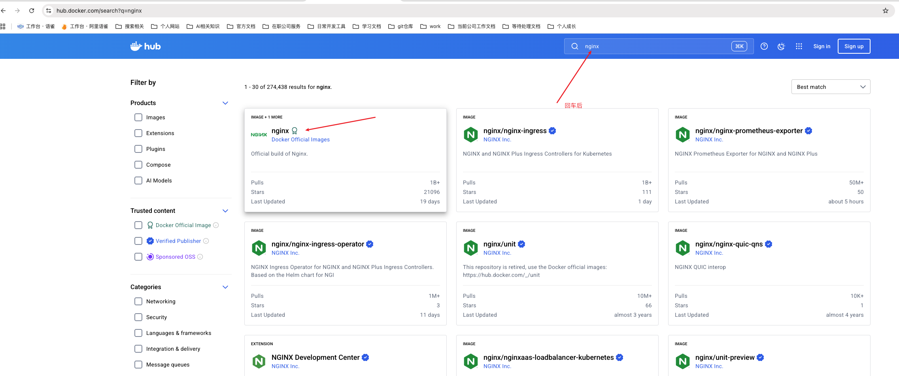
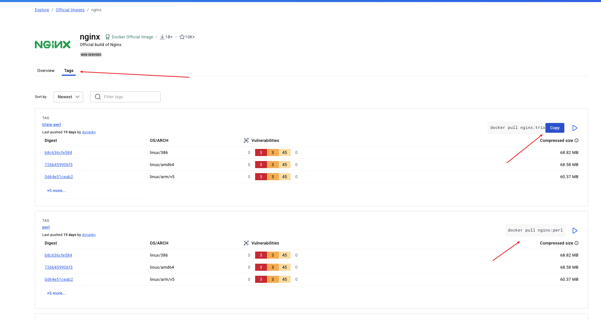
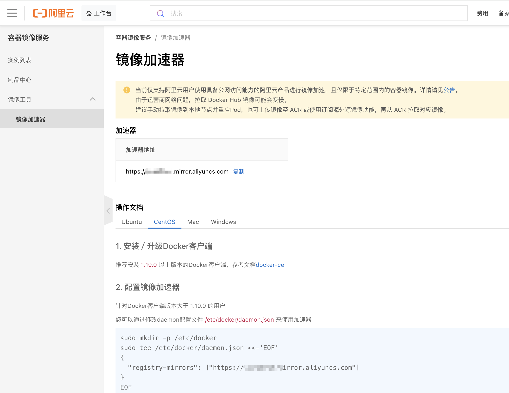

---
group:
  title: Docker
order: 2
title: Docker安装

nav:
  title: 发布部署
  order: 2
---

## 1、Docker 安装

Docker 的安装方法因操作系统而异。以下是主流操作系统（Linux、Windows、macOS）上安装 Docker 的详细指南。

### 1.1、在 Linux 上安装 Docker（以 Ubuntu 为例）

官方推荐使用 Docker Engine（社区版，即 Docker CE）。

**步骤 1：卸载旧版本（如有）**

```bash
sudo apt remove docker docker-engine docker.io containerd runc
```

**步骤 2：更新系统并安装必要依赖**

```bash
sudo apt update
sudo apt install ca-certificates curl gnupg lsb-release
```

**步骤 3：添加 Docker 官方 GPG 密钥**

```bash
sudo mkdir -p /etc/apt/keyrings
curl -fsSL https://download.docker.com/linux/ubuntu/gpg | sudo gpg --dearmor -o /etc/apt/keyrings/docker.gpg
```

**步骤 4：设置稳定版仓库**

```bash
sudo mkdir -p /etc/apt/keyrings
curl -fsSL https://download.docker.com/linux/ubuntu/gpg | sudo gpg --dearmor -o /etc/apt/keyrings/docker.gpg
```

**步骤 5：安装 Docker Engine**

```bash
sudo apt update
sudo apt install docker-ce docker-ce-cli containerd.io docker-compose-plugin
```

**步骤 6：验证安装**

```bash
sudo docker run hello-world
```

如果看到 “Hello from Docker!”，说明安装成功。

**免 sudo 使用 Docker 将当前用户加入 docker 用户组：**

```bash
sudo usermod -aG docker $USER
```

之后就可以直接运行 docker ps 而无需 sudo。

### 1.2、在 macOS 上安装 Docker

macOS 不支持原生运行 Docker Engine（因为内核不同），但可通过 Docker Desktop for Mac 提供完整体验。

安装步骤：

访问官网下载页面：[https://www.docker.com/products/docker-desktop/](https://www.docker.com/products/docker-desktop/)

下载.dmg 安装包并双击安装。

拖动 Docker 图标到 Applications 文件夹完成安装。

在 Launchpad 中打开 Docker Desktop，首次启动会提示输入密码并配置。

安装完成后，打开终端，运行：

```bash
docker --version
docker run hello-world
```

注意：需要 macOS 10.15（Catalina）或更高版本，并启用虚拟化（Intel 芯片需开启 VT-x，Apple Silicon 原生支持）。

### 1.3、在 Windows 上安装 Docker

Windows 有两种选择：

- Docker Desktop for Windows（推荐，适用于开发）
- Docker Engine on WSL 2（通过 Windows Subsystem for Linux）

推荐方式：安装 Docker Desktop

**前提条件：**

- Windows 10/11 64 位：专业版、企业版或教育版（家庭版需额外步骤）。
- 启用 WSL 2 和 Hyper-V（或使用 WSL 2 后端）。
- 至少 4GB 内存。

**安装步骤：**

1. 下载 Docker Desktop：[https://www.docker.com/products/docker-desktop/](https://www.docker.com/products/docker-desktop/)
2. 运行安装程序（.exe），按提示安装。
3. 安装完成后重启电脑（如提示）。
4. 首次启动 Docker Desktop，登录或跳过账户。
5. 打开 PowerShell 或 CMD，运行：

```bash
docker --version
docker run hello-world
```

对于 Windows 家庭版用户：需先安装 WSL 2，再安装 Docker Desktop（新版已支持家庭版）。

### 1.4、验证安装是否成功

无论哪个平台，都可以通过以下命令验证：

```bash
docker --version          # 查看版本
docker info               # 查看详细信息
docker run hello-world    # 运行测试容器
```

如果输出类似：

```bash
Hello from Docker!
This message shows your installation appears to be working correctly.
```

说明 Docker 已正确安装！

## 2、应用安装

安装完成 Docker 之后，就可以通过 Docker 安装一些应用，我们可以访问[https://hub.docker.com/](https://hub.docker.com/)，这个类似 npm，进行应用版本的管理，可以直接在网站中搜索需要安装的软件，比如下面我们想安装一个 nginx，可以先在网站中搜索 nginx:


然后点进去查看详情，找相应版本的安装命令：


最终的安装效果：

```bash
zhangjianhua@U-QCX2V1Y9-0238 ~ % docker pull nginx:1.29-perl
1.29-perl: Pulling from library/nginx
a77810269512: Pull complete
88770be1d442: Pull complete
cc57e8335c98: Pull complete
bb8ecb62799c: Pull complete
2254fb813b11: Pull complete
40b6fc5618c6: Pull complete
b89cf3ec7a3e: Pull complete
cf9a807fe41d: Pull complete
854fd87c40aa: Download complete
7f77eab6713f: Download complete
Digest: sha256:8a12ca7fe29679a2197396f42180ca0a57bea1a7c92f7212f19393bbb07b4bb3
Status: Downloaded newer image for nginx:1.29-perl
```

我们可以通过 docker images 查看我们已经安装的应用：

```bash
zhangjianhua@U-QCX2V1Y9-0238 zjh % docker images

IMAGE             ID             DISK USAGE   CONTENT SIZE   EXTRA
nginx:1.29-perl   8a12ca7fe296        319MB         74.6MB
```

## 3、阿里云服务器安装 Docker

**步骤 1：卸载旧版本（如有）**

```bash
sudo dnf remove docker \
                docker-client \
                docker-client-latest \
                docker-common \
                docker-latest \
                docker-latest-logrotate \
                docker-logrotate \
                docker-selinux \
                docker-engine-selinux \
                docker-engine
```

**步骤 2：安装必要依赖**

```bash
sudo dnf install -y yum-utils device-mapper-persistent-data lvm2
```

注意：虽然系统用 dnf，但 yum-utils 仍然可用（Alibaba Cloud Linux 兼容）。

**步骤 3：添加 Docker 官方仓库**

```bash
sudo yum-config-manager --add-repo https://download.docker.com/linux/centos/docker-ce.repo
```

Alibaba Cloud Linux 3 与 CentOS 8/Stream 兼容，因此使用 centos 仓库是官方认可的做法。Docker 官方也明确支持 RHEL 及其兼容发行版。

**步骤 4：（可选）配置国内镜像加速（提升下载速度）**

编辑仓库文件，将 baseurl 指向阿里云镜像（更稳定快速）：

```bash
sudo sed -i 's|https://download.docker.com|https://mirrors.aliyun.com/docker-ce|g' /etc/yum.repos.d/docker-ce.repo
```

这一步强烈建议在阿里云 ECS 上执行，避免因网络问题导致安装失败。

**步骤 5：安装 Docker Engine**

```bash
sudo dnf install -y docker-ce docker-ce-cli containerd.io docker-buildx-plugin docker-compose-plugin
```

**步骤 6：启动并设置开机自启**

```bash
sudo systemctl start docker
sudo systemctl enable docker
```

**步骤 7：验证安装**

```bash
sudo docker --version
sudo docker run hello-world
```

    如果看到：

```bash
Hello from Docker!
This message shows your installation appears to be working correctly.
```

说明安装成功！

有的时候会报错：

```bash
[root@xxx ~]# sudo docker run hello-world
Unable to find image 'hello-world:latest' locally
docker: Error response from daemon: Get "https://registry-1.docker.io/v2/": net/http: request canceled while waiting for connection (Client.Timeout exceeded while awaiting headers).
See 'docker run --help'.
[root@xxx ~]#
```

根本原因：阿里云服务器无法访问 Docker Hub（registry-1.docker.io），这是国内云服务器的常见问题（受网络限制或防火墙策略影响）。直接使用步骤 9 即可解决。

**步骤 8：（可选）将当前用户加入 docker 组，免 sudo**

```bash
sudo usermod -aG docker $USER
```

然后重新登录终端或执行：

```bash
newgrp docker
```

之后即可直接运行：

```bash
docker ps
```

**步骤 9：（可选）配置 Docker 镜像加速器（阿里云）**

在阿里云上拉取 Docker Hub 镜像可能较慢，建议配置镜像加速器：

创建或编辑 Docker 配置文件：

```bash
sudo mkdir -p /etc/docker
sudo tee /etc/docker/daemon.json <<-'EOF'
{
  "registry-mirrors": ["https://<your-aliyun-mirror>.mirror.aliyuncs.com"]
}
EOF
```

替换<your-aliyun-mirror>为你的专属加速地址（免费）：

- 登录 [阿里云容器镜像服务控制台](https://cr.console.aliyun.com/cn-beijing/instances/mirrors)
- 左侧菜单 → 镜像工具 → 镜像加速器
- 复制你的专属地址如[https://xxx.mirror.aliyuncs.com]

```bash
sudo mkdir -p /etc/docker
sudo tee /etc/docker/daemon.json <<-'EOF'
{
  "registry-mirrors": ["https://xxx.mirror.aliyuncs.com"]
}
EOF
```

重启 Docker 生效：

```bash
sudo systemctl daemon-reexec
sudo systemctl restart docker
```


