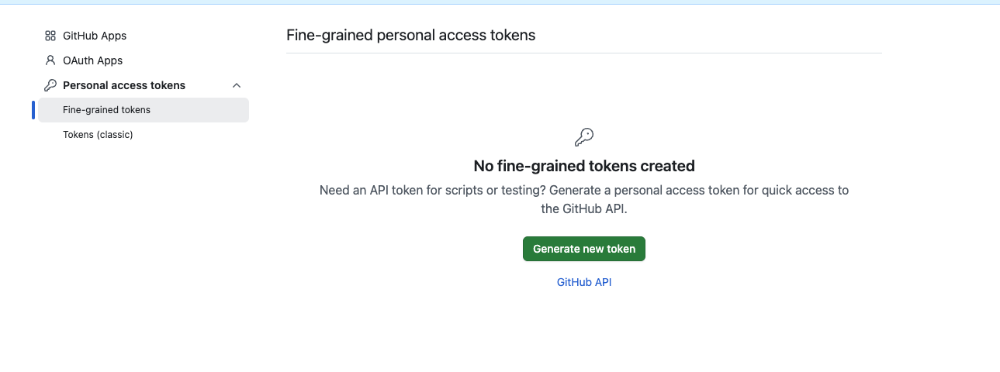
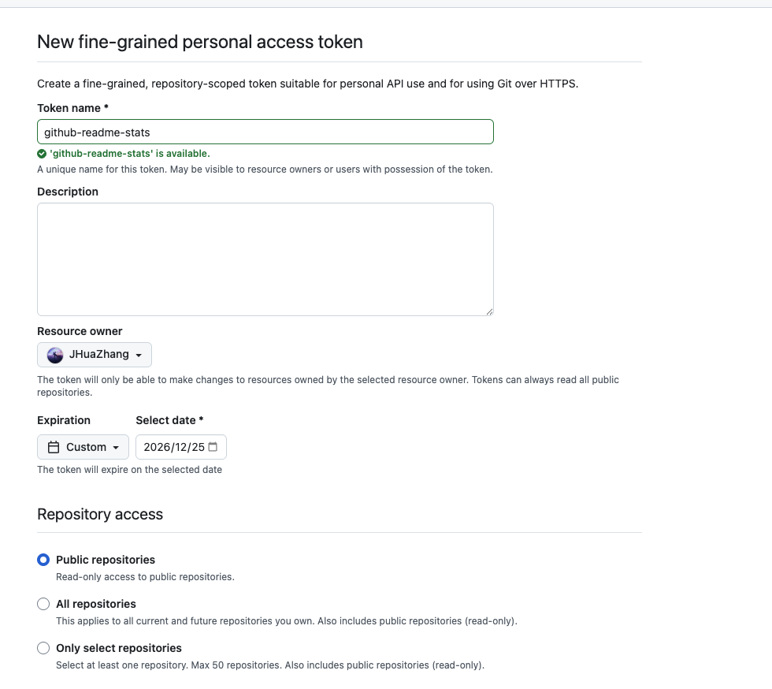
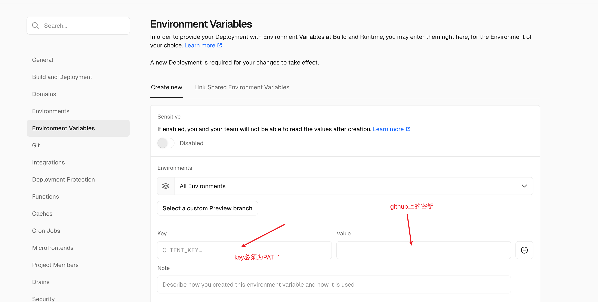

## 1、介绍
自定义主页很简单。我们首先在 GitHub 上新建一个仓库，仓库名和自己 Github 用户名相同，然后添加一个 README.md 自述文件，在该文件里添加信息即可。

关于其中的一些功能美化，我们可以参考博客：[https://www.cnblogs.com/PeterJXL/p/18437094](https://www.cnblogs.com/PeterJXL/p/18437094)。下面我们就实现一些美化功能。

## 2、美化功能
### 2.1、贪吃蛇
使用起来也不难，先新建一个 workflow 文件（名字随意），不需要任何改动，然后提交：

```yaml
name: generate animation

on:
  # run automatically every 2 hours
  schedule:
    - cron: "0 */2 * * *" 
  
  # allows to manually run the job at any time
  workflow_dispatch:
  
  # run on every push on the master branch
  push:
    branches:
    - master
  
  

jobs:
  generate:
    permissions: 
      contents: write
    runs-on: ubuntu-latest
    timeout-minutes: 5
  
    steps:
      # generates a snake game from a github user (<github_user_name>) contributions graph, output a svg animation at <svg_out_path>
      - name: generate github-contribution-grid-snake.svg
        uses: Platane/snk/svg-only@v3
        with:
          github_user_name: ${{ github.repository_owner }}
          outputs: |
            dist/github-contribution-grid-snake.svg
            dist/github-contribution-grid-snake-dark.svg?palette=github-dark
  
  
      # push the content of <build_dir> to a branch
      # the content will be available at https://raw.githubusercontent.com/<github_user>/<repository>/<target_branch>/<file> , or as github page
      - name: push github-contribution-grid-snake.svg to the output branch
        uses: crazy-max/ghaction-github-pages@v3.1.0
        with:
          target_branch: output
          build_dir: dist
        env:
          GITHUB_TOKEN: ${{ secrets.GITHUB_TOKEN }}

```

将下列代码复制到 Markdown 内，将用户名部分替换成你自己的，并提交。这段代码的目的是：加载贪吃蛇动画，且贪吃蛇的暗亮风格与你的 Github 的暗亮风格进行自动适配。

```html
<!-- Snake Code Contribution Map 贪吃蛇代码贡献图 -->
<picture>
  <source media="(prefers-color-scheme: dark)" srcset="https://raw.githubusercontent.com/JHuaZhang/JHuaZhang/output/github-contribution-grid-snake-dark.svg">
  <source media="(prefers-color-scheme: light)" srcset="https://raw.githubusercontent.com/JHuaZhang/JHuaZhang/output/github-contribution-grid-snake.svg">
  
</picture>
```

### 2.2、GitHub统计卡片
参考地址：[https://github.com/anuraghazra/github-readme-stats](https://github.com/anuraghazra/github-readme-stats)

使用原本很简单，将如下代码复制到你的 markdown 文件中，更改 ?username= 的值为你的 GitHub 用户名：

```html
<p align="center"> 
```

但是github-readme-stats.vercel.app 这个 Vercel 部署由于使用量极大（每天数百万请求），Vercel 免费套餐有资源限制，项目维护者有时会临时暂停部署以控制成本或进行维护。

因此我们可以 fork 该项目并自己部署到 Vercel，完全免费且稳定：

访问：[https://github.com/anuraghazra/github-readme-stats](https://github.com/anuraghazra/github-readme-stats)

+ 点击右上角 Fork 到 GitHub 账号。
1. 去 [Vercel Dashboard](https://vercel.com/new)：
2. 点击 “New Project”。
3. 导入 fork 的 github-readme-stats 仓库。
4. 直接点击 Deploy（无需配置）。

部署成功后，会得到自己的 URL，例如：

```html
https://github-readme-stats-lovat-beta.vercel.app
```

然后修改 README 中的图片链接：

```html
<p> 
```

不过这里会有一个坑，就是需要配置一个环境变量，需要GitHub设置一个 GitHub Token，

**创建 GitHub Personal Access Token (PAT)：**

1. 打开 GitHub → 点右上角头像 → Settings。


2. 左侧菜单 → Developer settings(最底部) → Personal access tokens → Tokens (classic)。
3. 点击 Generate new token → Generate new token (classic)。



4. 填写：
    1. Note: readme-stats-token（随便写）
    2. Expiration: 建议选 No expiration 或 90 天以上
    3. Permissions: 只需勾选 public_repo（因为只需读取公开信息）
5. 滚动到底部 → 点 Generate token。



6. 复制生成的 token 字符串（形如 ghp_abc123...），只显示一次！

**将 Token 添加到 Vercel 项目环境变量：**

1. 打开你的 Vercel 项目页面：
    1. [https://vercel.com/](https://vercel.com/)
    2. 进入项目 github-readme-stats（你刚部署的那个）
2. 左侧菜单 → Settings → Environment Variables



3. 点击 New 添加变量：
    1. Name: PAT_1
    2. Value: 粘贴你刚才复制的 token（如 ghp_abc123...）
4. 点 Add
5. （可选）点击顶部 Deployments → 找到最新部署 → 点 Redeploy 使环境变量生效。


