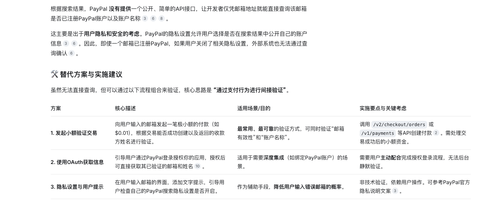
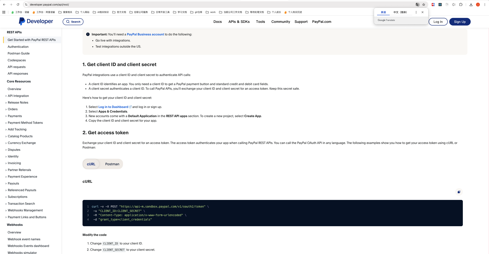
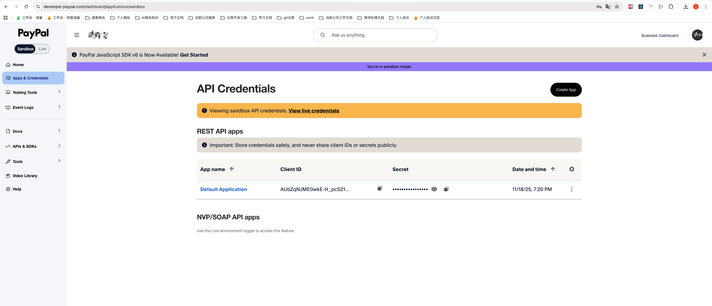
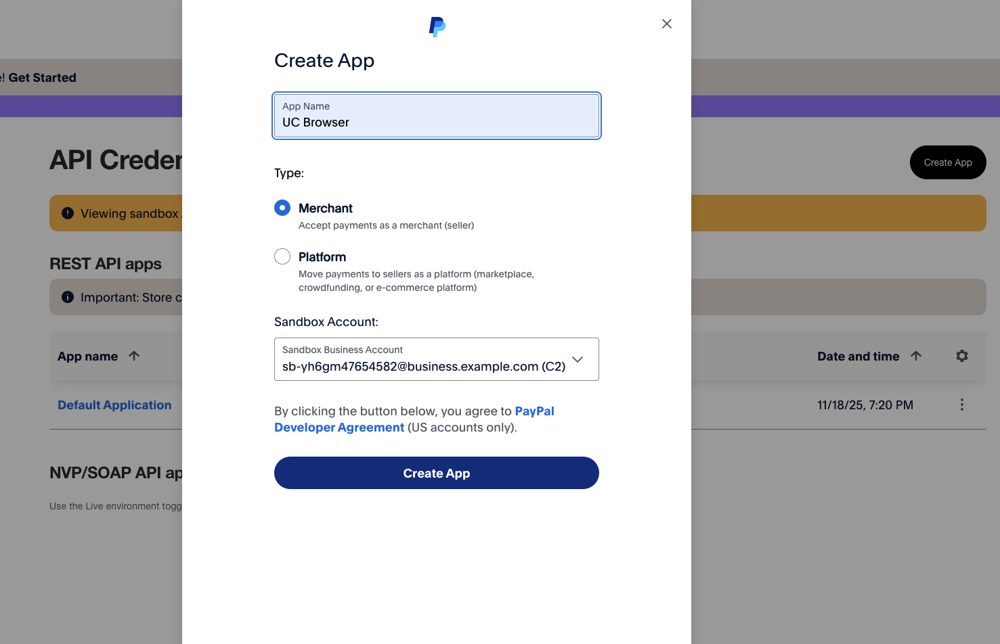
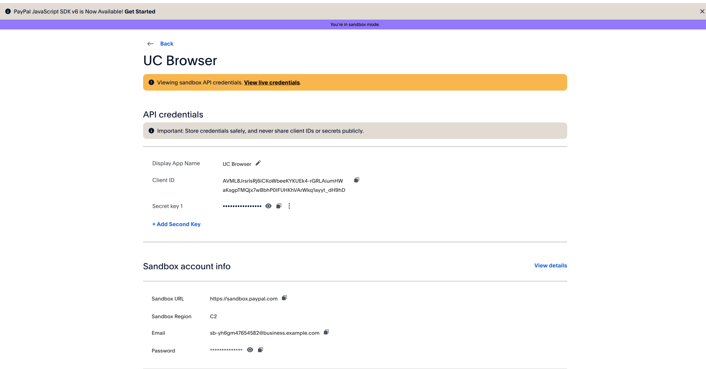
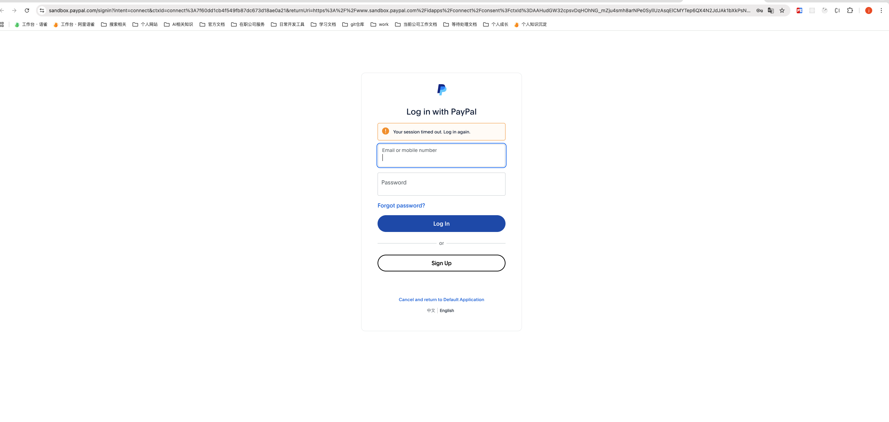
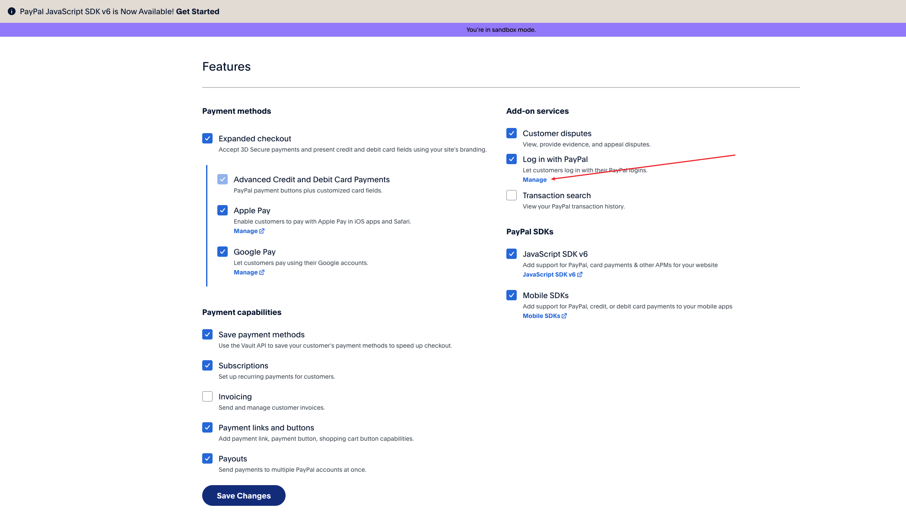
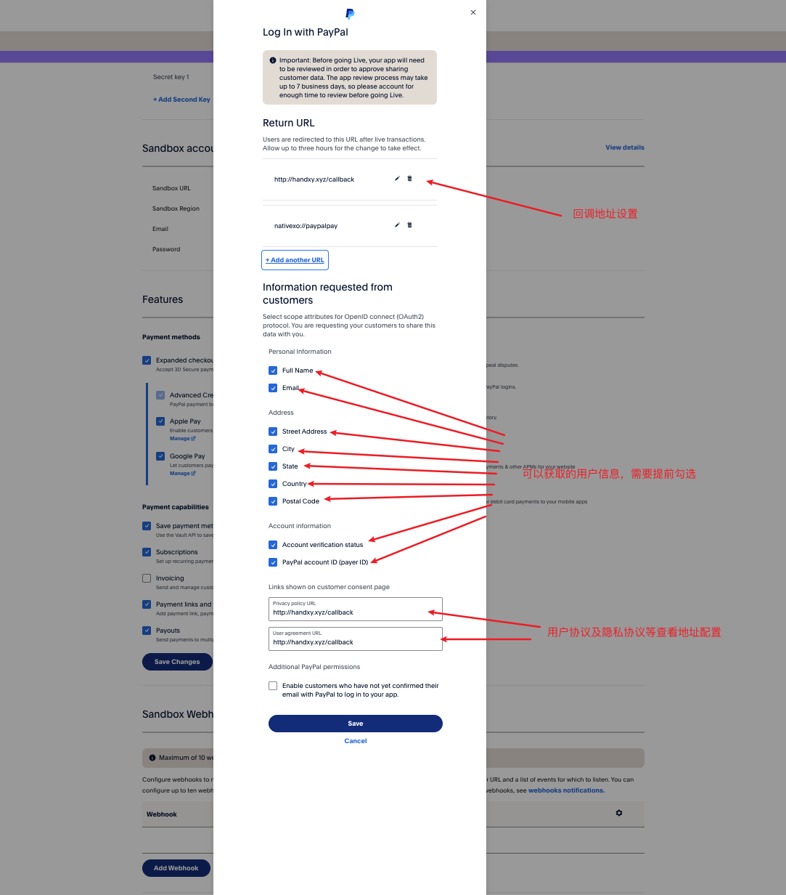
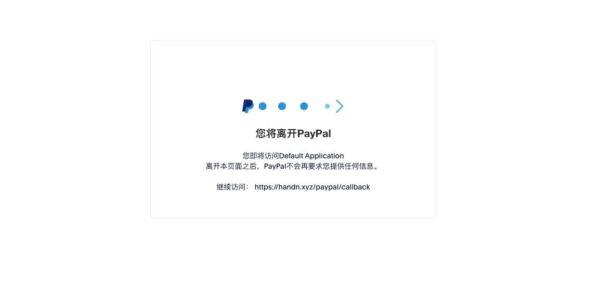
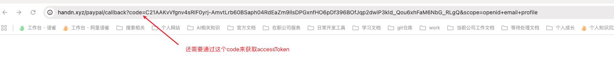

## 1、背景
国际网盘达人分享拓展拉美地区，经与达人沟通反馈，当地银行卡等基础金融设施覆盖低，多用paypal收款。因此期望接入paypal对外付款能力，满足拉美地区达人提现需求。同时paypal作为全球性的提现渠道，也能够在部份地区起到帮助提升提现能力覆盖的作用。

原本计划是让用户手动输入PayPal账号，进行提现，但是考虑到用户输入账号可能输入错误，可能出现转给其他账户，或者转账给未注册的邮箱，并且即使邮箱未注册，这笔钱追回也很麻烦。因此，需要获取到用户注册的PayPal账号或邮箱，然后进行提现。但是PayPal没有提供获取用户注册的PayPal账号或邮箱的接口，只能通过网页端获取。查找资料可以看到常用的方案大致如下：<!-- 这是一张图片，ocr 内容为： -->



因为第二种方案不会带来资损，因此我们最终选择第二种方案，具体实现如下。

## 2、前端技术方案
我们可以访问PayPal的[开发文档]([https://developer.paypal.com/api/rest](https://developer.paypal.com/api/rest),)，可以看到详细的内容：

<!-- 这是一张图片，ocr 内容为： -->


通过上面开发者文档，可以看到首先需要获取一个clientId以及clientSecret，然后去获取对应的access token，这个access token就是用户登录确认之后，下发的一个token，大致内容如下：

```json
{
  "scope": "https://uri.paypal.com/services/invoicing https://uri.paypal.com/services/disputes/read-buyer https://uri.paypal.com/services/payments/realtimepayment https://uri.paypal.com/services/disputes/update-seller https://uri.paypal.com/services/payments/payment/authcapture openid https://uri.paypal.com/services/disputes/read-seller https://uri.paypal.com/services/payments/refund https://api-m.paypal.com/v1/vault/credit-card https://api-m.paypal.com/v1/payments/.* https://uri.paypal.com/payments/payouts https://api-m.paypal.com/v1/vault/credit-card/.* https://uri.paypal.com/services/subscriptions https://uri.paypal.com/services/applications/webhooks",
  "access_token": "A21AAFEpH4PsADK7qSS7pSRsgzfENtu-Q1ysgEDVDESseMHBYXVJYE8ovjj68elIDy8nF26AwPhfXTIeWAZHSLIsQkSYz9ifg",
  "token_type": "Bearer",
  "app_id": "APP-80W284485P519543T",
  "expires_in": 31668,
  "nonce": "2020-04-03T15:35:36ZaYZlGvEkV4yVSz8g6bAKFoGSEzuy3CQcz3ljhibkOHg"
}
```

### 2.1、创建clientId及clientSecret
如下我们需要访问[https://developer.paypal.com/dashboard/applications/sandbox](https://developer.paypal.com/dashboard/applications/sandbox)，再访问的前提下需要先进行登陆。

<!-- 这是一张图片，ocr 内容为： -->


如下选择商家进行创建即可：

<!-- 这是一张图片，ocr 内容为： -->


可以看到这里就会有对应的信息管理内容：<!-- 这是一张图片，ocr 内容为： -->


而clientId及clientSecret分别有不同的作用：

#### 2.1.1、clientId的作用
**①、拼接登录地址**

如下所示需要引导用户跳转到paypal的登录页，因此这个时候需要clientId进行url拼接：

拼接的代码大致如下：

```javascript
async auth() {
  const { ctx, config } = this;
  const { clientId } = config.paypal;

  // 构建PayPal授权链接
  const redirectUri = 'https://handn.xyz/paypal/callback'; // 设置的回调地址
  const scope = 'openid email profile'; // 必须包含 openid

  const authDomain = config.paypal.sandbox ? 'www.sandbox.paypal.com' : 'www.paypal.com';

  const authUrl = `https://${authDomain}/signin/authorize?client_id=${clientId}&response_type=code&scope=${encodeURIComponent(
    scope
  )}&redirect_uri=${encodeURIComponent(redirectUri)}`;

  ctx.logger.info('Redirecting to PayPal auth URL');
  ctx.redirect(authUrl);
}
```

如下是我们本地测试中生成的链接。

[https://www.sandbox.paypal.com/signin?intent=connect&ctxId=connect%3A7f60dd1cb4f549fb87dc673d18ae0a21&returnUri=https%3A%2F%2Fwww.sandbox.paypal.com%2Fidapps%2Fconnect%2Fconsent%3FctxId%3DAAHudGW32cpsvDqHOhNG_mZju4smh8arNPe0SyllUzAsqElCMYTep6QX4N2JdJAk1bXkPsNYbwx0vdq5YfmzY_ok%26client_id%3DAUbaOXudaWOTumWvQorC9w7ym-ksOMTY1l1xcV_ntnBtp7fO-t8aaCMxxHht2k2jbSYMezjhscyk6h1Q%26scope%3Dopenid%2Bemail%2Bprofile%26redirect_uri%3Dhttps%253A%252F%252Fhandn.xyz%252Fpaypal%252Fcallback%26response_type%3Dcode&flowId=b970dd38501545298d51426c89c790ba](https://www.sandbox.paypal.com/signin?intent=connect&ctxId=connect%3A7f60dd1cb4f549fb87dc673d18ae0a21&returnUri=https%3A%2F%2Fwww.sandbox.paypal.com%2Fidapps%2Fconnect%2Fconsent%3FctxId%3DAAHudGW32cpsvDqHOhNG_mZju4smh8arNPe0SyllUzAsqElCMYTep6QX4N2JdJAk1bXkPsNYbwx0vdq5YfmzY_ok%26client_id%3DAUbaOXudaWOTumWvQorC9w7ym-ksOMTY1l1xcV_ntnBtp7fO-t8aaCMxxHht2k2jbSYMezjhscyk6h1Q%26scope%3Dopenid%2Bemail%2Bprofile%26redirect_uri%3Dhttps%253A%252F%252Fhandn.xyz%252Fpaypal%252Fcallback%26response_type%3Dcode&flowId=b970dd38501545298d51426c89c790ba)

页面展示效果如下：

<!-- 这是一张图片，ocr 内容为： -->


**②、配合clientSecret获取accessToken**

```javascript
async getAccessToken(code) {
  const { ctx, config } = this;
  const { clientId, clientSecret, oauthEndpoint } = config.paypal;

  // 将clientId和Secret进行Base64编码
  const auth = Buffer.from(`${clientId}:${clientSecret}`).toString('base64');

  // 使用 URLSearchParams 确保数据为 x-www-form-urlencoded 格式
  const data = new URLSearchParams();
  data.append('grant_type', 'authorization_code');
  data.append('code', code);

  try {
    const result = await ctx.curl(oauthEndpoint, {
      method: 'POST',
      headers: {
        'Content-Type': 'application/x-www-form-urlencoded',
        Authorization: `Basic ${auth}`,
      },
      data: data.toString(), // 关键：必须使用字符串格式
      dataType: 'json',
      timeout: 30000,
    });

    ctx.logger.info('PayPal token response status:', result.status);

    if (result.status !== 200) {
      ctx.logger.error('PayPal getAccessToken error: ', result.data);
      throw new Error(`Failed to get access token: ${result.data.error_description}`);
    }

    ctx.logger.info('Access token obtained successfully');
    return result.data;
  } catch (error) {
    ctx.logger.error('PayPal getAccessToken request failed: ', error);
    throw error;
  }
}
```

	可以看到这里获取accessToken的时候需要clientSecret和clientId拼接成base64格式的字符串，然后去调用'https://api.sandbox.paypal.com/v1/oauth2/token',接口获取accessToken。

#### 2.1.2、clientSecret的作用
同上面clientId一起获取accessToken，具体内容如上。

### 2.2、设置回调地址
进入对应的应用设置，找到这个配置：

<!-- 这是一张图片，ocr 内容为： -->


<!-- 这是一张图片，ocr 内容为： -->


如上可以看到这里可以设置我们应用的回调地址以及需要获取到用户哪些信息。

### 2.3、实现跳转paypal登录
#### 2.3.1、拼接跳转地址URL
在前面clientId的作用中，我们介绍到了这里是需要访问指定的地址，并进行参数拼接：

```javascript
  async auth() {
    const { ctx, config } = this;
    const { clientId } = config.paypal;

    // 构建PayPal授权链接
    const redirectUri = 'https://handn.xyz/paypal/callback';
    const scope = 'openid email profile'; // 必须包含 openid

    const authDomain = config.paypal.sandbox ? 'www.sandbox.paypal.com' : 'www.paypal.com';

    const authUrl = `https://${authDomain}/signin/authorize?client_id=${clientId}&response_type=code&scope=${encodeURIComponent(
      scope
    )}&redirect_uri=${encodeURIComponent(redirectUri)}`;

    ctx.logger.info('Redirecting to PayPal auth URL');
    ctx.redirect(authUrl);
  }
```

	因为这个clientId属于秘钥，不能让用户感知，因此我们需要通过node服务来运行，这里我将其配置到了egg的config.default.js中，当然也可以配置在环境变量中，大致代码如下：

```javascript
/**
   * 沙箱环境
   */
config.paypal = {
  clientId:
    process.env.PAYPAL_CLIENT_ID ||
    'AUbaOXudaWOTumWvQorC9w7ym-ksOMTY1l1xcV_ntnBtp7fO-t8aaCMxxHht2k2jbSYMezjhscyk6h1Q',
  clientSecret:
    process.env.PAYPAL_CLIENT_SECRET ||
    'EBvLvkom57mHkyxeXY_P0kpe6_le_DeH6MuAnHLhQ5z34QvUrMILyimbDuVzqWh1KHktHDSLugXMvCyS',
  sandbox: true,
  oauthEndpoint: 'https://api.sandbox.paypal.com/v1/oauth2/token',
  userInfoEndpoint: 'https://api.sandbox.paypal.com/v1/identity/oauth2/userinfo?schema=paypalv1.1',
};
```

#### 2.3.2、拼接地址scope详解
在PayPal OAuth 2.0授权中，scope参数定义了希望访问的用户数据权限。以下是常见的scope值：

**基本OpenID Connect Scopes：**

```javascript
// 必选
'openid'                    // OpenID Connect基本权限

// 用户信息
'email'                     // 获取用户邮箱
'profile'                   // 获取用户基本信息（姓名、地址等）
'address'                   // 获取用户地址信息
'phone'                     // 获取用户电话号码
```

**支付相关Scopes：**

```javascript
// 支付权限
'https://uri.paypal.com/services/payments/futurepayments'  // 未来支付权限
'https://uri.paypal.com/services/payments/payment/authcapture'  // 授权并捕获支付
'https://uri.paypal.com/services/expresscheckout'          // Express Checkout权限

// 参考交易（Reference Transactions）
'https://uri.paypal.com/services/customer/charge'          // 向客户收费
```

**商业账户管理：**

```javascript
// 卖家/商家权限
'https://uri.paypal.com/services/disputes/read-seller'     // 读取争议信息
'https://uri.paypal.com/services/disputes/update-seller'   // 更新争议信息
'https://uri.paypal.com/services/invoicing'                // 发票相关权限
'https://uri.paypal.com/services/subscriptions'            // 订阅管理
```

组合示例：

```javascript
// 常见的组合方式：

// 1. 仅登录认证
const scope1 = 'openid email';

// 2. 登录+完整用户信息
const scope2 = 'openid email profile address phone';

// 3. 登录+支付权限（移动应用常见）
const scope3 = 'openid email https://uri.paypal.com/services/payments/futurepayments';

// 4. 商家应用
const scope4 = 'openid email https://uri.paypal.com/services/disputes/read-seller https://uri.paypal.com/services/invoicing';
```

### 2.4、获取accessToken
如上我们配置了回调地址，当用户跳转到paypal登录页进行登录之后，会返回到填写的回调页，大致流程如下：

<!-- 这是一张图片，ocr 内容为： -->


<!-- 这是一张图片，ocr 内容为： -->


可以看到这里paypal会自动给我们自动加一个code参数。下面我们就需要使用这个code调用paypal提供的接口获取accessToken：

```javascript
  /**
   * 处理PayPal的回调，获取授权码，换取用户信息
   */
  async callback() {
    const { ctx, service } = this;
    const { code, error } = ctx.query;

    // 检查用户是否授权成功
    if (error) {
      ctx.logger.warn('User denied PayPal authorization: ', error);
      await ctx.render('paypal_error.html', {
        error: '用户拒绝了授权请求',
      });
      return;
    }

    if (!code) {
      ctx.logger.error('PayPal callback missing authorization code.');
      await ctx.render('paypal_error.html', {
        error: '缺少授权码',
      });
      return;
    }

    ctx.logger.info('Received PayPal authorization code');

    try {
      // 1. 使用授权码获取访问令牌
      ctx.logger.info('Exchanging code for access token...');
      const tokenData = await service.paypal.getAccessToken(code);
      ctx.logger.info('获取到了tokenData', tokenData);
      const accessToken = tokenData.access_token;

      // 2. 使用访问令牌获取用户信息
      ctx.logger.info('Fetching user info with access token...');
      const userInfo = await service.paypal.getUserInfo(accessToken);

      // 3. 记录获取到的用户信息
      ctx.logger.info('PayPal user info retrieved - Email:', userInfo.email);

      // 4. 在这里可以保存用户信息到数据库
      // await this.saveUserInfo(userInfo);

      // 5. 渲染成功页面
      await ctx.render('paypal_success.html', {
        email: userInfo.email,
        name: userInfo.name,
        userId: userInfo.userId,
      });
    } catch (error) {
      ctx.logger.error('PayPal OAuth process failed: ', error);
      await ctx.render('paypal_error.html', {
        error: `授权失败: ${error.message}`,
      });
    }
  }
```

如上代码，我们通过在egg的service层写的getAccessToken，大致内容如下：

```javascript
  /**
   * 使用授权码获取访问令牌
   * @param code
   */
  async getAccessToken(code) {
    const { ctx, config } = this;
    const { clientId, clientSecret, oauthEndpoint } = config.paypal;

    // 将Client ID和Secret进行Base64编码
    const auth = Buffer.from(`${clientId}:${clientSecret}`).toString('base64');

    // 使用 URLSearchParams 确保数据为 x-www-form-urlencoded 格式
    const data = new URLSearchParams();
    data.append('grant_type', 'authorization_code');
    data.append('code', code);

    try {
      const result = await ctx.curl(oauthEndpoint, {
        method: 'POST',
        headers: {
          'Content-Type': 'application/x-www-form-urlencoded',
          Authorization: `Basic ${auth}`,
        },
        data: data.toString(), // 关键：必须使用字符串格式
        dataType: 'json',
        timeout: 30000,
      });

      ctx.logger.info('PayPal token response status:', result.status);

      if (result.status !== 200) {
        ctx.logger.error('PayPal getAccessToken error: ', result.data);
        throw new Error(`Failed to get access token: ${result.data.error_description}`);
      }

      ctx.logger.info('Access token obtained successfully');
      return result.data;
    } catch (error) {
      ctx.logger.error('PayPal getAccessToken request failed: ', error);
      throw error;
    }
  }
```

这里需要调用[https://api.sandbox.paypal.com/v1/oauth2/token](https://api.sandbox.paypal.com/v1/oauth2/token)接口去获取，当然这是sandbox环境下的，正式环境下去掉这个sandbox就行了。

### 2.5、通过accessToken获取用户信息
如上可知，获取到const userInfo = await service.paypal.getUserInfo(accessToken);，而具体的getUserInfo为：

```javascript
  /**
   * 使用访问令牌获取用户信息
   * @param accessToken
   */
  async getUserInfo(accessToken) {
    const { ctx, config } = this;
    // 确保使用正确的用户信息端点
    const userInfoEndpoint = config.paypal.userInfoEndpoint;

    try {
      const result = await ctx.curl(userInfoEndpoint, {
        method: 'GET',
        headers: {
          Authorization: `Bearer ${accessToken}`,
        },
        dataType: 'json',
        timeout: 30000,
      });

      ctx.logger.info('查询用户信息接口', result);

      if (result.status !== 200) {
        ctx.logger.error('PayPal getUserInfo error: ', result.data);
        // 尝试提供更详细的错误信息
        const errorMsg = result.data.error_description || result.data.message || 'Unknown error';
        throw new Error(`Failed to get user info: ${errorMsg}`);
      }

      // 处理返回的用户信息
      const userInfo = result.data;
      ctx.logger.info('Raw PayPal user info:', JSON.stringify(userInfo));

      // 提取邮箱信息
      let email = null;
      if (userInfo.emails && Array.isArray(userInfo.emails) && userInfo.emails.length > 0) {
        email = userInfo.emails[0].value;
      }
      if (!email) {
        ctx.logger.warn('No email found. Available fields:', Object.keys(userInfo));
      }
      return {
        email,
        name: userInfo.name ? `${userInfo.name.given_name || ''} ${userInfo.name.surname || ''}`.trim() : '未知用户',
        userId: userInfo.user_id,
        verified: userInfo.verified_account || false,
      };
    } catch (error) {
      ctx.logger.error('PayPal getUserInfo request failed: ', error);
      throw error;
    }
  }
```

```javascript
  /**
   * 沙箱环境
   */
  config.paypal = {
    userInfoEndpoint: 'https://api.sandbox.paypal.com/v1/identity/oauth2/userinfo?schema=paypalv1.1',
  };
```

	可以看到这里accessToken是作为Authorization放在header中，就可以通过get请求获取到了。

## 3、实现无感跳转
上面的例子中，我们直接使用egg中view使用html模版进行的，下面我们调整为egg只做校验，而react进行点击跳转以及重定向操作，我们调整egg的路由：

```javascript
// app/router.js
module.exports = app => {
  const { router, controller } = app;
  router.get('/api/paypal/auth', controller.paypal.auth);
  router.post('/api/paypal/getUserInfo', controller.paypal.getUserInfo);
};
```

对应的调整controller为：

```javascript
const { Controller } = require('egg');

class PaypalController extends Controller {
  /**
   * 生成PayPal授权链接并重定向用户地址
   */
  async auth() {
    const { ctx, config } = this;
    const { clientId } = config.paypal;

    // 构建PayPal授权链接
    const redirectUri = 'https://handn.xyz/paypal/callback';
    const scope = 'openid email profile'; // 必须包含 openid

    const authDomain = config.paypal.sandbox ? 'www.sandbox.paypal.com' : 'www.paypal.com';

    const authUrl = `https://${authDomain}/signin/authorize?client_id=${clientId}&response_type=code&scope=${encodeURIComponent(
      scope
    )}&redirect_uri=${encodeURIComponent(redirectUri)}`;

    ctx.logger.info('Redirecting to PayPal auth URL');
    // 返回拼接的参数
    ctx.body = {
      success: true,
      data: {
        authUrl,
      },
    };
  }

  async getUserInfo() {
    const { ctx, service } = this;
    const { code } = ctx.request.body;
    if (!code) {
      ctx.logger.error('PayPal callback missing authorization code.');
      ctx.body = {
        success: false,
        error: '缺少授权码',
      };
    }
    try {
      // 1. 使用授权码获取访问令牌
      const tokenData = await service.paypal.getAccessToken(code);
      ctx.logger.info('获取到了tokenData', tokenData);
      const accessToken = tokenData.access_token;
      // 2. 使用访问令牌获取用户信息
      ctx.logger.info('Fetching user info with access token...');
      const userInfo = await service.paypal.getUserInfo(accessToken);
      // 3. 记录获取到的用户信息
      ctx.logger.info('PayPal user info', userInfo);
      ctx.body = {
        success: true,
        data: userInfo,
      };
    } catch (error) {
      ctx.body = {
        success: false,
        error: error.message,
      };
    }
  }
}

module.exports = PaypalController;
```

然后就可以来写前端功能：

```javascript
import { Button, message } from 'antd';
import { useState } from 'react';

const Home = () => {
  const [paypalEmail, setPaypalEmail] = useState('');
  const [loading, setLoading] = useState(false);
  const [count, setCount] = useState(0);

  const handleLinkPaypal = async () => {
    setLoading(true);
    try {
      const res = await fetch('/api/paypal/auth');
      const data = await res.json();
      if (data.success) {
        const popup = window.open(data.data.authUrl, 'paypalAuth', 'width=600,height=700');
        // 监听弹窗消息
        const handleMessage = (event: MessageEvent) => {
          // 安全：生产环境应校验 event.origin
          if (event.data?.type === 'PAYPAL_AUTH_SUCCESS') {
            setPaypalEmail(event.data.userInfo.email);
            message.success('PayPal 账户绑定成功！');
            popup?.close();
          } else if (event.data?.type === 'PAYPAL_AUTH_FAILED') {
            message.error(`绑定失败: ${event.data.error}`);
            popup?.close();
          }
        };

        window.addEventListener('message', handleMessage);
        // 可选：30秒后自动清理
        setTimeout(() => {
          window.removeEventListener('message', handleMessage);
        }, 30000);
      }
    } catch (error) {
      console.error(error);
      message.error('获取授权链接失败');
    } finally {
      setLoading(false);
    }
  };

  return (
    <div style={{ padding: '20px' }}>
      <h1>提现申请</h1>
      <Button type="primary" onClick={handleLinkPaypal} loading={loading}>
        关联 PayPal 账户
      </Button>
      {paypalEmail && <p>已绑定: {paypalEmail}</p>}
      页面count为{count}
      <p>
        <button onClick={() => setCount(count + 1)}>+1</button>
      </p>
    </div>
  );
};

export default Home;
```

```javascript
import { useEffect } from 'react';
import { useSearchParams } from 'react-router-dom';

const Callback = () => {
  const [searchParams] = useSearchParams();

  useEffect(() => {
    const code = searchParams.get('code');
    const error = searchParams.get('error');

    if (error) {
      // 通知 opener（Home 页）失败
      window.opener?.postMessage(
        {
          type: 'PAYPAL_AUTH_FAILED',
          error: '用户取消授权',
        },
        '*'
      ); // 生产环境替换为具体 origin
      window.close();
      return;
    }

    if (!code) {
      window.opener?.postMessage(
        {
          type: 'PAYPAL_AUTH_FAILED',
          error: '缺少授权码',
        },
        '*'
      );
      window.close();
      return;
    }

    fetch('/api/paypal/getUserInfo', {
      method: 'POST',
      headers: { 'Content-Type': 'application/json' },
      body: JSON.stringify({ code }),
    })
      .then((res) => res.json())
      .then((data) => {
        if (data.success) {
          // 成功：通知 Home 页
          window.opener?.postMessage(
            {
              type: 'PAYPAL_AUTH_SUCCESS',
              userInfo: data.data,
            },
            '*'
          );
        } else {
          window.opener?.postMessage(
            {
              type: 'PAYPAL_AUTH_FAILED',
              error: data.error,
            },
            '*'
          );
        }
      })
      .catch((err) => {
        window.opener?.postMessage(
          {
            type: 'PAYPAL_AUTH_FAILED',
            error: err.message,
          },
          '*'
        );
      })
      .finally(() => {
        window.close();
      });
  }, [searchParams]);

  return <div>正在处理 PayPal 授权...</div>;
};

export default Callback;

```

如上分别为首页和Callback页面，可以看到这里Home页点击获取url之后使用window.open打开的paypal登录页，然后回调页面中先获取code，查询到用户信息之后，使用postMessage将数据传递给Home页，然后进行页面关闭。

这里有两个问题：

**问题①、为什么不使用iframe**

在之前招商银行做用户合同签订功能的时候，也是需要跳转到第三方法大大电子签约页面，进行签约之后返回到之前页面，法大大也是提供的这种回调的功能，但是当时我写的方案是使用iframe的方式，通过设置一个页面占据全屏的弹窗，然后将iframe嵌在其中，这样用户关闭相当于关闭弹窗，不需要这样使用open的方式打开新页，用户体验也会更加好一点，不过这里通过查资料发现PayPal明确禁止在`<iframe>`中加载其登录/授权页面。

当尝试用 iframe 嵌入 PayPal 授权页时，PayPal 服务器会返回以下 HTTP 响应头：

```plain
X-Frame-Options: SAMEORIGIN
```

或

```plain
Content-Security-Policy: frame-ancestors 'self';
```

这些头部指令会强制浏览器阻止在第三方网站的 iframe 中加载 PayPal 页面。所以window.open的方式才能实现这个功能。

不过具体情况，这里没有进一步实现，感兴趣的小伙伴可以自己尝试。

**问题②、UC浏览器的限制**

UC浏览器对于这种window.open和postMessage做了限制的，首先在UC中window.open会打开一个新的标签页，页面回调完成过后关闭标签页会有问题，其次postMessage在UC中直接用是无效的，需要使用客户端的方法,类似下面这种使用jsapi的方式：

```javascript
window?.['ucapi']?.invoke('base.postmessage', {
  data: {
    msg_type: 'H5EVT_Chat_Commuicate',
    page_uuid: window['__chat_page_uuid'], // 页面唯一标识，从query取
    data: {
      event: eventName,
      data: data,
    },
  },
  success(ret) {
    console.log(ret);
  },
  fail(ret) {
    console.log(ret);
  },
});
```

而window.open页面的开启和关闭，也需要客户端同学提供指定的jsapi，才能够完成这个功能的开发。


