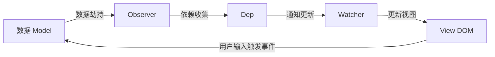

---
group:
  title: 【01】vue基础篇
  order: 1
title: vue指令v-model双向数据绑定
order: 6
nav:
  title: Vue
  order: 4
---

## 1. v-model 指令介绍

`v-model` 是 Vue 中一个非常重要的指令，用于在表单输入元素或自定义组件上创建**双向数据绑定**。

**双向数据绑定的含义**：

- **数据 → 视图**：将 Vue 实例中的数据（`data`）渲染到表单元素的 `value`（或 `checked`、`selected`）属性上。当数据改变时，视图会自动更新。
- **视图 → 数据**：当用户在表单元素上进行输入、选择等操作时，这些操作会自动更新 Vue 实例中对应的数据。

**本质**：`v-model` 是一个**语法糖**，它帮我们简化了手动监听输入事件和绑定值的操作。

---

## 2. 在原生表单元素上的使用

`v-model` 会根据不同的表单元素类型，自动应用合适的属性和事件。

### 2.1 文本输入框（`<input type="text">`）和 `<textarea>`

```vue
<template>
  <div>
    <input type="text" v-model="message">
    <p>您输入的是：{{ message }}</p>
  </div>
</template>

<script>
export default {
  data() {
    return {
      message: 'Hello Vue!'
    };
  }
};
</script>
```

**原理**：背后使用 `value` 属性和 `input` 事件，等价于：

```vue
<input :value="message" @input="message = $event.target.value">
```

### 2.2 复选框（`<input type="checkbox">`）

#### 单个复选框：绑定到布尔值

```vue
<template>
  <div>
    <input type="checkbox" id="checkbox" v-model="checked">
    <label for="checkbox">{{ checked }}</label>
  </div>
</template>

<script>
export default {
  data() {
    return {
      checked: false
    };
  }
};
</script>
```

#### 多个复选框：绑定到同一个数组

数组中的值为被选中项的 `value`。

```vue
<template>
  <div>
    <input type="checkbox" value="Jack" v-model="checkedNames"> Jack
    <input type="checkbox" value="John" v-model="checkedNames"> John
    <input type="checkbox" value="Mike" v-model="checkedNames"> Mike
    <p>被选中的人：{{ checkedNames }}</p>
  </div>
</template>

<script>
export default {
  data() {
    return {
      checkedNames: []   // 将会包含 ['Jack', 'John', 'Mike'] 中被选中的项
    };
  }
};
</script>
```

### 2.3 单选框（`<input type="radio">`）

绑定到被选中的单选框的 `value` 值。

```vue
<template>
  <div>
    <input type="radio" value="One" v-model="picked"> One
    <input type="radio" value="Two" v-model="picked"> Two
    <p>被选中的是：{{ picked }}</p>
  </div>
</template>

<script>
export default {
  data() {
    return {
      picked: ''   // 将会是 'One' 或 'Two'
    };
  }
};
</script>
```

### 2.4 选择框（`<select>`）

#### 单选

```vue
<template>
  <div>
    <select v-model="selected">
      <option disabled value="">请选择</option>
      <option>A</option>
      <option>B</option>
      <option>C</option>
    </select>
    <p>选择的是：{{ selected }}</p>
  </div>
</template>

<script>
export default {
  data() {
    return {
      selected: ''
    };
  }
};
</script>
```

#### 多选（使用 `multiple` 属性）

```vue
<template>
  <div>
    <select v-model="selected" multiple>
      <option>A</option>
      <option>B</option>
      <option>C</option>
    </select>
    <p>选择的是：{{ selected }}</p>
  </div>
</template>

<script>
export default {
  data() {
    return {
      selected: []   // 将会是一个包含多个选项的数组
    };
  }
};
</script>
```

---

## 3. v-model 修饰符

`v-model` 提供了多个修饰符来处理特殊需求。

### 3.1 `.lazy` 修饰符

**默认行为**：`v-model` 在每次 `input` 事件触发后同步数据（即用户输入时实时更新）。  
**加了 `.lazy` 后**：数据同步改为在 `change` 事件触发时进行（即输入框失去焦点或按下回车键时更新）。

```vue
<template>
  <div>
    <h2>lazy 修饰符</h2>
    <input v-model.lazy="msg" />
    <p>只有 input 失去焦点或按回车时才会更新：{{ msg }}</p>
  </div>
</template>

<script>
export default {
  data() {
    return {
      msg: 'Hello Vue!'
    };
  }
};
</script>
```

**原理对比**：

| 方式 | 等价代码 |
|------|----------|
| 无修饰符 | `<input :value="value" @input="value = $event.target.value">` |
| `.lazy` | `<input :value="value" @change="value = $event.target.value">` |

**使用场景**：
- 减少频繁更新（如搜索建议、表单提交前的最终值）。
- 性能优化（避免每次按键触发计算）。
- 与表单验证结合，在用户完成输入后统一校验。

### 3.2 `.number` 修饰符

用于自动将用户输入转换为数字类型，避免因表单默认返回字符串导致的类型问题。

**核心作用**：
- 尝试将输入值通过 `Number()` 或 `parseFloat()` 转换为数值类型。
- 如果转换成功（如 `"123"` → `123`），数据变为数字类型。
- 如果转换失败（如 `"aaaa"`），不同 Vue 版本行为略有差异：
  - Vue 2：会显示 `NaN`（但类型仍可能为 `number` 或回退）。
  - Vue 3：会回退到原始输入值（字符串），不强制显示 `NaN`。

```vue
<template>
  <div>
    <h2>number 修饰符</h2>
    <input v-model.number="number" />
    <p>值为：{{ number }}，类型为：{{ typeof number }}</p>
  </div>
</template>

<script>
export default {
  data() {
    return {
      number: 0
    };
  }
};
</script>
```

**等效代码**（近似）：

```vue
<input :value="value" @input="value = Number($event.target.value)">
```

> **注意**：`.number` 不会阻止用户输入非数字字符，它只是在数据更新时尝试转换。如果需要严格限制输入内容，应配合其他方式（如 `type="number"` 或自定义指令）。

### 3.3 `.trim` 修饰符

自动去除用户输入的首尾空格，提升表单数据的规范性。

**处理规则**：
- 仅去除首尾空格，中间空格（如 `"Hello   World"`）保留。
- 空字符串或仅含空格 → 转为空字符串（非 `null` 或 `undefined`）。

```vue
<template>
  <div>
    <h2>trim 修饰符</h2>
    <input type="text" v-model.trim="msg" />
    <p>{{ msg }}</p>
  </div>
</template>

<script>
export default {
  data() {
    return {
      msg: ' Hello Vue! '
    };
  }
};
</script>
```

**等效代码**：

```vue
<input :value="value" @input="value = $event.target.value.trim()">
```

**修饰符组合使用**：

| 组合 | 执行顺序与效果 |
|------|----------------|
| `.trim.number` | 先去除首尾空格，再转为数字（如 `" 123 "` → `123`） |
| `.trim.lazy` | 失去焦点时，先去空格再更新数据 |
| `.trim.lazy.number` | 失去焦点时，先去空格 → 转数字（如 `" 45.6 "` → `45.6`） |

> 注意：当在模板中使用插值表达式 `{{ msg }}` 显示内容时，Vue 会自动折叠连续空格（HTML 特性），但实际数据中的空格仍然存在。

---

## 4. 双向数据绑定的原理与 v-model 的实现

### 4.1 双向绑定的核心原理

Vue 的双向数据绑定建立在**响应式系统**之上，其核心包括三个部分：**数据劫持（Observer）**、**依赖收集（Dep）** 和 **观察者（Watcher）**。



**工作流程**：

1. **数据劫持（Observer）**：Vue 在初始化时会递归遍历 `data` 对象的所有属性，使用 `Object.defineProperty`（Vue 2）或 `Proxy`（Vue 3）将这些属性转换为 getter/setter。当读取属性时，会触发 getter；当修改属性时，会触发 setter。

2. **依赖收集（Dep）**：每个响应式属性都有一个对应的依赖管理器 `Dep`（Dependency）。在组件首次渲染时，Watcher 会读取数据，触发 getter，此时该属性的 `Dep` 会将当前 Watcher 记录下来，表示“这个 Watcher 依赖于此属性”。

3. **观察者（Watcher）**：Watcher 充当中介角色，负责将数据变化通知到视图。每个组件实例对应一个渲染 Watcher，此外还可以有用户自定义的 Watcher（如 `watch` 选项中的监听函数）。

4. **视图更新**：当数据发生变化时，setter 被调用，会通知 `Dep` 中记录的所有 Watcher 执行更新。Watcher 随后触发重新渲染（或执行自定义回调），从而更新 DOM。

**双向绑定的“另一向”**（视图 → 数据）则是通过监听 DOM 事件实现的：当用户在输入框中输入内容时，触发 `input` 或 `change` 事件，Vue 的事件处理器会使用新值更新对应的响应式数据，这样就完成了从视图到数据的更新。

### 4.2 v-model 的实现原理

`v-model` 本质上是一个语法糖，它结合了 **数据绑定（v-bind）** 和 **事件监听（v-on）**。对于不同类型的表单元素，Vue 内部会使用不同的属性和事件。

#### 4.2.1 文本输入框 / textarea

- **属性**：`value`
- **事件**：`input`
- **等效代码**：`<input :value="message" @input="message = $event.target.value">`

当用户输入时，`input` 事件将文本框最新值赋给 `message`；当 `message` 被其他逻辑改变时，`value` 绑定确保文本框显示最新值。

#### 4.2.2 单个复选框

- **属性**：`checked`
- **事件**：`change`
- **等效代码**：`<input type="checkbox" :checked="checked" @change="checked = $event.target.checked">`

`checked` 绑定布尔值，`change` 事件将 `target.checked` 写回数据。

#### 4.2.3 多个复选框（绑定数组）

- **属性**：`value` 和 `checked`（通过计算处理）
- **事件**：`change`
- **实现思路**：Vue 会为每个复选框生成一个数组，当复选框选中/取消时，动态向数组中添加或移除对应的 `value`。

#### 4.2.4 单选框

- **属性**：`checked`（与 `value` 比较）
- **事件**：`change`
- **等效代码**：
  ```vue
  <input type="radio" :checked="picked === value" @change="picked = value">
  ```

#### 4.2.5 选择框（select）

- **属性**：`value`
- **事件**：`change`
- **等效代码**：`<select :value="selected" @change="selected = $event.target.value">`

对于多选（`multiple`），`selected` 为数组，事件处理时会基于 `$event.target.selectedOptions` 更新数组。

### 4.3 Vue 2 与 Vue 3 在响应式实现上的差异

| 特性 | Vue 2 | Vue 3 |
|------|-------|-------|
| 数据劫持方式 | `Object.defineProperty` | `Proxy` |
| 监听能力 | 只能监听已有属性，无法监听新增/删除属性（需要 `Vue.set`/`Vue.delete`） | 可监听属性新增、删除、数组索引等变化 |
| 性能 | 递归遍历所有属性，初始化开销随对象深度增大 | 懒代理（lazy proxy），按需代理，性能更优 |
| 对数组的处理 | 重写数组方法（push, pop 等）实现响应式 | Proxy 天然支持数组索引和长度变化 |

尽管底层实现不同，但 `v-model` 的对外表现基本一致，唯一细微差异在于 `.number` 修饰符对无效输入的处理。

### 4.4 自定义组件上的 v-model

`v-model` 也可以用在自定义组件上。默认情况下，组件上的 `v-model` 会使用 `value` 作为 prop，`input` 作为事件。

**父组件**：
```vue
<CustomInput v-model="parentData" />
```

**子组件**：
```vue
<template>
  <input :value="value" @input="$emit('input', $event.target.value)">
</template>
<script>
export default {
  props: ['value']
}
</script>
```

在 Vue 3 中，可以指定不同的 prop 和事件名（使用 `modelValue` 和 `update:modelValue`），并支持多个 `v-model` 绑定。

---

## 5. 总结

- `v-model` 是实现双向数据绑定的核心指令，简化了表单交互开发。
- 它根据不同的表单元素类型自动选择合适的属性和事件。
- 修饰符 `.lazy`、`.number`、`.trim` 提供了更精细的控制，解决常见场景需求。
- 双向绑定的原理基于 Vue 的响应式系统：数据劫持 + 依赖收集 + 观察者模式。
- `v-model` 本质是语法糖，在原生元素上拆解为 `v-bind` 和 `v-on` 的组合。
- 理解 `v-model` 的实现机制有助于在自定义组件中正确使用，并为后续学习表单控制和状态管理打下基础。
