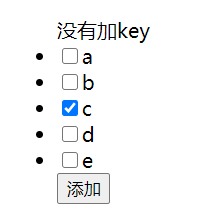
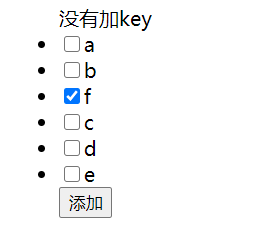
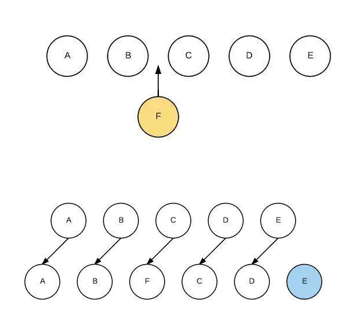
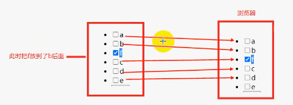
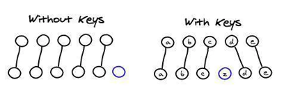

---
group:
  title: 【01】vue基础篇
  order: 1
title: vue指令v-for列表渲染
order: 8
nav:
  title: Vue
  order: 4
---

## 1. v-for 指令介绍

Vue.js 中的 `v-for` 指令用于基于源数据多次渲染一个元素或模板块，是列表渲染的核心工具。它类似于其他编程语言中的循环语句，支持对数组、对象、整数等多种数据类型的遍历。

**基础语法**：

```vue
<!-- 遍历数组 -->
<div v-for="(item, index) in items" :key="item.id"></div>

<!-- 遍历对象 -->
<div v-for="(value, key, index) in object" :key="key"></div>

<!-- 遍历数字范围 -->
<div v-for="n in 5" :key="n"></div>
```

- **数组遍历**：`item` 是当前元素，`index` 是索引（从 0 开始）。
- **对象遍历**：`value` 是属性值，`key` 是属性名，`index` 是遍历顺序。
- **数字范围**：生成从 1 到指定数字的序列。

### 1.1 基本示例

**① 数组渲染**

```vue
<template>
  <div>
    <h2>数组的遍历</h2>
    <ul>
      <li v-for="(item, index) in arr" :key="index">{{ index }} - {{ item }}</li>
    </ul>
  </div>
</template>

<script>
export default {
  data() {
    return {
      arr: ['aaa', 'bbb', 'ccc'],
    };
  },
};
</script>
```

渲染结果：

- 0 - aaa
- 1 - bbb
- 2 - ccc

**② 对象渲染**

```vue
<template>
  <div>
    <h2>对象的遍历</h2>
    <ul>
      <li v-for="(value, key, index) in obj" :key="index">{{ index }} - {{ key }} : {{ value }}</li>
    </ul>
  </div>
</template>

<script>
export default {
  data() {
    return {
      obj: {
        name: '张三',
        age: 18,
      },
    };
  },
};
</script>
```

渲染结果：

- 0 - name : 张三
- 1 - age : 18

**③ 数字范围迭代**

```vue
<template>
  <div>
    <span v-for="n in 10" :key="n">{{ n }} </span>
  </div>
</template>

<script>
export default {
  name: 'NumberDemo',
};
</script>
```

渲染结果：`1 2 3 4 5 6 7 8 9 10`

---

## 2. 关键特性

### 2.1 key 属性

Vue 在进行列表渲染时，默认会遵守**就地复用策略**：当列表数据变化时，Vue 会直接对已有的标签进行复用，不会将所有的标签全部重新删除和创建，只会重新渲染数据，然后根据需要创建新的元素直到数据渲染完为止。

Vue 为 `v-for` 提供了一个 `key` 属性，用来提升渲染效率。使用 `key` 时，Vue 不会去改变原有的元素和数据，而是创建新的元素然后把新的数据渲染进去。在使用 `v-for` 时，需要给元素添加一个 `key` 属性，这个 `key` 属性必须是唯一的标识，且不能是可变的。

- 写 `v-for` 时，都需要给元素加上一个 `key` 属性。
- `key` 的主要作用就是用来提高渲染性能的。
- `key` 属性可以避免数据混乱的情况出现（如果元素中包含了有临时数据的元素，不用 `key` 就可能产生数据混乱）。

下面是一个相关的示例：

```vue
<template>
  <div>
    <ul>
      没有加 key
      <li v-for="a in arr"><input type="checkbox" />{{ a }}</li>
      <button @click="add">添加</button>
    </ul>
    <hr />
    <ul>
      有加 key
      <li v-for="item in arr" :key="item"><input type="checkbox" />{{ item }}</li>
      <button @click="add">添加</button>
    </ul>
  </div>
</template>

<script>
export default {
  data() {
    return {
      arr: ['a', 'b', 'c', 'd', 'e'],
    };
  },
  methods: {
    add() {
      this.arr.splice(2, 0, 'f');
    },
  },
};
</script>
```

**页面效果示意图：**





**现象说明**：当我们想在 b 和 c 中间插入一个 f，使用 `splice` 方法添加后，如果之前选中了 c 再点击添加，会发现选中状态变成了 f。这是因为没有添加 `key` 时，虚拟 DOM 对比过程导致的状态错位。

**图解原理（无 key 的情况）：**





在没有 `key` 时，虚拟 DOM 上新增的 f 并没有对应浏览器上任何元素，但虚拟 DOM 后面的 c 会指向浏览器上新建的 f，导致最终浏览器上显示的 f 被选中。

**使用 key 时：**



**为什么 v-for 要加 key？**

`key` 属性默认绑定的是位置（`index` 下标），有 `key` 时状态根据 `key` 属性绑定到相应的数组元素。但一般不建议直接绑定 `index`，就是为了避免插入元素导致 `index` 发生变更的情况。绑定到的元素建议用唯一标识 `id`。加 `key` 主要是为了高效地更新虚拟 DOM。

### 2.2 数组更新检测

Vue 能够检测到以下数组方法的变化，并触发视图更新：

- `push()`
- `pop()`
- `shift()`
- `unshift()`
- `splice()`
- `sort()`
- `reverse()`

```javascript
// 这些会触发视图更新
this.items.push(newItem);
this.items.splice(0, 1); // 删除第一个元素
```

但是**不能通过索引直接设置项**：

```javascript
// 不会触发更新
this.items[0] = newValue;

// 正确做法
this.$set(this.items, 0, newValue);
// 或
this.items.splice(0, 1, newValue);
```

#### 原理：数组方法的响应式处理

Vue 在初始化数据时，会对数据进行响应式处理。对于数组，Vue 会重写上述方法，使得在调用这些方法时，除了执行原始操作外，还会触发视图更新。具体实现如下：

```javascript
const arrayProto = Array.prototype;
const arrayMethods = Object.create(arrayProto);

const methodsToPatch = ['push', 'pop', 'shift', 'unshift', 'splice', 'sort', 'reverse'];

methodsToPatch.forEach(function (method) {
  // 原始数组方法
  const original = arrayProto[method];
  Object.defineProperty(arrayMethods, method, {
    value: function mutator(...args) {
      // 先执行原始方法
      const result = original.apply(this, args);
      // 获取数组的 ob 对象（即 Observer 实例）
      const ob = this.__ob__;
      // 对于 push、unshift、splice 这些可能添加新元素的方法，需要对新增的元素进行响应式处理
      let inserted;
      switch (method) {
        case 'push':
        case 'unshift':
          inserted = args;
          break;
        case 'splice':
          inserted = args.slice(2);
          break;
      }
      if (inserted) ob.observeArray(inserted);
      // 通知更新
      ob.dep.notify();
      return result;
    },
  });
});
```

因此，当调用 `this.items.splice(0, 1, newValue)` 时，Vue 重写的 `splice` 方法会执行三件事：

1. 执行原始 `splice` 方法，更新数组。
2. 对新增的元素（即 `newValue`）进行响应式处理。
3. 通知所有依赖该数组的 `Watcher` 进行更新。

而直接通过索引设置数组元素（如 `this.items[0] = newValue`）之所以不能触发视图更新，是因为 Vue 没有重写数组的索引设置操作。Vue 2 中由于 JavaScript 的限制，无法检测到这种操作。因此，Vue 提供了 `Vue.set`（或在实例中用 `this.$set`）方法来确保响应式更新。

---

## 3. v-for 使用 of 分隔符

在 Vue 中，`v-for` 指令可以使用 `in` 或 `of` 作为分隔符，两者在功能上没有区别，只是语法上的不同。Vue 官方文档通常使用 `in`，但为了更接近 JavaScript 迭代器的语法，也可以使用 `of`。

**基本使用方法**：

```vue
<div v-for="item of items" :key="item.id">
  {{ item.name }}
</div>
```

这与使用 `in` 的效果完全相同：

```vue
<div v-for="item in items" :key="item.id">
  {{ item.name }}
</div>
```

**使用 `of` 的原因**：

- 更接近 JavaScript 迭代语法：在 JavaScript 中，我们使用 `for...of` 循环来遍历可迭代对象（如数组、字符串、Map、Set等）。因此在 Vue 模板中使用 `v-for="item of items"` 会让有 JavaScript 背景的开发者感到更自然。
- 一致性：当遍历数组时，使用 `of` 与 JavaScript 的 `for...of` 循环一致。

虽然 `for...of` 在 JavaScript 中不能直接遍历对象（除非对象实现了可迭代协议），但 Vue 的 `v-for` 对对象进行了支持，同样可以使用 `of`：

```vue
<template>
  <ul>
    <li v-for="(value, key, index) of myObject" :key="key">{{ index }}. {{ key }}: {{ value }}</li>
  </ul>
</template>

<script>
export default {
  data() {
    return {
      myObject: {
        title: 'How to do lists in Vue',
        author: 'Jane Doe',
        publishedAt: '2016-04-10',
      },
    };
  },
};
</script>
```

同样适用于数字范围：

```vue
<template>
  <span v-for="n of 5" :key="n">{{ n }} </span>
</template>
```

**使用建议**：

- `v-for` 使用 `of` 或 `in` 在功能上没有区别，只是个人偏好。
- 使用 `of` 更符合 JavaScript 的 `for...of` 循环语法，而 `in` 则与 JavaScript 的 `for...in` 循环类似（但注意，在 Vue 中遍历对象时，`v-for` 的行为与 `for...in` 不同，因为它会遍历对象自身的所有属性，而不是原型链上的属性，并且可以通过第三个参数获取索引）。
- 不同的团队可能有不同的代码风格指南：

```javascript
// 团队 A 的规范：统一使用 in
module.exports = {
  rules: {
    'vue/v-for-uses-in': 'error', // 强制使用 in
  },
};

// 团队 B 的规范：统一使用 of
module.exports = {
  rules: {
    'vue/v-for-uses-of': 'error', // 强制使用 of
  },
};
```

---

## 4. v-for 原理剖析

### 4.1 虚拟 DOM 与 diff 算法中的 v-for

`v-for` 的底层依赖 Vue 的虚拟 DOM 和 diff 算法。当一个包含 `v-for` 的组件重新渲染时，Vue 需要对比新旧两个列表的虚拟节点，并高效地更新真实 DOM。

**主要流程**：

1. **编译阶段**：Vue 模板编译器将 `v-for` 指令转换为 `_l` 函数调用（渲染列表的辅助函数），并生成一个包含循环逻辑的渲染函数。
2. **渲染阶段**：执行渲染函数时，`_l` 函数根据数据源循环生成虚拟节点数组（VNode 数组）。
3. **更新阶段（diff 时）**：当列表数据变化时，新的 VNode 数组与旧的 VNode 数组进行 diff。Vue 的 diff 算法会尽量复用节点，减少 DOM 操作。

### 4.2 无 key 时的 diff 策略

当没有提供 `key` 时，Vue 采用 **“就地更新”** 策略：对于新旧两个列表，Vue 会按索引位置逐一比对 VNode，如果 VNode 的类型和标签相同，则直接更新该节点的属性（如文本、类名等），不会移动节点的位置。

- **优点**：不需要移动节点，性能较好。
- **缺点**：会导致节点内部的子组件状态或临时 DOM 状态（如复选框的选中、输入框的内容）错乱，因为节点只是被原地更新了内容，而不是根据数据逻辑重新排列。

例如前面插入新元素导致选中状态错位的例子，就是因为在没有 `key` 的情况下，Vue 按索引位置复用节点，错误地将原来第 3 个节点的状态赋给了新插入的节点。

### 4.3 有 key 时的 diff 策略

当提供了唯一的 `key` 时，Vue 会基于 `key` 对列表进行更精确的比对：

1. 首先，对新旧 VNode 中具有相同 `key` 的节点进行比对和复用。
2. 对于新增的 `key`，创建新节点；对于删除的 `key`，销毁旧节点。
3. 对于顺序变化，Vue 会移动 DOM 节点到正确位置，而不是简单地原地更新。

这个过程通常分为三步：

- **创建新节点**：新列表中有但旧列表中没有的 `key`，创建真实 DOM。
- **删除旧节点**：旧列表中有但新列表中没有的 `key`，删除真实 DOM。
- **移动/更新节点**：新旧列表中都存在的 `key`，但顺序不同，Vue 会移动节点；如果内容有更新（如文本变化），也会更新内容。

通过 `key`，Vue 可以保持节点与数据之间的映射关系，从而保证列表渲染的正确性，同时仍然复用尽可能多的 DOM 节点，兼顾性能和正确性。

**推荐**：始终为 `v-for` 提供一个唯一的 `key`，且不要使用 `index`，而是使用数据中的唯一标识（如 `id`）。

### 4.4 与 Vue.set / $set 的关系

由于直接通过索引设置数组项无法触发视图更新，Vue 提供了 `Vue.set` 或组件实例方法 `this.$set`，其原理是：

- 对于数组，`$set` 内部会调用 `splice` 方法（变异方法）来完成更新，从而触发响应式通知。
- 对于对象，`$set` 会添加一个新的响应式属性，并触发更新。

因此，当需要修改数组中某个元素时，推荐使用 `this.$set(arr, index, newValue)` 或 `arr.splice(index, 1, newValue)`。

---

## 5. 总结

- `v-for` 是 Vue 中列表渲染的核心指令，支持数组、对象、数字范围的遍历。
- **`key` 属性至关重要**：必须为每个列表项提供唯一且稳定的 `key`（不使用 `index`），以保证状态正确性和渲染性能。加 `key` 主要是为了高效地更新虚拟 DOM。
- Vue 可以检测到数组的七种变异方法（`push`、`pop`、`shift`、`unshift`、`splice`、`sort`、`reverse`）并自动更新视图；对于直接索引修改或修改 `length`，需要使用 `$set` 或 `splice` 替代。
- `v-for` 支持 `in` 和 `of` 分隔符，功能相同，可根据团队规范选择。
- 原理层面：`v-for` 通过虚拟 DOM 和 diff 算法实现高效更新，`key` 是 diff 过程中准确识别节点复用的关键。

正确使用 `v-for` 和 `key` 是 Vue 开发中常见且重要的实践，能有效避免界面状态异常和性能问题。
